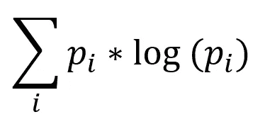
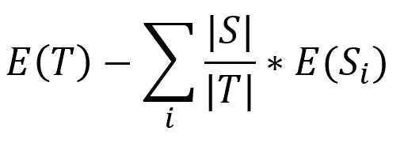
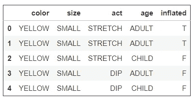

# 决策树与熵

> 原文：<https://medium.com/swlh/on-decision-trees-and-entropy-7e6f26a4b014>

决策树算法和熵函数的研究


Photo by [Johannes Plenio](https://unsplash.com/photos/UewgGfZgYj0?utm_source=unsplash&utm_medium=referral&utm_content=creditCopyText) on [Unsplash](https://unsplash.com/search/photos/tree?utm_source=unsplash&utm_medium=referral&utm_content=creditCopyText)

在**预测分析**领域，决策树是可以应用于回归&分类任务的算法之一

决策树背后的思想是根据数据集中的要素在该点对响应变量的贡献，递归构建一个倒置的树状结构。在每次迭代中，将以这样的方式选择特征，使得结果模型最小化成本函数。

该结构从顶部的根节点开始，然后分支并连接到其他节点，最终到达树的终端节点或叶子。树中的每个节点代表一个特征；每个链接或分支代表一个决策，每个叶子代表一个结果(响应变量的类别或连续值)

## 利弊

决策树背后的**简单性**是通过确定任何给定点的最重要特征来创建模型的方式。因为它**没有假设**变量之间是线性的或任何关系，它不仅限于线性或其他相关变量——它可以应用于任何数据集。此外，与许多其他算法不同，在应用决策树之前不需要大量的数据操作

它有时被称为**贪婪**算法，因为它在每一点都试图最大限度地最小化成本函数。这种过度的最小化成本函数的尝试会导致**过度拟合**训练数据，从而导致在测试数据上进行预测时的高方差。修剪或套袋等技术经常被用来解决这个问题

## 决策树的类型

根据所使用的成本最小化技术，决策树可以有许多分类，其中重要的一对是:

*   CART(分类和回归树)—使用基尼不纯度度量来计算每次迭代的信息增益
*   ID3(迭代二分法 3) —使用熵函数来计算信息增益度量

这里，我们将研究 ID3 决策树的熵函数&设计一个算法来计算任何迭代的熵

# 熵和信息增益

****的熵**每个特征**的每个唯一值计算如下:



特征的**信息增益**计算如下:



其中，E(T)是响应变量的熵

## 履行



我们将使用 UCI 数据仓库中的气球数据集。它代表实验的不同条件——根据 4 个预测特征确定“膨胀”的响应变量:颜色、大小、行为和年龄

```
# data = Balloons dataset
# N = Number of columns
# target = response variable
# en = Entropy of target variable
# cats = dictionary of counts of unique values for response variable
# vals = dictionary of counts of unique values for current featurefor i in range(0,N-1):
    x=data.columns[i]
    ig=0
    for k, v in vals.items():
        ent=0

        for k1 in cats.keys():
            n=data.loc[(data[target]==k1) & (data[x]==k), x].count()
            prob = -(n/v) * np.log(n/v) **#Calculating Probability**
            ent= ent + prob             **#Calculating Entropy**
        info = info + ((v/total)*ent)   **#Calculating Information**
        gain = en - ig                **# Calculating Information Gain**
```

## 在第一次迭代之后

让我们看看如何使用上面的函数计算第一次迭代的熵和信息增益

1.  计算熵和信息增益 w . r . t .
    列"颜色":
    '黄色':32，'紫色':28
    "颜色"黄色带"膨胀"真-19
    "颜色"黄色带"膨胀"假-13
    "颜色"紫色带"膨胀"真-12
    "颜色"紫色带"膨胀"假-16
    E(黄色)=(-19/32)* log(19/32)+(-13/32)* log
2.  类似地，计算剩余列的熵和信息增益:
    IG(大小)= 0.0148
    IG(行为)= 0.131
    IG(年龄)= 0.130
3.  选择列“Act”作为根节点，因为它具有最高的信息增益

## 后续步骤

然后，该算法将递归地执行以下步骤来构建决策树(超出了本文的范围):

*   具有最高信息增益的特征将被指定为该迭代的节点
*   来自该节点的分支将由来自该节点的可能的每个唯一值(条件/决策)形成
*   根据随后的特征和条件，分支将通向其他节点
*   如果没有其他可能的特性或条件，将创建叶节点&不会进行进一步的分支

这样，决策树将被递归地构建。然后，可以应用该模型来预测响应变量的值或类别

[](https://medium.com/swlh)

## 这篇文章发表在 [The Startup](https://medium.com/swlh) 上，这是 Medium 最大的创业刊物，拥有+411，714 名读者。

## 在这里订阅接收[我们的头条新闻](http://growthsupply.com/the-startup-newsletter/)。

[](https://medium.com/swlh)