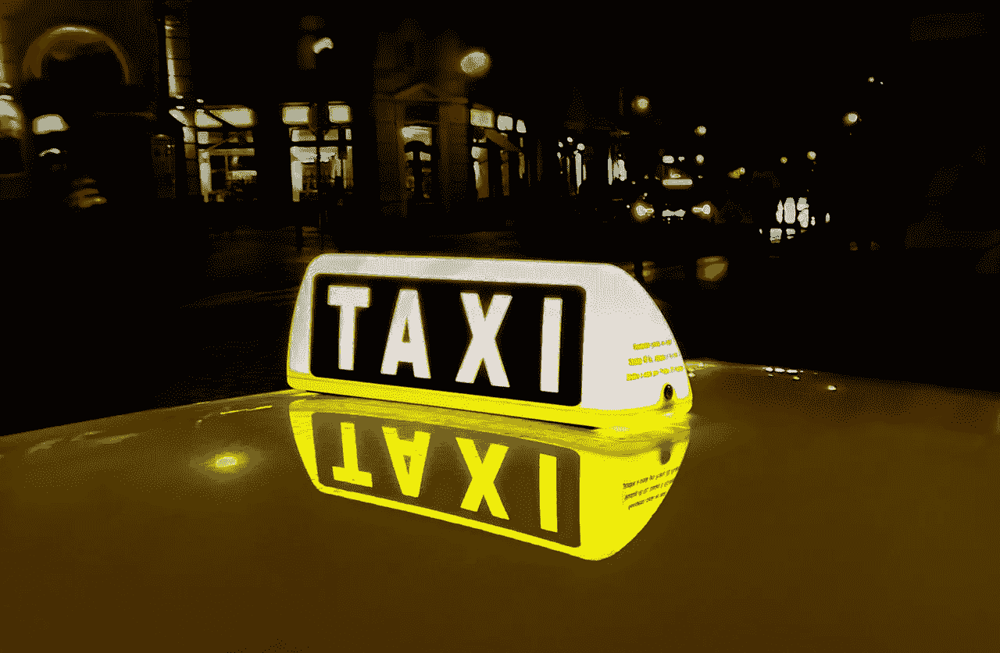

# 优步十年前的按需乘车:对被遗忘的“移动 1.0”创新的回忆

> 原文：<https://medium.com/swlh/on-demand-rides-a-decade-before-uber-recollections-on-a-forgotten-mobile-1-0-innovation-32911beaa763>

20 多年前，当支持数据的移动电话出现时，它们承诺将互联网应用的浪潮从个人电脑扩展到消费者想漫游的任何地方。无聊的会议时在桌子底下发邮件？当然可以。浴室里的文字游戏？为什么不呢？