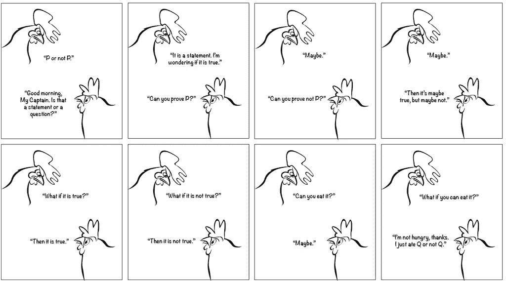
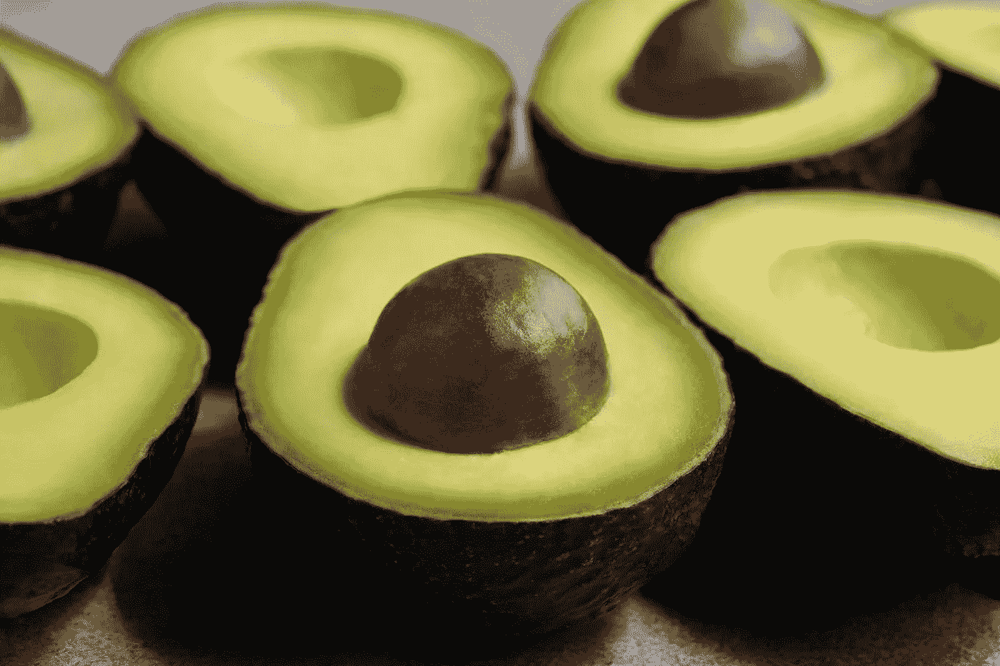
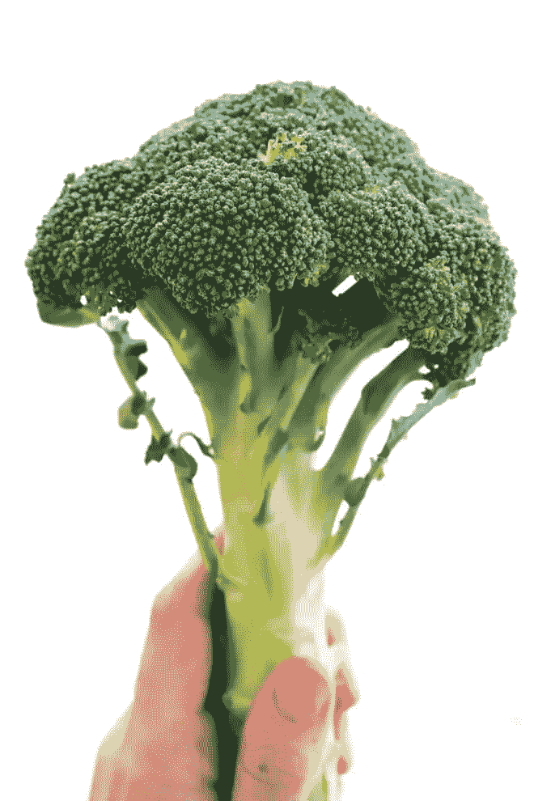
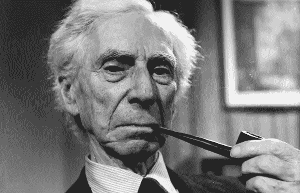
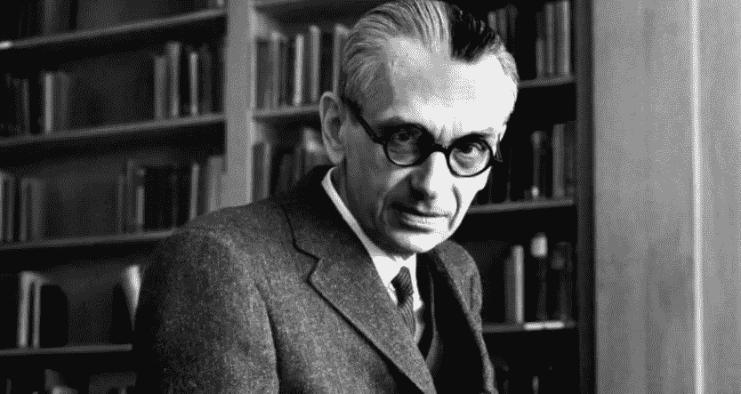
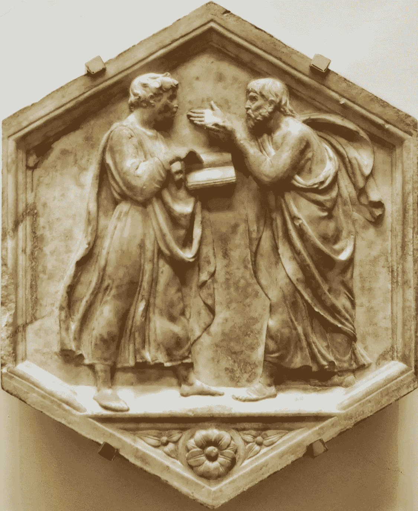
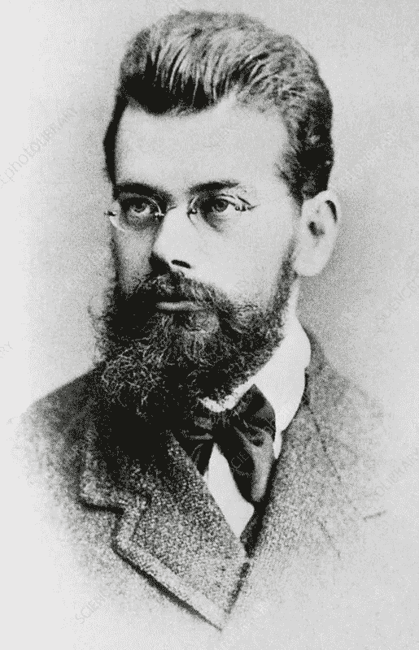
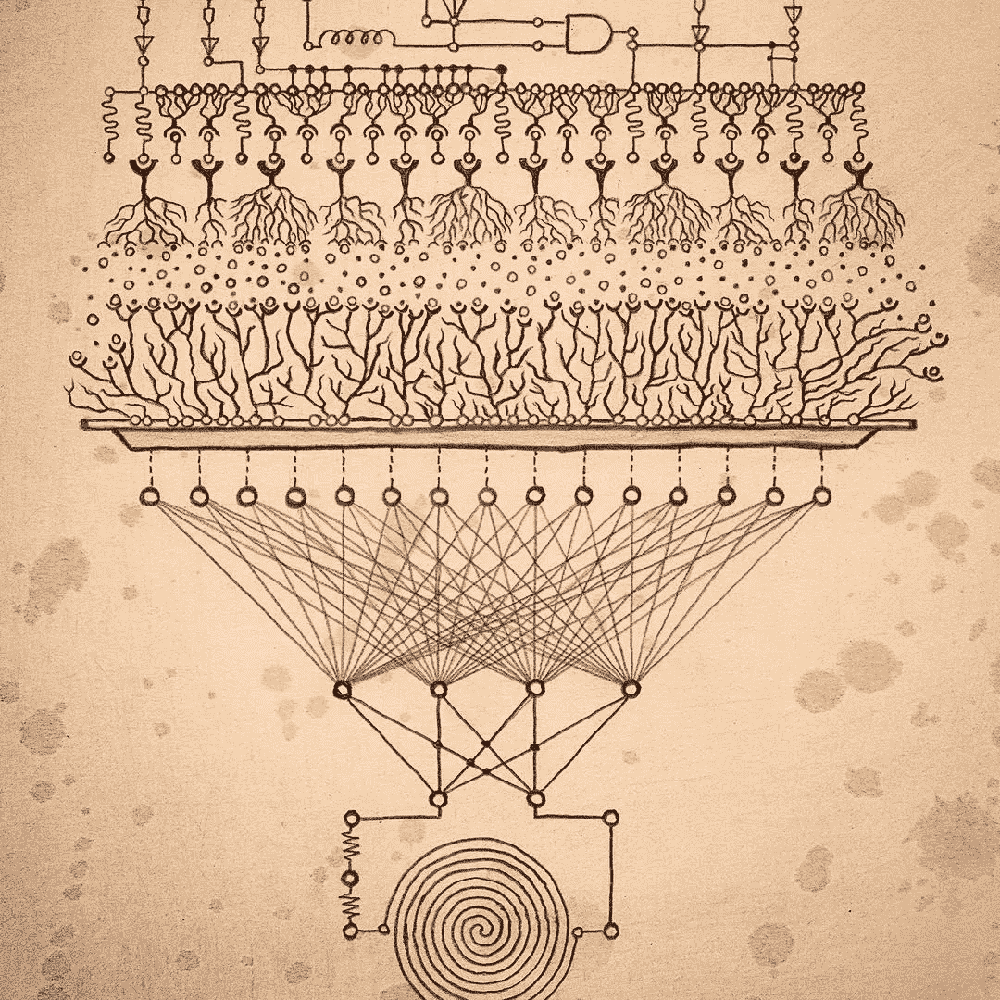

# 关于分析、突现和鳄梨

> 原文：<https://medium.com/swlh/on-the-analytic-the-emergent-and-avocados-31fcf46cbe16>

## 从根本上逃离我们的认知路径依赖

The Excluded Middle: [Can you eat it](https://againstprofphil.org/2019/01/21/anti-realism-and-uncle-realism-meet-the-law-of-excluded-middle/)?

你被*逻辑迷团*感染了吗？

让我们做一个快速的实地测试，只是为了确定:你听说过排中律吗？

如果是这样，你很可能已经被感染了。至少部分是。它可能处于休眠状态。

这种迷因感染可以追溯到柏拉图和他的思想三定律，它指出:

> 对于任何[命题](https://en.wikipedia.org/wiki/Proposition)，[要么](https://en.wikipedia.org/wiki/Exclusive_or)那个命题[为真](https://en.wikipedia.org/wiki/Truth_value)要么它的[否定](https://en.wikipedia.org/wiki/Negation)为真。

一件事是，或者不是。很简单…

这个定律和它的两个同床异梦的同伴——不矛盾律和同一律——为现代逻辑的诞生埋下了种子。逻辑之树的枝杈上生长着理性的果实。

故事大概是这样的。

但如果柏拉图在匆忙创建一个内在连贯的逻辑关系系统时，意外地排除了远不止一个不存在的中间物呢？事实上，我相信他做到了，并希望证明我们现代世界中紧密持有的观点之间的许多摩擦都可以追溯到这一致命的错误转变。

从哪里开始？

首先，让我们考虑以下问题:

> 鳄梨是水果吗？

mmm………..…..

好吧，好吧，我承认:我是一个吃了大量鳄梨的加州人，所以这个例子有点偏狭。但是跟着我。

我们应该如何着手回答这个问题？首先，从水果的概念开始似乎是合适的。水果，即*单词*，是一系列字母串成的*符号*。我们把这种 s *符号*叫做*字*。并且我们将这些*词语*映射到*世界上*事物的*类别*。

那么什么是*类别*？从柏拉图的角度来看，一个范畴很像一个桶。要么有东西属于这个桶，要么没有。作为一个关于分类水果桶的更直观的例子，考虑西兰花:

Yes, it’s a large image. Good for consideration, right?

我们应该把西兰花放在水果桶里吗？

没有，你说呢？

嗯。为什么对于花椰菜来说很容易做出这个决定，但是出于某种原因，鳄梨给我们带来了更多的麻烦？这肯定与我们定义水果桶的方式有关。那么，是什么让水果成为水果呢？快速搜索返回:

> 果实:树或其他植物的甜而多肉的产品，含有种子，可作为食物食用。

好吧…

我们离答案更近了吗？

好了，我们现在有相当多的桶需要定义:*甜*，*肉*，*树*，*植物*，*包含*，*种子*，*食物*。一个鳄梨属于所有这些桶吗？

不要担心，我们不会详尽地定义所有的桶，因为我们将在后面看到:这样做实际上是不可能的。

关键是，一个看似简单的关于鳄梨的问题，看起来变得非常复杂。当然，以节省时间的名义，人不可能为了确保不漏一个而*充分地*探索每个桶的*整个*表面。

从技术上来说——出于好奇——鳄梨 [*是浆果*](https://www.californiaavocado.com/blog/avocado-fruit-or-vegetable) 。这也使它成为一种水果，因为浆果，你看，是水果的一个子类。很有道理，不是吗？

但是等一下，让我们检查一下…

菜桶呢？另一项调查显示:

> 蔬菜:用作食物的植物或植物的一部分，通常作为肉或鱼的配菜，如卷心菜、土豆、胡萝卜或豆类。

呃……好吧。看起来鳄梨*也符合这个定义*。毕竟，鳄梨是*植物的*部分，我经常从吃一个配有培根和鸡蛋的鳄梨开始我的一天。

你感到沮丧了吗？也许有点悬？

那么，*这到底是怎么回事*？

欢迎来到*抽象的极限案例，*带给你方便、营养、最好的奶油形式的鳄梨*。*

我们不假思索地用来描述世界的这些类别桶——给我们的世界以简单的外观，更不用说功能的实用主义——实际上是相当漏洞的。要彻底证明鳄梨是不是水果并不容易。

这样做需要对一个人愿意包含的具体程度设定一个限度，更实际的是，我们愿意花多少时间来争论鳄梨。

那好吧。那么，如果我们愿意花无限的时间去堵塞我们漏水的水桶会怎么样呢？也许一些杰出的人应该把他们一生的工作奉献给创造一个系统，在这个系统中漏桶*甚至不能存在*！

*这将显示那些该死的加州人和他们愚蠢的鳄梨问题……*

好吧，让英国人去培养这样一个厌恶鳄梨的 a̶s̶s̶h̶o̶l̶e 天才吧。他的名字叫伯特兰·罗素——一位相当著名的数学家和哲学家——他把自己职业生涯的大部分时间都献给了堵漏工作。换句话说，他试图建立一个由一组有限的规则组成的正式系统——或者像厌恶鳄梨的人所说的那样，由*公理*组成——这将最终证明使用一个桶系统证明所有数学真理的能力。

Good old Bertie. Could you look more *like the guy trying to spoil all the world’s fun, even if you tried?*

它被称为*数学原理，*，数学就像它的名字一样奇特。

不幸的是，对于老伯蒂来说，这还不够花哨。像他之前的伊卡洛斯一样，他飞得太靠近太阳，融化了他应该防水的公理翅膀，让他的防漏桶梦想搁浅。

而那个孙的名字——当然除了孙——就是，天才中的天才，牛油果当之无愧的冠军:

You know this man loves him some avocados.

哥德尔用一点创造性的数学证明了罗素的无漏洞梦想不仅仅是不可能的，它的不可能直接来自于它试图完成的事情。那就是:当你试图创造一个无泄漏的世界时，你就产生了导致泄漏的条件。

因此，我们已经表明，将逻辑抽象与现实世界的过程结合起来——当在稍微强大一点的显微镜下观察时——证明比我们的老朋友柏拉图所说的要困难得多。

As you can tell, Plato did not like having his Laws contradicted…

*狡猾的 f*cker* ，即柏拉图。

好了，我们知道将抽象类别绑定到现实世界不仅很棘手，而且在不创建漏桶的情况下几乎不可能做到。但是为什么会这样呢？

也许是因为我们居住的世界从根本上说是由动态过程组成的，这些动态过程随着时间的推移而出现并保持稳定，而抽象符号在表现这些过程的丰富性方面能力有限。

等一下。我以为我们在讨论鳄梨和水桶，而不是紧急动态过程。怎么回事？

嗯，想想当你把一个鳄梨放在水果碗里太久会发生什么:它会变坏。但这很奇怪。鳄梨没有长出腿*去任何地方*，更不用说一个叫坏的*地方。还是做到了？嗯，它没有在太空中任何地方旅行。但是跨越时间呢？*

啊，我打赌你不知道鳄梨也是时间旅行者。但是当然，像任何其他的生命过程一样，鳄梨必须随着时间的推移而存在。或者，至少，它必须持续存在，直到我把它放进我的嘴里，把它融入到我自己的过程中，或者如果它已经变坏了，也许把它扔进堆肥里。

但是为什么它不干脆拒绝旅行呢？

为什么它允许自己随着时间的推移被带到不好的地方？

当鳄梨宝宝离开妈妈树温暖沙沙的叶子时，它的脐带被切断了，就像我们一样，它的出生标志着走向死亡的起跑线。

黑暗，对吗？责怪迪伦:

> "如果你不忙着出生，你就忙着死亡。"
> —鲍勃·迪伦

事实证明，嵌入到产生树的各种过程中，也有助于幼鳄梨抵抗各种过程的分解效应，这些过程在脱离其祖先资助的赋予生命的能量和营养流时贪婪地吞噬它。

换句话说，当它离开妈妈树的时候，小鳄梨就变得真实了。

Boltzmann: A mind truly ahead of its time.

但是也许我们应该寻求一种稍微正式一点的方式来讨论这些不同的*过程*的相互作用。对我们来说幸运的是，另一个死人——这一次是一个可怕的胡子，而不是一个愚蠢的烟斗——到处都是。也就是说，他*一直在做这件事，直到他自杀，因为 a̶u̶s̶t̶r̶i̶a̶̶d̶i̶d̶n̶'̶t̶̶h̶a̶v̶e̶̶e̶n̶o̶u̶g̶h̶̶a̶v̶o̶c̶a̶d̶o̶s̶̶t̶o̶̶f̶e̶e̶d̶̶h̶i̶s̶̶h̶a̶b̶i̶t 和他的同行们不相信他毕生创造的理论。*

他的名字叫路德维希·玻尔兹曼，他是第一个将 [*熵*](https://en.wikipedia.org/wiki/Entropy) 概念形式化的人。熵的细节有些棘手，但我们只能说它是一个用来描述这样一个事实的词，除非你不断地给一个连贯的过程添加能量，否则这个过程将随着时间的推移变得越来越随机。当然，当谈到生命系统时，*越来越随机*最终汇聚于死亡和分解。

这意味着你周围的一切，每时每刻，都是由嵌入在秩序和混乱之间不可避免的斗争中的过程组成的。在每一个尺度上，促进有序信息持续存在的过程必须不断抵制那些缓慢分解任何需要能量才能持续存在的事物的过程。你现在可能明白为什么生命过程需要持续的能量流动。

这和水桶，柏拉图，还有我们一开始讨论的奇怪的被排斥的中间法则有什么关系，然后就像你约会了三个星期的那个笨蛋一样放弃了，这样你就不会在感恩节没有约会了，因为你的表弟有了新的迷恋对象，你他妈的受不了他们自恋的傲慢，而且…

但是我跑题了。

事实证明，我们的好朋友柏拉图知道关于熵、细胞、进化或几乎任何我们后来认为对我们称之为生命的起源、维持和分化至关重要的过程。当然，我们也不能因此而责怪他。他还认为这个世界完全是由火、土、空气和水组成的，在大多数人连屁股都不擦的时候，没有人能证明事实并非如此。

好吧，好吧，我知道，我太刻薄了。为了给予应有的信任，我们开始理解和分类上述发现的过程在很大程度上归功于柏拉图的三大定律。如果没有源自他的逻辑公理的结构性思维，我们就不太可能想出如何系统地分类和理解我们发现自己嵌入其中的过程分层网络。

但是，就像发情的大象一样，强大的力量会很快变得危险。

事实证明，分析逻辑的应用已经成为相当专制的国王。在逻辑编程的眼中，柏拉图法则的分支过于频繁地遮蔽了视网膜表面，将人类的盲点扩展到了被排除在外的中间部分:即，涌现过程之间的大多数复杂交互。

逻辑和它的法则给了人类一把无与伦比的力量之锤，我们的头脑已经慢慢地看到了一个钉子的世界。然而，产生经验现实的过程远远超出了这个金属领域。

对于那些愿意更仔细观察的人来说:锤子和钉子也是自然发生的过程。

Autopoiesis, as depicted by the artist [Corrine Antoinette Fedchun](https://www.pinterest.com/pin/58406126400088404/?lp=true).

这里存在一种基本的视角张力:我们是自上而下还是自下而上地解释我们的世界？我们是应用*理性的便利类别*，完全知道它所提供的水桶将永远漏下去，还是一头扎进无限复杂的突现过程及其自创单位的环境中？

当然，就像许多其他人类决策一样，天平倾向于有时间限制的*。我明白了:人们喜欢在死前完成一些事情，而*生命的长度不足以应对无限复杂的事情。当然可以。好吧。不幸的是——或者对像我这样痴迷于复杂性的人来说是幸运的——人类再也不能忽视这种紧张及其产生的摩擦。**

*在当今世界，这种紧张关系造成的摩擦到处都在引发火灾。这是关于现代和后现代观点争论的核心。它激发了集体行动的集中管理和分散管理之间的循环振荡。这是魔鬼坐在那些被迫辩论人类在其上升历史中创造的残留类别系统内部和之间的承载能力和泄漏点的人的肩膀上。*

*毫无疑问:我们可能在表面上解决不了这些问题——浪费宝贵的时间尝试这种徒劳的努力是徒劳的。*

*所以让我们把事情搞清楚。*

*或者，等等……也许我们正试图游到它的表面？*

*嗯…*

*为了更全面地理解我们所处的复杂现实，我们必须学会在头脑中同时持有自下而上和自上而下的观点。*

*我们必须*练习使用我们的类别作为工具*，同时理解如果我们足够深入地追寻它们的边缘，*曾经看似具体的边缘将会转变成它们自己的过程生态*。*

*我们必须明白*只有从上往下看系统时，一层中被排除在外的中间层才显得空空如也*，但是从下往上看，被排除在外的中间层那本应贫瘠的土壤*实际上可以焕发生机*。*

*以这种方式，我们可以在分析和涌现之间建立一个稳定的路径。我们可以把罗素和哥德尔居住的曾经互不相干的世界连接起来；我们可以将柏拉图和亚里士多德嵌入一个自动催化循环中；也许我们甚至可以用智能薄膜来代替无数的漏桶，这些漏桶在我们的当代景观中引起不稳定的派系斗争。*

*这样一个透镜——一个将分析和突现编织成炼金术，甚至可能是[魔法](https://en.wikipedia.org/wiki/Clarke%27s_three_laws)，认知超材料的透镜——甚至可能催化传统的科学分析语法和根本的灵性突现语法之间的建设性对话流程。*

*这是摆在我们面前的一个巨大挑战，但如果我们要成功地通过前面越来越狭窄的渠道，我们必须克服这个挑战。*

*当然——如果我们成功了——你可以期待自助餐上的鳄梨。*

*请不要天真地将它们简化为单纯的水果…*

*如果你喜欢这个，请随意鼓掌，并在 [Minds](https://www.minds.com/matthewpirkowski) 或 [Twitter](https://twitter.com/MattPirkowski) 上给我一个跟进。*

**附注:对于那些想进一步了解兔子洞的人来说，一个对排中律有着类似直觉的聪明人不仅仅是写了一篇关于它的文章:他的名字叫 L . E.J Brouwer，他创造了被称为* [*直觉主义*](https://en.wikipedia.org/wiki/Intuitionism) *的哲学和数学观点。**

*我怀疑这种观点并没有消亡，而仅仅是蓄势待发，为追求上述目标做好准备。*

**

## *这篇文章发表在 [The Startup](https://medium.com/swlh) 上，这是 Medium 最大的创业刊物，拥有+429，678 名读者。*

## *在这里订阅接收[我们的头条新闻](https://growthsupply.com/the-startup-newsletter/)。*

**