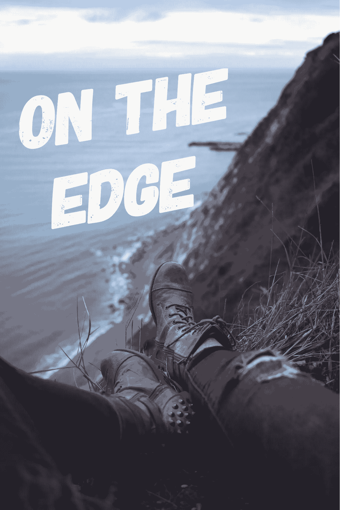

# 在边缘——我的崩溃，第一部分

> 原文：<https://medium.com/swlh/on-the-edge-my-breakdown-part-1-c8c0a619eac0>

几年前，我彻底崩溃了，这与焦虑、阴暗的想法、抑郁和压力有关。我这样描述吧。想象一下，感觉就像是在你人生中最重要的考试，也就是驾驶考试的前一天晚上，你刚刚和你爱的人发生了一场最糟糕的争吵，就像没有人重视你，就像你刚刚在街上被人袭击，你刚刚听到了毁灭性的消息。