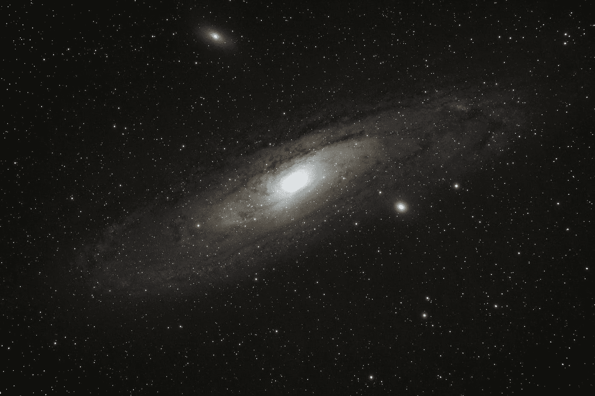

# 在狩猎寻找下一颗超新星

> 原文：<https://medium.com/swlh/on-the-hunt-for-the-next-supernova-cfb5d2fa8aa5>

## 罗伯特·埃文斯:发现垂死恒星的人

Photo by [Bryan Goff](https://unsplash.com/@bryangoffphoto?utm_source=medium&utm_medium=referral) on [Unsplash](https://unsplash.com?utm_source=medium&utm_medium=referral)

你如何找到一颗超新星——那到底是什么？

超新星是垂死的恒星。从地球上观测这样的事件很困难，需要强大的计算机程序。然而，这并不适用于这个非凡的人。