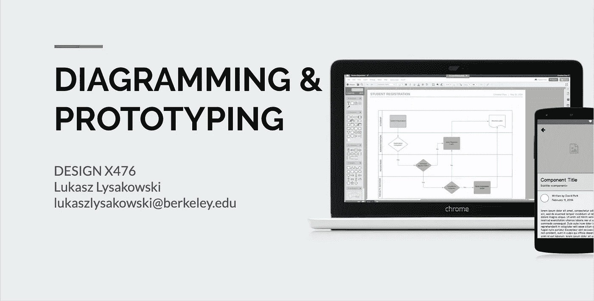

# 设计师为什么要教设计

> 原文：<https://medium.com/swlh/on-why-designers-should-teach-design-5d6cb4bd15c9>

## 以及为什么教设计让我成为更好的设计师。

最近，我开始在加州大学伯克利分校的用户体验(UX)设计专业项目上讲课。我在那里教[为 UX](https://extension.berkeley.edu/search/publicCourseSearchDetails.do?method=load&courseId=29946164) 设计 X476 图表和原型。

教授设计和艺术是我长期以来的兴趣，因为我在生活中有幸运的机会…