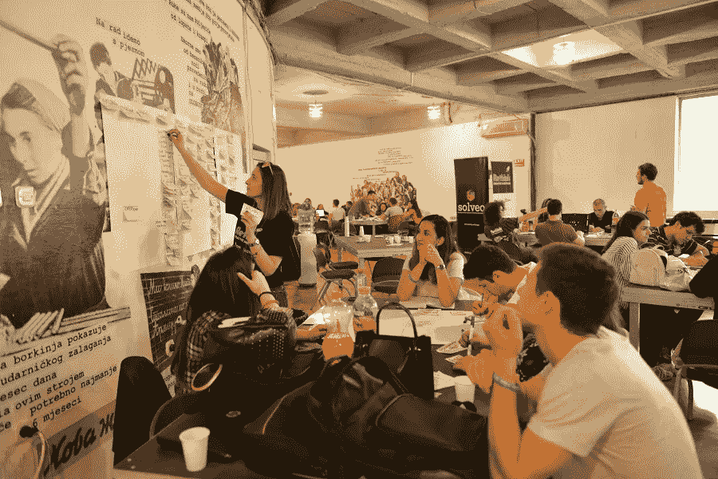
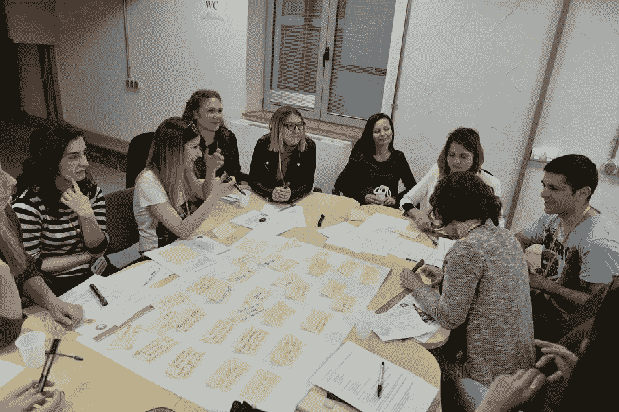
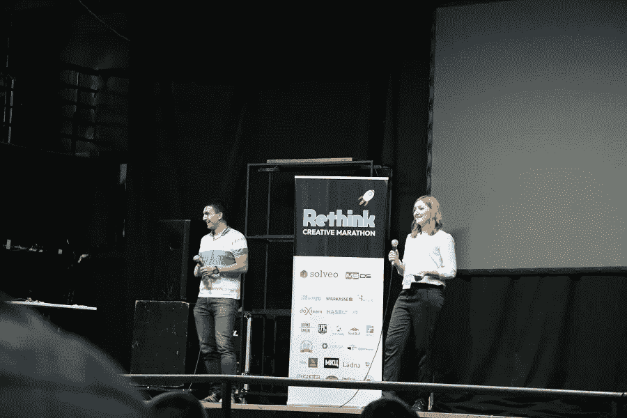

# 这个巴尔干半岛国家曾经因假新闻工厂而声名狼藉，现在它正试图重塑自我

> 原文：<https://medium.com/swlh/once-infamous-for-fake-news-factories-this-balkan-country-is-trying-to-reinvent-itself-f1e45f3642ae>

几年前，马其顿因试图影响上届美国总统选举的假新闻工厂而臭名昭著。现在，这个巴尔干半岛的小国想要在创业产业中扬名立万。

2016 年，马其顿是假新闻的代名词。在全国各地的小城镇里，有许多生产虚假政治内容的所谓工厂。这些工厂运营着数以百计的网站，目标是美国的受众。

这些内容的主要制作者是马其顿的青少年和学生，他们想赚点外快。他们一点也不知道他们最终会因为错误的原因出现在历史教科书中。

三年过去了，马其顿的年轻人再次成为焦点。学生们现在正积极投身于国内许多令人兴奋的初创企业。一个例子是 [Solveo](https://www.solveo.co/) ，一家将学生与寻找商业问题创造性解决方案的企业配对的创业公司。

根据他们的知识和发展想法的潜力，学生们被分配任务并竞争奖项，同时提出公司面临的日常业务挑战的答案。

Solveo 的联合创始人 Ivan Zografski 告诉 ZDNet，这家初创公司由马其顿企业家 Ivan Zografski 和 Dragana Neshovska 在 2016 年创立，背后的主要理念是需要真正的创新，主要针对当地企业。

在寻找新产品的过程中，寻求马其顿青年的帮助显然是第一步。

“我们提供解决方案的核心方法之一是通过众包和开放式创新，”当被问及为什么咨询公司更喜欢年轻人而不是专业人士时，Zografski 解释道。

“我们相信，50 个年轻、新鲜的头脑比一个专业人士和专家的创新能力至少强 10 倍。说到创新，没有人能成为真正的专家。”

然而，这并不意味着 Solveo 排斥专家。据该公司的联合创始人内绍夫斯卡说，情况恰恰相反。

“年轻一代可能更有远见，更激进，而专家通常更注重商业和现实。她说:“一项创新要取得成功，需要一种整体的方法。

根据客户的需求，学生在这一过程中的角色可以有所不同。

“如果需要的话，他们可以提出想法。如果需要营销，他们可以是营销团队。在这个过程中，他们可以是设计师，也可以是其他团队的一员。他们可以测试最终产品以降低失败的风险，或者他们可以成为共同创造者，”Neshovska 解释道。

对于 24 岁的 Mila Josifovska 来说，参与 Solveo 的项目是一次改变人生的经历。

“对我来说，最重要的收获是发现创业世界，了解创造多种机会的企业家心态。它给了我一个实习机会，后来又给我找了一份工作，”Josifovska 告诉 ZDNet。

Ivona Zabaznovska 年仅 19 岁时，就参加了 Solveo 发起的首届比赛。

“高层管理人员看到了我和我的团队开发的解决方案，我们有机会听到直接的反馈，这是宝贵的，”她说。

20 岁的 Ivona Barbutova 曾参与品牌声誉管理和改善网上银行的项目。

“我们清楚地知道公司面临的挑战以及我们需要采取的步骤。我们打破常规，提出了创新的解决方案，”Barbutova 解释道。

在短短三年内，Solveo 从两名员工发展到十多名员工，帮助数百名学生为来自瑞典、瑞士和美国的客户开展项目。

然而，当谈到马其顿的创业场景的进一步发展时，Solveo 的创始人同意，仍然缺乏的是更多的财政和行政支持。

“我们看到了巨大的潜力，但缺乏支持。我们希望看到大学通过向年轻一代推广更具创业精神的思维方式来更多地参与进来。”

*原载于 2019 年 5 月 3 日*[*【https://www.zdnet.com】*](https://www.zdnet.com/article/once-infamous-for-fake-news-factories-this-balkan-country-is-trying-to-reinvent-itself/)*。*