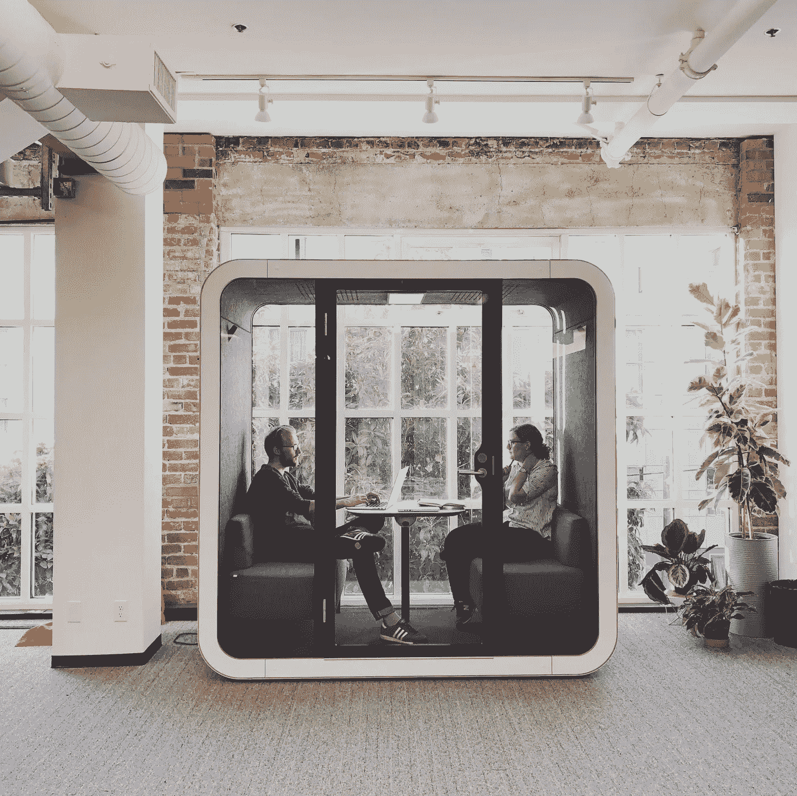

# 一对一是我最有价值的会议；我是这样运行它们的

> 原文：<https://medium.com/swlh/one-on-ones-are-my-most-valuable-meetings-heres-how-i-run-them-d9ae7c64dade>

Front employees having a one-on-one

在[前线](http://www.frontapp.com)的员工参与度和保留率很高。我们的员工 NPS 为 97，在最近的员工参与度调查中，93%的团队成员认为他们知道自己的工作如何有助于实现前线的目标。我们远没有做到每件事都完美，但有几件事我们可能做对了，当我觉得某件事正在起作用并产生巨大影响时，我会…