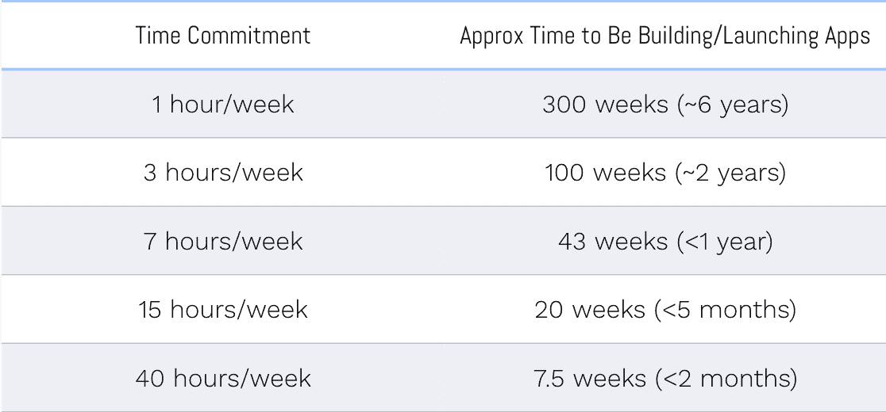

# 一个人的旅程:数月内学会编码和发布

> 原文：<https://medium.com/swlh/one-persons-journey-learning-to-code-and-launch-in-months-d4f95676c3ae>

> “回想起来，最终学习编码的过程教会了我一件重要的事情:我常常是自己最大的阻碍者。”

**四年前:**坐在讲堂里学习热力学和管道尺寸。

**三年前:**坐在办公室里为财富 500 强创建 Excel 模型。

两年前:被第一台 Macbook 收购，开始涉足搜索引擎优化、产品和数字广告领域。

一年前:决定是时候学习编码了。

六个月前，我开始了我的第一个项目。

# 2018 年 2 月

在技术边缘工作多年后，2018 年 2 月，我终于决定是时候停止把鼻子贴在玻璃窗上观看了。我想成为这个世界的一部分。

直到 2018 年 2 月，我一直敬畏地看着技术的出现，但不断地为为什么*“我做不到”*或证明为什么那个世界*“是为别人准备的”*找借口。2018 年 2 月是我旅程的开始，让这个世界不再是一个黑匣子，而是开始创造，缓慢但坚定。

具体来说，这是一个关于我这一年找到正确灵感的故事，最终学会了编码，并最终在 2018 年期间推出了四个项目，从而获得了年度制造商提名和制造商节金色小猫的提名。希望，如果你在类似的地方——一个你正处于飞跃边缘的地方——这篇文章将作为编码灵感的一种形式，把你推下悬崖。

# 你=你最大的敌人

在我的生活中，一直会有阻碍者。回想起来，最终学习编码的过程教会了我一件重要的事情:我常常是自己最大的阻碍者。

多年来，我制造的许多借口很少基于现实，而是不开始的理由。我告诉自己，其他以我一直想要的方式成功的人是从不同的布料上剪下来的，得到了与我不同的机会，或者只是太超前了。虽然这些观念中的一些在特定的场景下可能是正确的，但我已经养成了一种习惯，在没有正确检查其准确性的情况下做出这些假设。

我告诉自己的大多数故事都是虚构的。具体来说，学习编码的这些神话阻止了我去思考编码是可及的。但它真的就在我的指尖。无论我是专注于寻找完美的想法，还是确定要学习的完美堆栈，我总是在做这些事情，而不是真正的制作过程。在一个教育比以往任何时候都更便宜、更容易获得的时代，我所需要做的就是开始。

谢天谢地，去年我终于明白了这一点。我没有做任何革命性的事情:我选择了一门我的课程，选择了一个要建立的项目，并开始跟踪我是否每天都在进步。

# 8 个月→ 1 个月→ 24 小时

在推出产品之前，您需要先构建一个产品。在你能制造一个产品之前，你需要学习如何制造一个产品。

从头开始学习编码并不像许多人想象的那样困难，但是我也不想给人一种“容易”的错觉。接受任何技能或行业都需要大量的奉献，编程也不例外。然而，知道类似于其他技能的获得，学习编码随着持续的努力而加速是有益的。

例如，这是我的时间表的简要概述:

*   八个月学习编码并启动我在 T2 的第一个项目
*   一个月编写我的[第二个项目](https://begreat.me/)
*   24 小时编写我的第三个项目
*   10 天编码我的[第四个项目](https://femake.tech/)

在寻找产品的过程中， [MYGA](https://www.producthunt.com/posts/make-yourself-great-again) 排到了第一，[尤妮亚](https://www.producthunt.com/posts/eunoia)排到了第二，[费马克](https://www.producthunt.com/posts/femake)排到了第四。重点不是应用程序应该花 24 小时甚至一周来创建。相反:

*   **每次启动，你都会学到一些东西，这些东西会更好地为你随后从事的其他项目提供信息。简单地说，你将通过直接或间接的反馈从错误中学习。稍后将详细介绍。**
*   虽然学习编码可能需要一段时间来掌握，但事情会变得更快。例如，我的第四个项目在复杂性上与我的第一个相似，但是花费的时间要少得多。直到我的第三个项目，我才觉得我真的可以快速出货。

这里的想法不是革命性的，只是简单地说，许多繁重的工作将在开始时以学习的形式发生。学习是强大的，正是它让我能够构建我的每一个应用程序，但我意识到这可能是压倒性的，很难坚持下去。在秩序之前总是会有混乱，这就是为什么你必须清楚地意识到你正在潜入的是什么。

# 1, 2, 3, 4

学习编码是我 2018 年的一个中心目标。我可以把我在实现目标上的“成功”归因于几件事，我将进一步深入探讨:

*   清楚地确定“为什么”
*   持续跟踪进度
*   边学习边创造
*   从小处着手

# 从为什么开始

在你开始开发之前，你应该确定你为什么要这样做。提示:如果是为了“变得富有”，你将永远无法完成漫长而持续的学习过程。

有人想学习编码的原因有很多。其中包括:

*   成为付费开发者
*   推出自己的产品
*   更有效地与同事合作

虽然没有正确的答案，但我鼓励你找出一个能持续激励你的理由，并在你经历这个过程时，问问自己你正在采取的行动是否能实现那个目标。

对我来说，就是能够制造和推出产品，所以我会问自己这样的问题:

“学习这项技术能让我创建我的第一个项目吗？”

*“我是否学到了有价值的技能，可以在未来的岁月里继续积累？”*

*“我是在为我希望成为其中一员的生态系统添砖加瓦吗？”*

确保你的目标伴随你整个过程，而不仅仅是一个简单的“最终目标”例如，如果你的唯一目标是“在产品搜索中排名第一”，你可能会发现自己很失望，如果你没有达到这个特定的指标，不管你的旅程可能有多么有益。

# 300 小时

当我开始学习的时候，我决定让自己负责的最好方法是跟踪自己的进步。因此，我每天都在追踪我是否在学习发展。最后，我可以回顾过去的一年，量化我的进步——具体来说，我可以说我花了大约 300 个小时学习和启动应用程序。

虽然这个数字因人而异，但它也提供了一个达到目标所需承诺水平的基本理解。例如，如果你计划每周只花一个小时来做这件事，那就要花很长时间——六年！就像生活中的任何事情一样，持续不断的努力会让你比你预期的更快到达目的地。

例如:

*   每天 1 小时(每周 7 小时)可以让你在不到 1 年的时间内达到目标！
*   每天约 2 小时(每周 15 小时)可以让你在不到 5 个月的时间内达到目标！
*   一个全职的承诺(如果可能的话)会让你在不到两个月的时间内达到目标！

我肯定许多人认为这些时间表听起来不太可能或不正确，但我想强调的是，发展并不是其他技能所独有的。投入等于产出。我看到人们在谷歌上搜索“学习编码的最快方法”(第 140 卷)或“如何快速学习编码”(第 880 卷)或“学习编码的简单方法”(第 70 卷)，而实际上这总是需要大量的时间和投资。

不管确切的准确性如何，我们很快就在日常生活中设定了这些 KPI，但奇怪的是却反对在日常生活中实施它们。通过简单地测量你花了多少时间学习做 X，你对自己的进步有了一个更客观的看法。

# 边学习边创造

由于学习的初始阶段需要时间，我鼓励人们把它分成几个步骤。在每个主要节点(例如:HTML → CSS →初级 JS →中级 JS →等等)，确保你正在创建一些东西，不管它有多简单。例如，您的项目可以是:

*   简单的个人页面
*   待办事项列表
*   一本小目录

通过一路添加小项目，你本质上强化了你所学的东西，同时也减轻了在利用信息之前吸收信息的心理负担。边做边编程是真正明确你所学内容的最有效的方法——这相当于在母语环境中练习你所学的语言。

我也鼓励人们在开始获得必要的知识时，提出一个他们希望完成的更大的项目。这个概念不一定是革命性的(我的当然不是)，但它应该是一个你可以在学习中不断努力的项目。创造的行为不仅会始终激励你，而且最终会帮助你更有效地学习。

# 从小处着手:启动就是学习

我们所有人都认为自己的想法比实际情况要好，所以实现客观验证的唯一途径就是启动。

出于这个原因，我真的鼓励制造商尽早发布。您不需要学习开发多年就可以开始，在许多情况下，您应该在感觉准备好之前就开始。这部分是正确的，因为你永远不会真正感到准备好了，但你也应该希望尽快收到产品反馈。这将从本质上阻止你走上一条未经验证的道路(制作没人关心的功能，润色没人会使用的网站，等等)。).

当你在学习开发时，专注于获得“狗屎出门”，因为发布是学习，请记住，制作一个产品是关于不断学习和旋转的，在没有发布的情况下，很难客观地做到这一点(即:不仅仅基于你自己的独特观点)。

一旦发布，立即获得人们关心的反馈。基于数据和具体的反馈(而不是像“这是一个伟大的应用程序！”)，你就可以决定一个项目是否值得继续下去。尽量客观地看待一次发射，梳理出自己原有思维中的瑕疵。记住:发布是免费反馈！

当你在构建时，不要太在意你的产品是否 100%完美，或者是否利用了最可扩展的堆栈。你知道昨天排名第一的产品是用什么堆叠制成的吗？是啊，我也是。

这也是为什么我鼓励那些对学习编码没有把握的人去选择它，而不是用“没有代码”来构建或者雇佣别人来完成。作为一名创作者，你快速做出微小但有意义的调整的能力被低估了。类似地，您无需寻找完美的“无代码”工具或在开发人员身上多花几千美元就能转向新项目的能力，将使您和您的钱包都保持精简和敏捷。

换句话说，你将能够更快地创造和改变，并且在未来不需要如此严重地依赖他人来创造你的愿景。即便如此，仅仅拥有技术背景就能帮助你更有效地与开发人员合作，并在更深层次上理解技术行业。

# 没有人“知道”他们在做什么

如果我还没有说服你开始学习编码，我将留给你一点智慧:没有人真正“知道”他们在做什么。那些在某个领域比你走得更远的人可能已经做得更久了。

在一个由二分法统治的世界中，人们被视为“技术”和“非技术”，但事实上，每个人都只是处于技术能力曲线的某处。

认识到许多创造者仍在学习并经常感觉自己是骗子是有帮助的，即使他们已经创造了很多年。区分成功人士和失败人士的唯一标准，是那些愿意不断建设、迭代并从错误中学习的少数人。所以如果你不确定开始，我鼓励你尝试一下。

*   不认为自己是技术型的？在注销之前尝试开发。
*   不确定你的想法？分享它们并获得反馈。
*   不敢发射？无论如何都要做。

# 建立你自己的道路

我希望我的故事有助于给你提供一些灵感，让你有可能在自己学习编码方面迈出一大步。然而，对于生活中的任何事情，记得**打造自己的道路**。仅仅因为你在 Twitter 上看到每个人都说 X 行业是“下一个”，或者你看到媒体美化风险投资，这并不意味着你需要走这条路。请记住，我们生活在一个点击量最大的标题能赚最多钱的世界里，因此媒体呈现的世界往往不是事情运作的真实情况。

所以，与其关注你现在知道的，不如关注你将来能学到的。不要被 300 小时的概念或者其他人可能领先多远所淹没。专注于在生活的马拉松中不断投资那些会给你带来机会和快乐的事情。

最重要的是，记住任何过程都有一个开始。**所以才开始**。:)

*如果您在整个过程中的任何一点有疑问，请随时* [*给我发消息*](https://twitter.com/stephsmithio) *！*

*原载于 2019 年 4 月 29 日*[*https://blog . steph Smith . io*](https://blog.stephsmith.io/finding-programming-inspiration-by-learning-to-code/)*。*