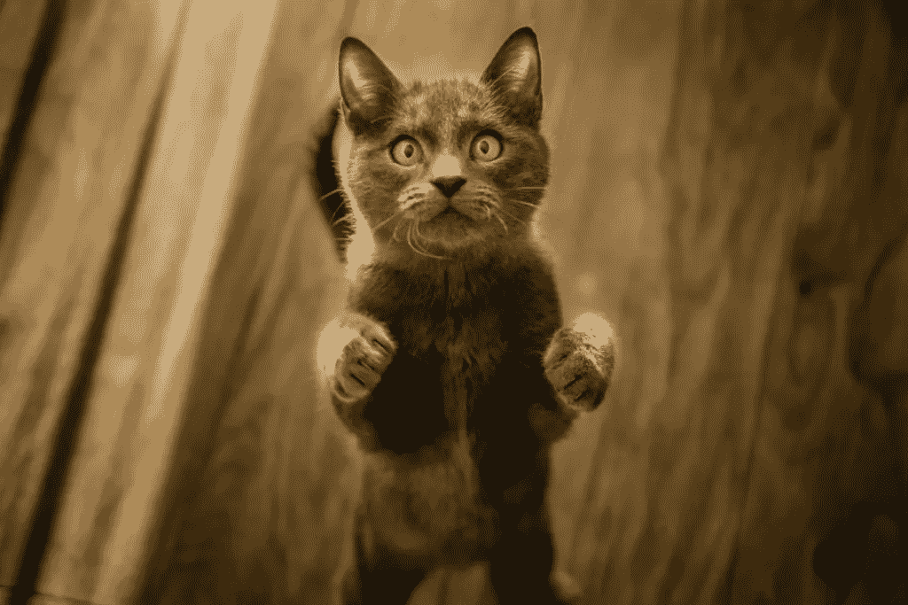
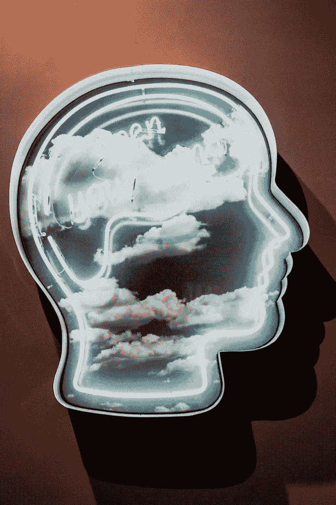

# 解决世界所有问题的一个特质

> 原文：<https://medium.com/swlh/one-trait-to-solve-all-the-worlds-problems-62a289e2a350>

## 好奇可能会害死猫。但是，对你和我来说，正是它让我们活着。

当我 11 年前开始我的销售生涯时，培养好奇心成了我做的最有帮助的事情。

好奇心正是让我能够与那些几乎没有商业经验的企业主接触的原因。

抛开我的自负，我不再害怕说，“我不知道那个是什么*，你能告诉我更多关于那个*的*吗？”*

你有多长时间会变得不好奇而有所防备？想要看起来像专家的愿望会阻止你与人交流吗？你上一次对他人做出判断而不是试图了解他们和他们的观点是什么时候？

# 好奇心改变你对待生活的方式

> “人们不知道的唯一原因是因为他们不太在乎。他们不感兴趣。缺乏好奇心是最奇怪、最愚蠢的失败”
> 
> 斯蒂芬·弗莱

好奇的心态让我们为未知的未来做好准备。这让生活的曲折变得有趣多了。

好奇心会让生活变得更愉快、更吸引人、更有意义。它增加了工作满意度、生活满足感和幸福感。

但是没有它，就有傲慢和无知；教条的信仰和固执；刻板印象，歧视，甚至仇恨和暴力。

让我们来探索好奇心如何以及为什么会对你在领导力和商业上的成功产生如此大的影响。

## 好奇心是恐惧、不安全感、愤怒和焦虑的解毒剂。

回想一下你感到恐惧、焦虑、愤怒或不知所措的时候。想象这一刻，想想这种体验是什么样的。

你在想什么？那一刻你的大脑告诉你什么？你的注意力和焦点在哪里？

你有多好奇？如果你更好奇呢？它会如何改变你的观点，让你获得新的机会？你会用不同的方式回应吗？为什么

## 好奇心让你能够与他人交流。

光听是不够的。正是通过关心和保持好奇，人际关系才得以形成。

> 爱的对立面不是恨，而是冷漠
> 
> 艾莉·威塞尔

好奇心滋生脆弱，导致理解。这种理解形成了一种即时的联系。

## 好奇心是深度学习的火花。

乔治·洛温斯坦做了一项关于好奇心理的研究。

“好奇心是一种被剥夺的感觉，当我们发现并关注我们知识中的空白时，我们会有这种感觉，”洛温斯坦说。

我们看到这种差距的唯一方法是对你正在做的事情感兴趣。随着你对某件事了解得越多，这种差距就越大。所以，你知道的越多导致你不知道的越多，同时也增加了你想知道更多的欲望。

## 最后，好奇心是通往幸福、充实和快乐生活的途径。

马丁·塞利格曼和克里斯·彼得森进行了一项快乐研究。他们确定了与生活满意度直接相关的 24 种性格优势。

好奇心是与生活享受最相关的五个特征之一。被希望、热情、感激和爱击败。

> 无聊的解药是好奇心。好奇心是无法治愈的。
> 
> 多萝西·帕克

# 结论:借此机会好奇一下

所以，借此机会好奇一下。向你不了解的地方倾斜。提出问题，然后学习。

**当今世界上许多苦难的根源都是缺乏好奇心。**

有比不好奇更多的理由。把它带进你的一天，敞开心扉面对正在发生的事情。不要把[生活看成是一个需要解决的问题](https://zacharend.com/are-you-sabotaging-your-productivity/)。相反，把它看作一个创造、学习和成长的机会。

你发现自己现在正处于什么样的挣扎中？

越来越多的好奇会如何帮助你更好地找到自己的路并采取下一步行动？

## 你想知道如何为成功做准备吗？

然后看看这个[免费意图清单](https://app.convertkit.com/landing_pages/457653)，当你加入我写的关于精神健康、正念、自我提升和生活课程的每周时事通讯时，你会免费得到它。