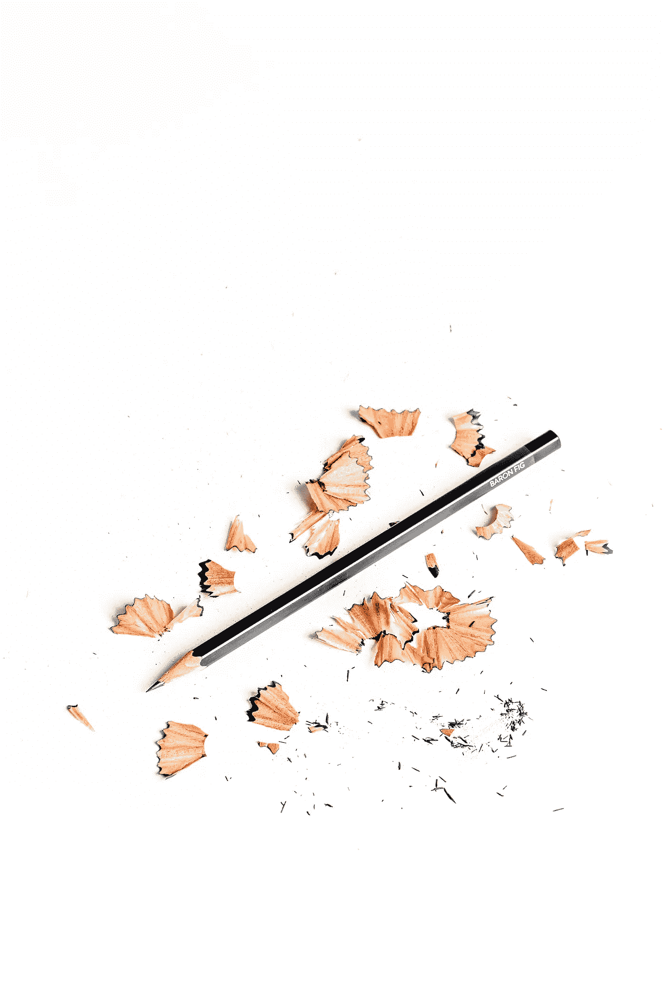
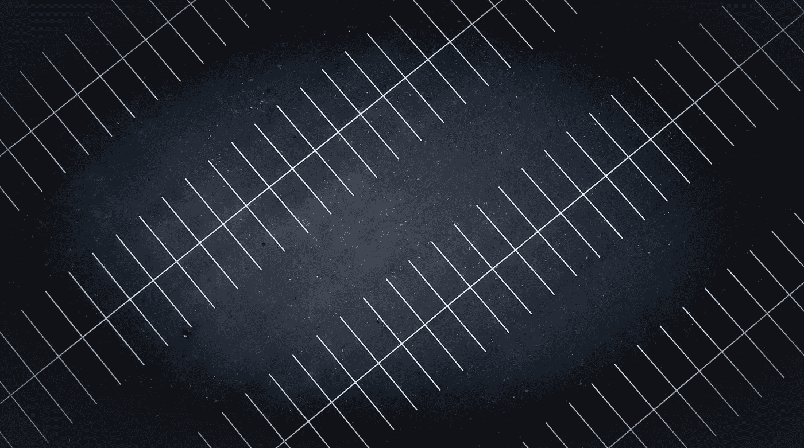

# 提高工作效率的一个方法是:把你需要的东西放在身边

> 原文：<https://medium.com/swlh/one-way-to-increase-your-productivity-keep-what-you-need-close-fac1d30b93e1>

每天，我们都有同样多的时间去完成我们计划要完成的事情。我们不能创造更多的时间，也必须有足够的时间休息和做工作之外的其他活动。因此，尽可能有效地利用我们的工作时间是有意义的。你的效率越高，你就越容易为自己做好日常工作。你在日常生活中节省下来的每一秒钟都会累积起来，成为更多有用的时间。

提高工作效率的一个方法是把你需要的所有东西，无论是数字的还是物理的，都放在手边，方便获取。知道所有东西的位置，并且能够毫不费力地找到它们，将会节省你大量的时间。假设你平均每天花一分钟的时间寻找工作所需的文档或任何工具。当然，这个时间量是最少的，因为我们通常会浪费很多时间来寻找丢失的电子邮件、文件或整理不工作的笔。如果你一年工作 250 天，那你一年要花 4 个小时寻找丢失的物品。现在假设平均每天增加到 5 分钟——一年加起来超过 20 小时。

[Photo: Carl Heyerdahl/Unsplash]

# 你需要什么

我们不能一天连续工作八小时。在这里或那里休息一分钟，花时间去寻找我们需要的办公用品，可能看起来不会有很大的不同。然而，如果我们想休息一下，最好是放松一下，而不是花时间沮丧地寻找从一开始就应该唾手可得的东西。

盘点完成工作所需的一切。然后，整理好这些工具，让它们在你需要的时候就在你身边。你的用品和文件离你越近，就越容易找到。您可以考虑的一些项目有:

# 数字地

*   文件:如果你需要临时或短时间处理某件事，就在你电脑的桌面上处理它。这样，当你完成的时候，它需要被删除或存档就更明显了。其他所有东西都应该放在他们指定的文件夹里。
*   电子邮件:按文件夹组织它们，并在 24 小时内回复、删除或存档你的电子邮件。
*   密码:使用密码管理器来组织你所有的密码。它还可以让你立即登录所有你最喜欢的和经常访问的网站。
*   浏览器上的快捷方式:在你的浏览器上放置你工作中最常用的网站的快捷方式。例如，如果你需要去一个网站登录你的银行账户，保存直接带你到登录页面的 URL 地址，而不是主要的银行网站。你保存的每一次点击都会累积起来。
*   应用程序:整理手机上的应用程序。删除你不需要的，把你最常用的放在屏幕前面。

[Photo: Tom Wright/Unsplash]

# 你的物理空间

实物供应和文件应该触手可及。只保留你需要的，去掉那些不再有用的。你手边需要什么，应该放在哪里？常见的供应品和工具有:

*   手机:工作时，选择一个固定的地方存放手机。
*   办公室电话:把你打得最多的电话号码列在身边。此外，手机应该放在伸手可及的地方，这样你就可以快速接听或拨打电话。
*   办公用品(回形针、订书机、钢笔/铅笔、计算器、笔记本)
*   商业名片
*   小吃和水
*   耳机
*   手机充电器:它可以放在你身边，这样你就可以给你的手机充电，如果需要的话还可以继续工作。
*   文件:它们最好按类别组织起来，放在容易拿到的地方。每年清理一次不再有用的旧文件是个好主意。

[Photo: Martin Sanchez/Unsplash]

# 让它更有效率

为工作中最常用的用品和工具选择最佳位置。理想情况下，你应该能够在一个运动中伸手去拿这些东西，你甚至不用思考，就能自动找到你要找的东西。一旦找到一个指定的地点，除非你发现一个更好的地点，保持物品在原处。你会围绕这些项目养成习惯，并自动开始节省每天宝贵的时间。

杂乱会让所有东西更难找到。我建议尽可能多地删除你不再需要的物品。一些项目可能不再工作，而另一些可能已经超过了它们的效用。尽量少用你最需要的备用物品，比如钢笔。你的空间越干净，你就越容易找到任何你需要的东西。

和其他任何东西一样，熵进入了我们的工作空间。由于一个艰巨的项目，我们可能已经在工作中度过了艰难的几周，我们的办公桌上堆满了文件。或者，也许有人送给我们一套办公用品作为礼物，我们把它们和其他用品一起放在桌子上。

建立一个惯例，用数字和物理的方式清理你的私人空间。这个习惯将有助于确保所有需要改进的地方都被整理好，你的空间将回到最佳状态。你将继续节省一天中的时间，并在工作中变得更有效率。

**相关故事:**

[**平衡生活:有规律的重要性**](/swlh/balancing-life-the-importance-of-having-a-routine-86e716e7cec5)

[**你的物理工作空间:如何有条理、高效、舒适**](/swlh/your-physical-workspace-how-to-be-organized-efficient-and-comfortable-518d7db0b7bb)

[**指标以及它们如何能让你的企业受益**](/swlh/metrics-and-how-they-can-benefit-your-business-dbf768696e3)

## 这篇文章发表在 [The Startup](https://medium.com/swlh) 上，这是 Medium 最大的创业刊物，有+432，678 人关注。

## 订阅接收[我们的头条新闻](https://growthsupply.com/the-startup-newsletter/)。

