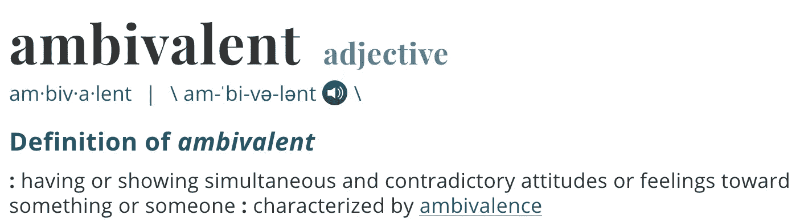

# 用一个词来解释你为什么卡住了

> 原文：<https://medium.com/swlh/one-word-for-why-you-are-stuck-d994991f33e7>

Photo by Charles 🇵🇭 on Unsplash

## 生存还是毁灭，这是个问题。——威廉·莎士比亚

我喜欢阅读，我经常思考写作会是什么样子。

不仅写作而且成为作家的想法。

内心深处有写作的欲望。但多年来，只有偶尔出现的词才会见诸报端。

我没有写，而是在想我不应该写的理由:

*   *没时间了？*
*   *我没那么好？*
*   我的同事会怎么想？
*   我在骗谁呢？我永远也不能以此谋生，所以为什么要投资时间呢？

我也会考虑我应该这样做的原因:

*   我想我会喜欢的
*   *我读了很多书，所以研究不成问题*
*   *我应该试一试，我会有什么损失*

写还是不写，是我思考多年的问题。想了很多，却没有写一个字！

你呢？你在拖延什么？在你的生活中，你渴望改变或开始做什么，但还没有？

为什么我们玩心理乒乓球，而不是对我们感兴趣的事情采取行动？

# 一个词解释了为什么…

如果用一个词来形容我们的挑战，会是什么？

这个词是矛盾的。

矛盾心理就是被卡住的定义。这就像我们的头脑中有两个辩论委员会在争论支持和反对有意义的行动。

为了减肥，你锻炼了几个星期，然后停止。你不想把钱花在琐碎的事情上，你制定了一个预算，并做了一周的好事。但是事情发生了，一个矛盾的欲望出现了，你买了你不需要的东西。

更糟糕的是，也许你正处于一个让你不感兴趣的职业生涯中。你知道你需要做出改变，朝着你热爱的方向前进，但是你仍然停留在原地。你被困住了并且不满。

矛盾心理的解药是做出决定并致力于它。但是你怎么能确定呢？如果你错了呢？

这些问题会让你止步不前，让你永远停滞不前。

你怎样才能超越只看到障碍而创造出你想要的结果呢？

# 不要责怪自己

你花多少时间说你应该停止你正在做的事情？你推迟了什么有趣的项目？

每年新年，世界各地的人们都会设定目标来阻止这种情况，减少那种情况，并解决 *xyz* 问题。

人们往往非常清楚他们应该改变什么，但他们从来没有这样做。为什么？

答案是他们设定了令人乏味的目标，认为石头可以比他们做得更好。

> 不要追求那些石头能比你做得更好的目标。
> 
> —马克·弗里曼

你想减少焦虑，摆脱恐惧。你知道你应该停止吃垃圾食品。有些坏习惯你知道对你没有帮助，你知道你应该停止这样做。

如果你是一块石头，这些都是伟大的目标。否则，你就是在为失败做准备。

如果你设定让你兴奋的目标，会有什么改变？如果意志力和纪律不是答案呢？

比如和几个朋友一起报名训练障碍赛。你会做一些有趣和令人兴奋的事情，减肥，感觉更健康，在这个过程中变得更强壮。

但是如此多的人选择了无聊的目标，以至于石头可以做得比他们更好。这些可笑的目标最初是从哪里来的？

# 你让头脑中的声音设定你的目标

你知道你头脑中的那个声音吗，那个让你无法采取有意义的行动的声音？

有一个声音在告诉你，你需要变得不那么雄心勃勃。这是一种内心的批判，它让你痛打自己一顿，并以自己的方式行事。

这是一台制造理由的机器，为你不应该前进制造各种理由。

[这种声音削弱了你领导他人的能力](https://zacharend.com/how-to-lead-from-the-heart-not-your-ego/)，夺走了你生命中宝贵的能量。

你让它设定了你所有的目标。如果这是你，那么你可能想知道如何[彻底解决这个声音](https://theascent.pub/is-fear-preventing-you-from-starting-b0632dcf7382)。

如果不是我们头脑中的声音，我们会听什么？倾听真实的低语——你的欲望、价值观、激情和真实的声音。

你的目标会转变成有意义的追求。你会给自己的生活注入能量、热情和参与。

减肥的目标转化为渴望感觉健康和有精力做重要的事情。

你花了多少时间去思考你一生中最想要的是什么？对你来说成功是什么样子的？

# 弄清楚你想成为什么样的人，想去哪里

如果你给我看你的日历，在过去的一周里，你花了多少时间思考你的人生方向？

也许你陷入困境是因为你还没有想清楚你真正渴望的是什么，也没有制定一个计划去得到它。

如果你花时间思考你想要什么，真正弄清楚它，并开始朝着它努力，你的生活会发生什么变化？

首先回答如下问题……

*   从现在起 5 年后，我想在我的生活中处于什么位置？
*   我会用过程中的哪些里程碑来表示进展？
*   我会采取什么步骤？
*   我将使用什么作为我旅行的燃料？
*   是什么点燃了我的火焰，在我的生命中创造了能量？

你已经有了这些问题的答案。当你花时间停下来，让声音安静下来，向内看，你会找到答案。

# 结论

> "你应该更关心你当前的轨迹，而不是你当前的结果."詹姆斯·克里

我们停滞不前的原因是我们对我们要去的地方充满矛盾。

我们让头脑中的声音来设定我们的目标，而不是去倾听什么是真实的，去跟随我们内心的方向。

我们把时间花在解决问题上，而不是创造我们想要的结果。

最重要的是，我们不再去想我们要去哪里，它是否会让我们兴奋，是否会挑战我们的成长。

如果你把每天的每时每刻创造你的目标作为你的目标会怎么样？

[当你发现什么对你来说是真实的时候，旅程就开始了](https://zacharend.com/how-to-discover-your-values/)。当你知道是什么点燃了你的激情，激发了你的能量，你会对自己的能力感到惊讶。

看着矛盾逐渐消失。

选择你的价值观，并承诺采取有意义的行动来实现你生活中想要看到的结果。

## 你想从你的生活中得到更多吗？

[免费下载我的发现你的价值观的 4 个步骤](https://pages.convertkit.com/47255dd5c9/d44858f307)。这个指南将帮助你更深入地了解自己，找到你热爱的工作，创造有意义和充实的生活。

*原载于 2019 年 3 月 20 日*[*zacharend.com*](https://zacharend.com/one-word-for-why-you-are-stuck/)*。*

## 这篇文章发表在 [The Startup](https://medium.com/swlh) 上，这是 Medium 最大的创业刊物，拥有+436，678 名读者。

## 在这里订阅接收[我们的头条新闻](https://growthsupply.com/the-startup-newsletter/)。

