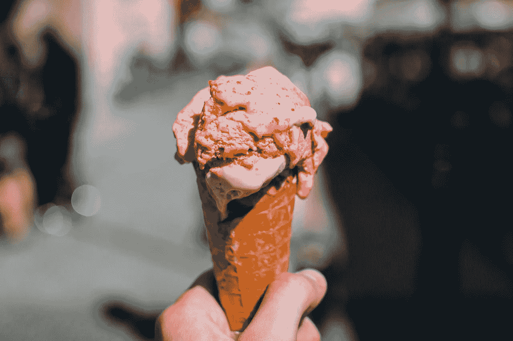

# 一个可以改善你内容的词

> 原文：<https://medium.com/swlh/one-word-that-will-improve-your-content-b3d2cd75eb7d>

Image by [StockSnap](https://pixabay.com/users/StockSnap-894430/?utm_source=link-attribution&utm_medium=referral&utm_campaign=image&utm_content=926426) from [Pixabay](https://pixabay.com/?utm_source=link-attribution&utm_medium=referral&utm_campaign=image&utm_content=926426)

我现在做内容营销已经 10 年了。

我可能已经写了 100 多篇博文了。我还制作了信息图表，录制了播客，甚至还针对特定的买家角色制作了一个常规的连环漫画。

关键是，我创造了过多的内容。并不是所有的都很好。实际上很多都很糟糕。