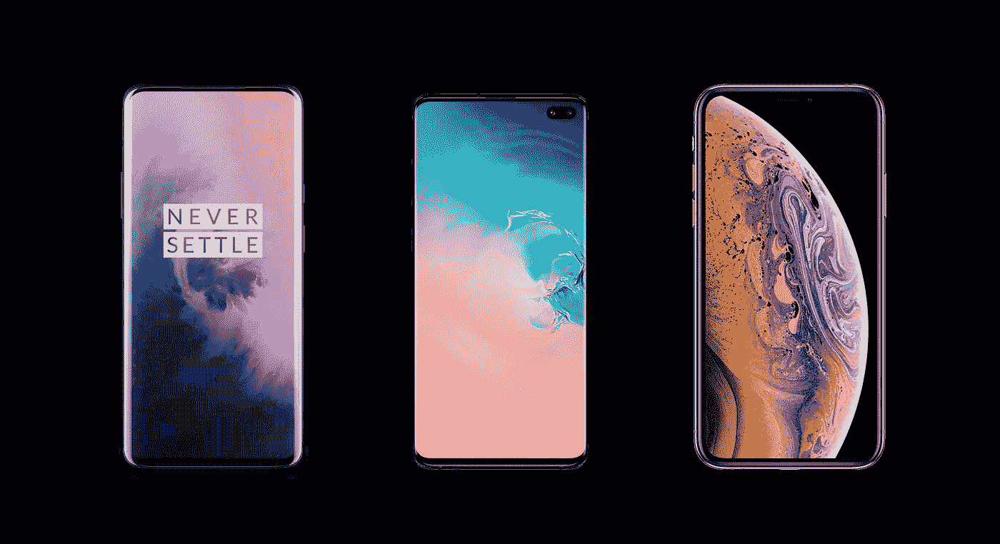

# 一加 7 很便宜，但还可以更便宜

> 原文：<https://medium.com/swlh/oneplus-7-is-cheap-but-it-can-be-cheaper-fd67b70d25ae>

## 对比一加、三星、苹果旗舰历年价格

[OnePlus 7 Pro](https://www.oneplus.in/7pro#/), [Samsung S10+](https://www.samsung.com/in/smartphones/galaxy-s10/) and [iPhone XS Max](https://www.apple.com/iphone-xs/) — Three of the best smartphones currently, but one is hundreds of dollars cheaper than the other two.

当一加在 2014 年 4 月发布第一款手机时，它改变了游戏规则。OnePlus One 的售价为 299 美元，不到三星 Galaxy S5 和 iPhone 6 价格的一半，提供了一个以零头价格与最好产品竞争的包。公司来了…