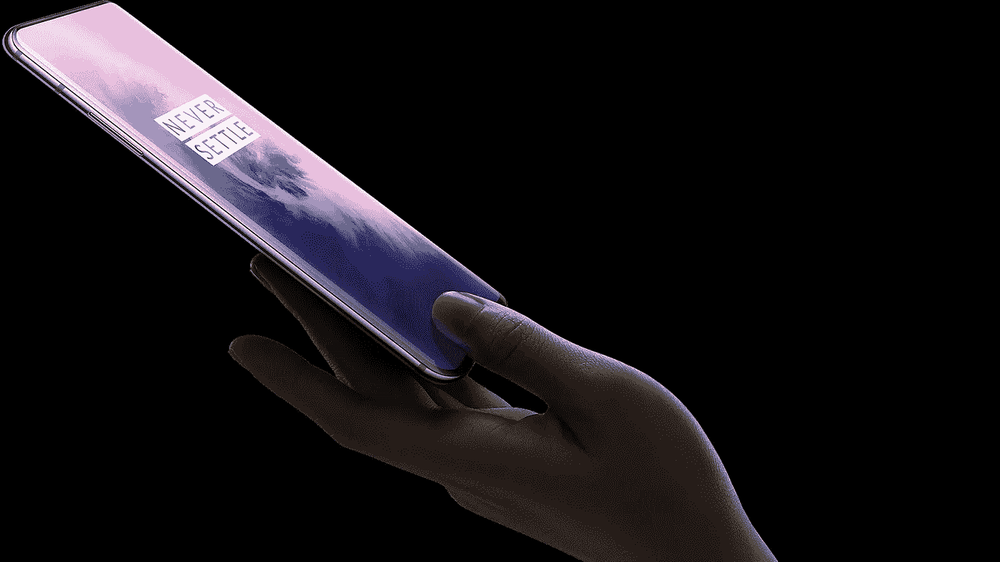

# 一加更懂得如何在网上销售

> 原文：<https://medium.com/swlh/oneplus-has-the-best-marketing-tactic-on-the-internet-bca071cbc3f2>

## 在互联网上，讲述产品故事的不是主题演讲，而是泄密和评论。

近半个世纪以来，苹果公司定义了电脑应该如何销售给大众。史蒂夫·乔布斯设计了这个宏大的主题演讲，他会在一个万众期待的时刻揭开每个产品的面纱，这个时刻被编织成一个引人注目的故事…