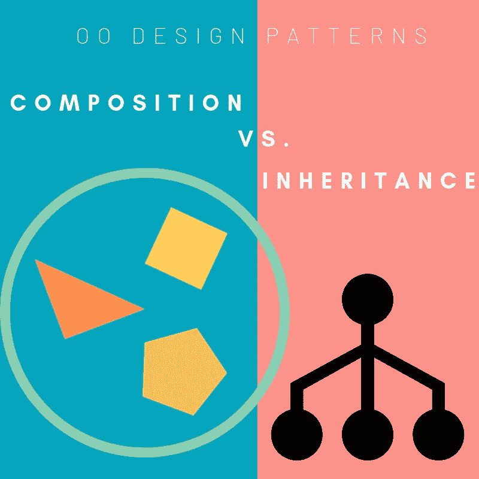

# 面向对象设计模式:组合与继承

> 原文：<https://medium.com/swlh/oo-design-patterns-composition-vs-inheritance-4206a6b018bb>

每个学徒的技术博客似乎都是如此，现在轮到我写一篇文章，比较和对比面向对象软件设计的两个主要方面:组合和继承。

我工作的第一门语言是 Ruby，它当然是面向对象的。甚至在我真正理解遗传或作曲之前，我就听说…