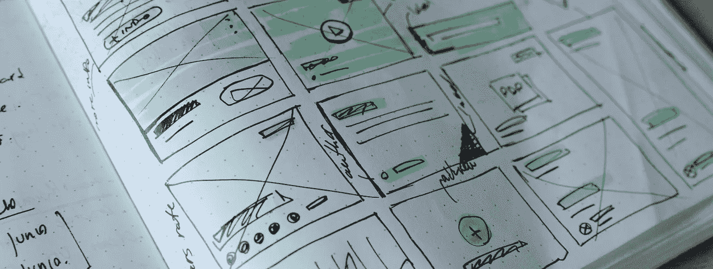

# 优化你的团队，而不是你的产品

> 原文：<https://medium.com/swlh/optimize-your-team-not-your-product-fbdfd10cea6b>

Photo by [José Alejandro Cuffia](https://unsplash.com/photos/_4815u_ACqQ?utm_source=unsplash&utm_medium=referral&utm_content=creditCopyText) on [Unsplash](https://unsplash.com/search/photos/ui?utm_source=unsplash&utm_medium=referral&utm_content=creditCopyText)

欣赏一个产品并试图解释这样一个解决方案是如何诞生的很容易。

大量的客户访谈、市场分析和深入的发现暴露了一个未解决的问题。快速原型制作、测试和无限迭代结合在一起，只需要足够的验证就可以继续。这些是我们在自己的产品流程中寻求重用的轶事和经验。