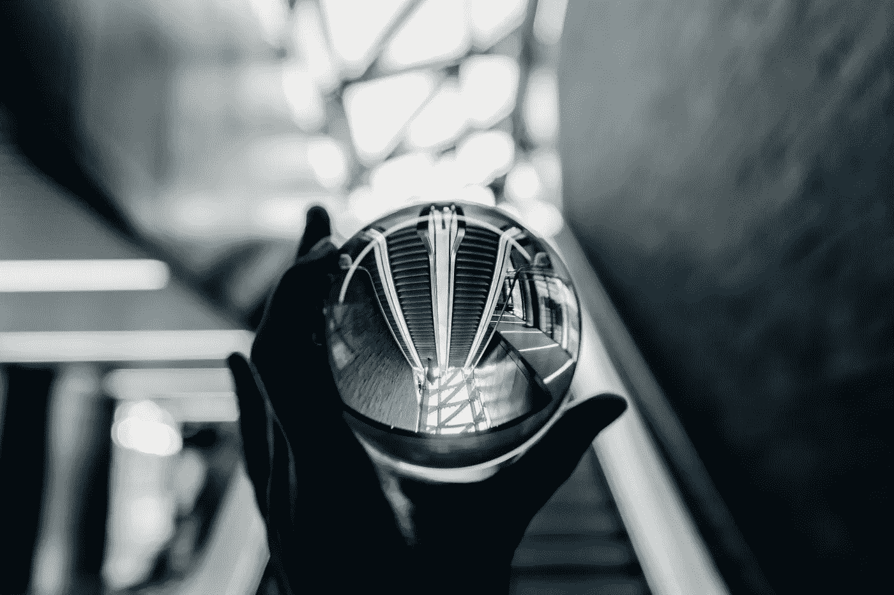

# 我们的致命缺陷和水晶球

> 原文：<https://medium.com/swlh/our-fatal-flaw-and-the-crystal-ball-9de08b096832>

## 我们不知道我们不知道什么。

Image Credit: [Nigel Tadyanehondo](https://unsplash.com/@nxvision?utm_source=unsplash&utm_medium=referral&utm_content=creditCopyText) on [Unsplash](https://unsplash.com/?utm_source=unsplash&utm_medium=referral&utm_content=creditCopyText)

算命师凝视着她水晶球的旋转迷雾。你听她讲述关于你和未来的故事。她知道你是谁，你曾经是谁，你将会是谁。

你相信她吗？

即使你说你没有，你有。因为算命先生不在什么神秘的帐篷里…