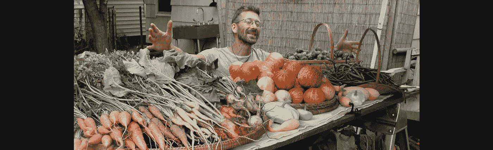

# 在真正的危机中，我们的蔬菜园不能养活我们

> 原文：<https://medium.com/swlh/our-veggie-gardens-wont-feed-us-in-a-real-crisis-a16e107f963e>

## 持续农业

A haul from the Author’s urban farming operation in Portland, Oregon, Sept. 15, 2007 *(Photo C.H.White)*

今年美国中西部地区的大规模洪水和高于正常水平的降水推迟或完全阻止了许多作物的种植。这种情况非常普遍，以至于从太空都能看到[。麻烦还没有结束:预计接下来比正常温度更热的天气可能会对玉米授粉产生不利影响](https://www.washingtonpost.com/business/2019/07/02/midwestern-farmers-struggles-with-extreme-weather-are-visible-space/?utm_term=.410659054198)