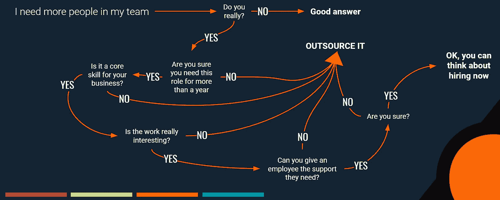

# 承包商，外包和建立自己的工程团队；选择哪一个以及何时选择

> 原文：<https://medium.com/swlh/outsource-or-do-it-yourself-a-guide-to-keeping-work-in-house-or-not-69ae4becb43d>

A not entirely serious flowchart of when to hire permanent staff

建立自己的团队是成为企业家的兴奋和承诺的一部分，但依靠企业外部的人才通常是正确的决定。外包和扩展你自己的团队都有风险和好处。在之前的一篇文章中， [*我描述了关于外包和永久员工成本*](/@Mark_Ridley/mythbusting-the-costs-of-building-teams-and-outsourcing-work-44ed635c4fdd) *的事实。今天，我们将带着* …