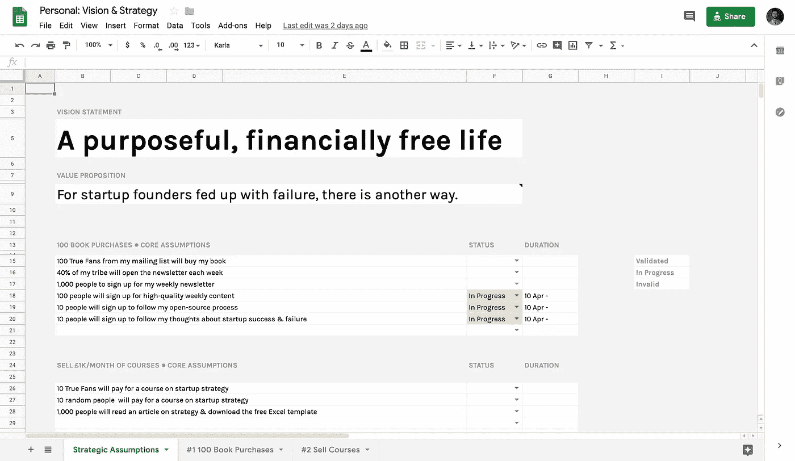
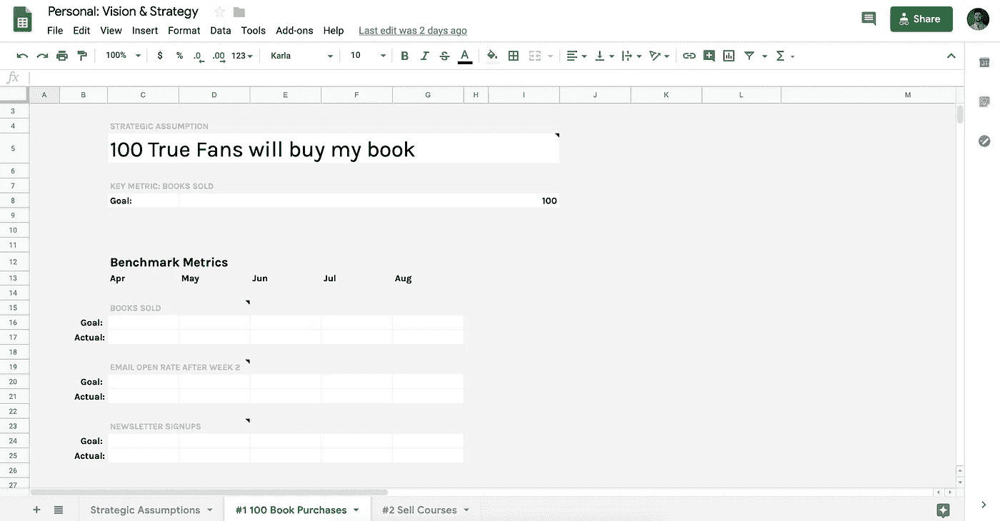
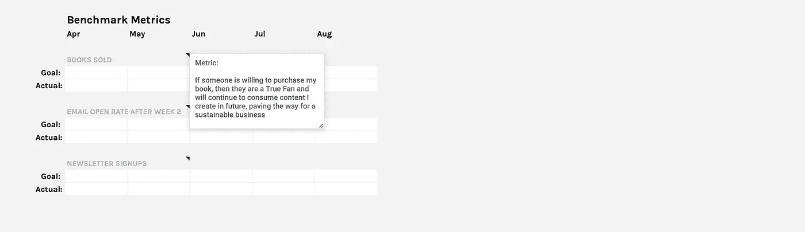
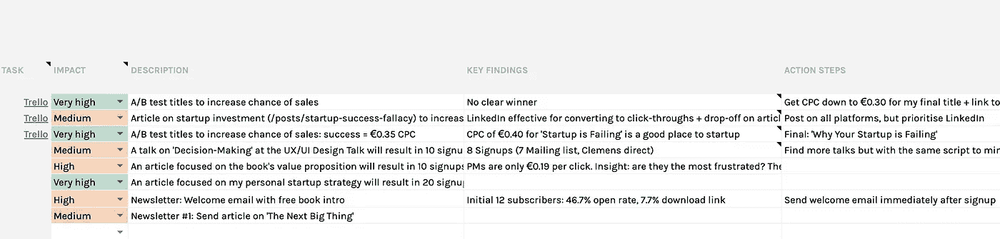

# 克服创业焦虑第 1/2 部分

> 原文：<https://medium.com/swlh/overcoming-startup-anxiety-pt-1-2-340025c4916d>

不幸的是，焦虑是创业过程中不可避免的一部分。

不确定性，无限不同的结果，随机事件的影响，快节奏，不断变化的环境和信息。所有这些都意味着我们所处的环境本来就是复杂和不确定的。当人类面临不确定性和复杂性时，我们自然会感到焦虑。

然而，我们不需要焦虑来吸引我们的注意力，对我们的表现和健康产生负面影响。如果利用得当——如果克服了——我们可以将它作为一个强大的工具，不仅让我们更有效地领导我们的业务和实现我们的目标，还可以帮助我们在工作中找到更多的平静，更好地享受旅程。

使用我开发的一个系统来处理焦虑和不确定性，这种焦虑和不确定性是从零开始创新和建立一家公司不可避免的，你也可以学习如何克服焦虑。

## 一切都不确定

创业时，一切都是不确定的。

我们不知道我们在试图解决什么问题。我们不知道我们的目标客户应该是谁。我们不知道我们能够——应该——构建什么来解决特定的问题。我们甚至不知道我们能否获得客户，留住客户，并最终从这些客户身上赚钱。

一切都是一个等待回答的问题。

我们所做的一切都依赖于一个多层次、灰色的未回答假设区域，我们需要验证这些假设，以确保我们的业务能够真正取得长期成功。

> “在与敌人接触之前，每个人都有一个计划”——冯·毛奇

但是，令人沮丧的是，每个假设一次只能解决一个。我们必须想出构建什么样的解决方案，这样才能测试我们是否能获得客户。我们需要获得客户来测试我们是否能留住他们。我们需要(在大多数情况下)留住客户，以弄清楚我们是否真的能从他们身上赚钱。我们需要从他们身上赚钱，然后确定我们是否能从他们身上赚到足够的钱来帮助我们实现盈利。

然而，建造新事物的内在不确定性是我们存在的现实。这是一个不可避免的事实，必须面对和克服。

不幸的是，许多创始人试图简单地忽略这个不方便的事实。他们盲目地、固执地相信这个计划一定会成功。他们将要建造的愿景是辉煌的。顾客肯定会喜欢它。

虽然这种方法会让你在幸福、平静的无知中运作，但结果几乎总是团队做错了事情&没有创造出一个有利可图的、可持续的业务。当不可避免的灾难到来时，团队突然意识到他们已经搞砸了，因为他们回避了他们应该在旅程开始时回答的困难问题，改变路线已经太晚了。(相信我，我不会鼓励任何人走这条路。我以前去过那里。)

然而，另一方面，当我们确实接受了深刻、复杂的不确定性的现实时，许多创始人在任务的压力和焦虑下崩溃了，因为你意识到了摆在你面前的任务的严重性和艰巨性，对你不利。

许多创始人在意识到他们所面临的巨大风险和挑战时，下意识的反应就是四处奔忙，惊慌失措，忙于任何事情。

他们不是专注于真正有效，也不是专注于他们需要回答的大战略假设，以了解他们是否有一个有效的长期商业模式，他们只是忙于自己，专注于无关紧要的繁忙工作。

一方面，为了避免过于自信地回避事实，另一方面，为了帮助我们面对&系统地克服因接受不确定性而产生的焦虑，我们需要一个过程来帮助我们找到正确的平衡。

我为实现这一目标而开发的流程不仅能帮助你在建立盈利企业的过程中回答关键假设，还能帮助你克服和减轻焦虑。

# 该过程

## 用确定性代替不确定性

我在创业界共事过的太多创业者都缺乏好的计划。

他们可能有一个愿景声明——一些关于改变世界的鼓舞人心的东西——但除此之外，他们真的只是随机应变，做任何事情&任何事情出现时看起来紧急的事情。

时间是用来灭火的，而不是为了一个特定的目标而刻意地、战略性地行动。

当我们没有明确的、可行的目标时，没有人知道优先考虑什么，做什么，如何进行。

因此团队四处奔波，压力很大，睁大眼睛，不确定他们应该做什么或为什么(这使他们更有压力，更睁大眼睛，更焦虑，更忙碌)。这真的有点恶性循环。这极大地损害了企业生产产品的机会，最终导致他们向客户交付价值&实现盈利。

从本质上讲，团队看不到清晰战略的必要性。

# 战略

如果愿景是我们激动人心的大目标(或目的地)，那么战略就是我们决定到达那里的路线。随着新信息的到来，一个策略可能——而且很多时候应该——发生变化，可能它不起作用，或者可能有更好的路线来帮助我们到达目的地。

战略决策是那些重大的、重要的决策，说:“伙计们，我们是因为这些原因走这条路，而不是那条路。”

这是为每个人选择一个明确的前进方向——每个人的行动都要专注于实现——而不惜牺牲其他一切。

通过清楚而自信地陈述我们想要去的方向，我们避免了一千个否则会发生的其他小决定:

_“我今天应该忙于这十项任务吗，它们看起来都很重要？！如果他们不为战略服务，就不会。”_

重点变得清晰，过去让我们忙碌的无止境、看似重要的任务被取消了，关于我们应该做什么和为什么做的会议和讨论减少了，因为当我们清楚地传达我们的战略时，事情变得清晰了。

为了定义我们的战略，我们将此作为我们业务和产品开发流程的一部分:

Example from my personal brand vision & strategy

例如，我的愿景是过“有目的、财务自由的生活”。

帮助我实现这一目标的一个策略是我的创业公司 Scribe。

另一个(上面显示的那个)是我正在努力实现的另一个策略。这个策略是在今年夏天有效地营销和销售 100 本我的新书，因为我认为这将为进一步的咨询、演讲和写作机会创造一个强大的跳板。

然而，为了实现这个目标，我不得不分解一系列需要验证的假设，以帮助我实现购买 100 本书的目标。

例如，如果我不能说服 10 个人通过我的文章以及我的任何其他战略设想注册我的时事通讯，那么我就不能实现那个战略，而应该转向尝试新的东西。

这种方法使我们的战略的实现有些令人气馁，因为我们意识到它取决于回答许多其他问题才能实现，但这种有条不紊的方法是确保我们在实现我们的目标方面实际上取得进展(或没有进展)的唯一方法。

再说一遍，我们要么忽视这个难以忽视的事实，在这个令人生畏的现实面前崩溃，要么干脆接受它，面对它，有条不紊地处理它。

## 运用策略带来确定性

一旦我们定义了我们的战略，我们需要将我们的工作集中在回答我们的战略需要验证才能成功的假设上，并跟踪沿途的进展。

然而，问题是，当我们回到日常工作中时，我们很快就会忘记那些愿景会议&我们做出的战略决策，这可能是危险的。

因此，为了让我们自己专注于回答我们的战略假设(记住，那些关于我们走向哪个方向的重大决定，并检查我们的进展以确定它是否是正确的方向)，我使用以下方法来确保我们所做的一切都与我们的战略相关联&支撑我们业务成败的战略假设。

## 路标

当您开始执行以实现我们的战略时，您可以使用以下框架来管理您的时间，使您专注于您的目标:

My personal strategy to sell 100 book copies

**1。在第二个标签上，写下你必须回答的大战略假设，以验证你的战略是否有效。**对我来说，例如，我目前正在计算是否会有“1000 名真正的粉丝(顾客)购买我的书”。

The key metrics to track my progress towards my strategic goal

**2。定义明确的指标，您需要改进这些指标来帮助您实现目标。以我为例，我目前的策略是:**
1。获得时事通讯注册，这样我就可以用我的内容提供价值&信任
2。发送有规律的、高影响力的内容，吸引我的受众来建立价值&信任
3。最终向读者卖出 100 本我书(很明显可能超过 100 本，但在重新定义我的方法之前，这似乎是我的第一个目标)

Experiments I am running to achieve my strategic goal

**3。定义有助于提高这些指标的实验，并最终确保您当前的策略有效**

1.影响:定义你认为这个实验对提高你的关键指标有多大影响。考虑到我们的资源有限，我们应该始终致力于影响力大、工作量小的任务，这样才能给我们实现目标的最佳机会(有时我们需要做一些必要的、但影响力小的事情，比如我早期的时事通讯，只有少数读者)
2。描述:不要将我们的工作定义为“任务”，我们专注于我们正在做的事情(例如，“我们应用程序中的聊天功能”)，如果你用具体的术语描述你的工作，相对于你的战略&关键指标，作为一个“实验”(例如，“建立聊天功能将增加 20%的销售额”)
3。关键发现:一旦我们开发并启动了实验，我们必须停下来评估实验是成功还是失败(即，它是否实现了我们假设的关键指标的增长)
4。行动步骤:一旦我们知道了结果，我们就可以利用这些信息来指导下一步的工作。如果这个实验没有足够的影响力，我们可以放弃这个想法，或者做一个我们认为更好的版本。如果它确实产生了影响，我们可以加倍努力，尝试再次提高。

如果这一切让你觉得有点不知所措，有点让人焦虑，那也没关系。我只是提供了一个概述&对这个过程如何帮助你作为一个企业和个人变得更有效的总体理解。

在本文的第 2 部分，我们将使用我自己的企业和个人目标中的例子，深入探讨我如何克服焦虑和保持专注，同时努力实现日常战略的具体步骤。

## 这篇文章发表在 [The Startup](https://medium.com/swlh) 上，这是 Medium 最大的创业刊物，拥有+446，678 名读者。

## 在这里订阅接收[我们的头条新闻](https://growthsupply.com/the-startup-newsletter/)。

