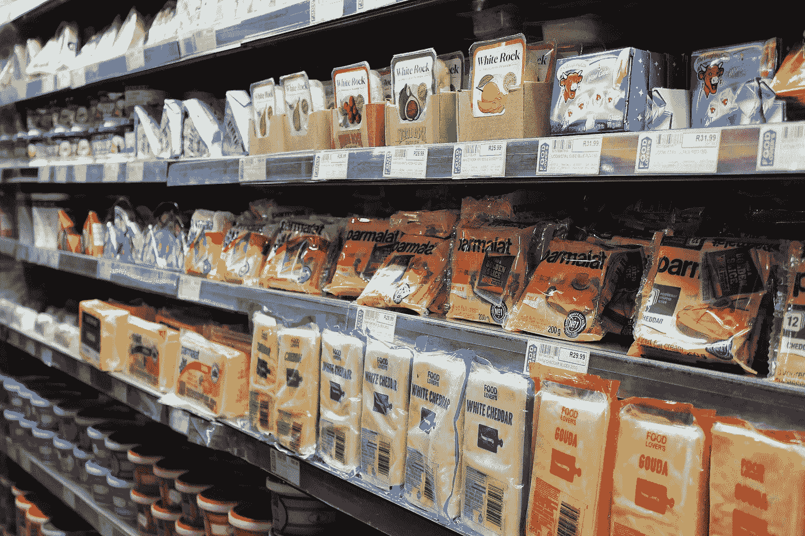

# 使用机器学习克服零售路边取货的限制

> 原文：<https://medium.com/swlh/overcoming-the-limitation-in-retail-curbside-pickup-using-machine-learning-3bde7e05168b>

零售领域最近的趋势是**路边的小货车**。该模式的一些有趣之处在于其劳动密集型&耗时的提货&包装操作，这限制了在给定时间点可以服务的订单数量。零售店已经成为零售商将产品送到零售商手中的配送中心