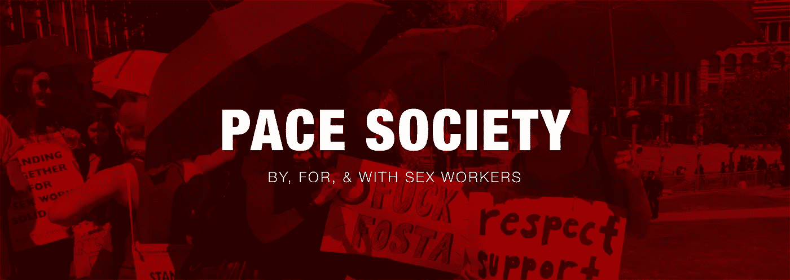

# 佩斯社会:UI 案例研究

> 原文：<https://medium.com/swlh/pace-society-a-ui-case-study-2bd82bf3354b>

**警告:**请注意，本文包含敏感内容，可能会冒犯某些人。

# 介绍

对于我们在 RED Academy 的第四个项目，我们与第二个社区合作伙伴合作，根据我们客户的要求和他们用户的需求设计了一个网站。我们在一个由 UX 和 UI 学生组成的团队中为这个项目重新设计了一个响应式的…