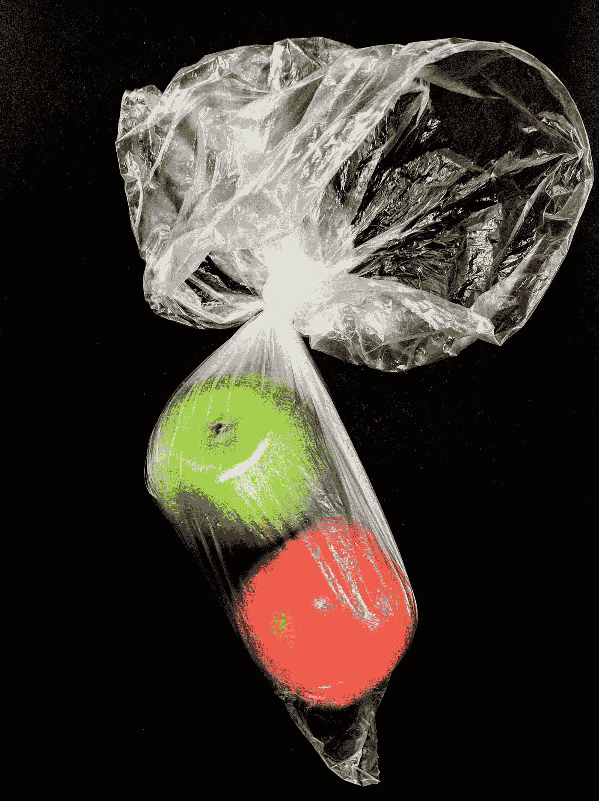

# 纸或塑料

> 原文：<https://medium.com/swlh/paper-or-plastic-b014a9cb2c77>

拯救地球的时间到了

Photo by [Sophia Marston](https://unsplash.com/@sophiajmars?utm_source=unsplash&utm_medium=referral&utm_content=creditCopyText) on [Unsplash](https://unsplash.com/search/photos/plastic?utm_source=unsplash&utm_medium=referral&utm_content=creditCopyText)

我居住的城市几个月前通过了一项法律，禁止在商店使用塑料袋。该法律上周没有生效。我毫无察觉地走进商店，却发现如果我想要一个纸袋，我需要付 5 美分。这并没有困扰我。然而，我的儿子拒绝付钱，他一边小心翼翼地抱着一加仑牛奶、西红柿和一盒麦片，一边走向他的车。他告诉我关于…