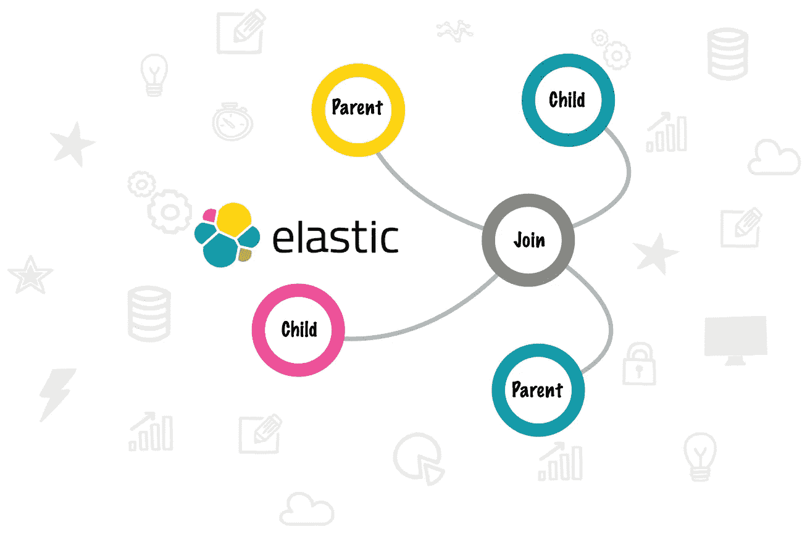

# 通过 ElasticSearch 7 实现亲子连接

> 原文：<https://medium.com/swlh/parent-and-child-joins-with-elasticsearch-7-381f6cca73fe>

在关系数据库中，子表引用带有外键的父表，这种关系称为**连接**。设计通常包括[标准化](https://support.microsoft.com/en-gb/help/283878/description-of-the-database-normalization-basics)数据。

ElasticSearch 是**而不是**一个关系数据库，它是关于搜索效率而不是存储效率。存储的数据是[非规格化的](/@katedoesdev/normalized-vs-denormalized-databases-210e1d67927d)并且非常平坦。这意味着联接不能跨越 [**索引**](https://www.elastic.co/guide/en/elasticsearch/reference/6.2/_basic_concepts.html#_index) …