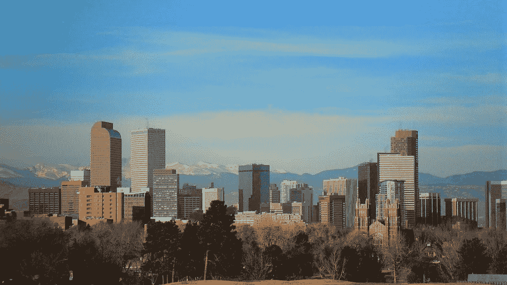

# 公园和绿地必须是任何气候解决方案的一部分

> 原文：<https://medium.com/swlh/parks-and-greenspace-must-be-part-of-any-climate-solution-44a570ca40a7>

[*这个故事最初刊登在*智能城市潜水](https://www.smartcitiesdive.com/news/parks-and-greenspace-must-be-part-of-any-climate-solution/556324/)上

最常见的是，气候变化在极端天气事件中显露出来。我们打开报纸或新闻应用程序，看到它令人不安的一面:加利福尼亚州肆虐的野火，西南部干旱，致命的零下温度和中西部毁灭性的洪水。

Photo: Wikimedia Commons