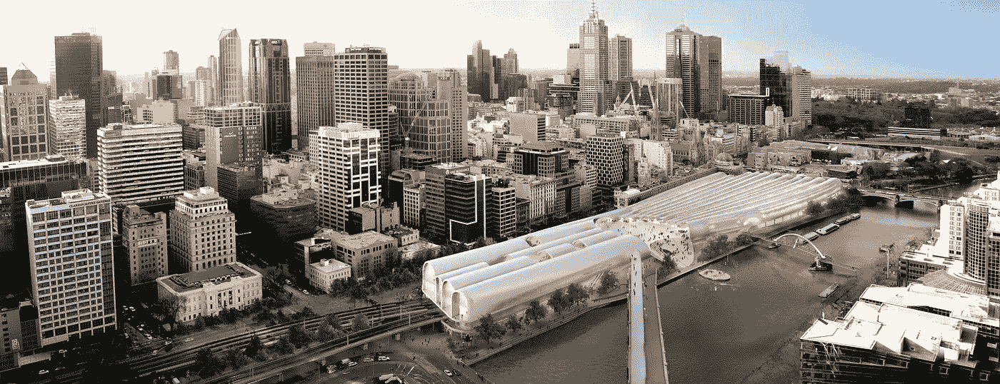

# 互联网:参与式设计新时代的承诺？

> 原文：<https://medium.com/swlh/participatory-design-in-the-age-of-the-internet-4b9039eac73e>

Winning Proposal of Melbourne’s Flinders Street Station competition. Image Courtesy of HASSELL + Herzog & de Meuron

## 检查它在当代过程中的使用。

***参与空间的设计***

著名建筑师丹尼尔·里贝斯金德强调，一个城市是由市民组成的，本着民主的精神，他们不仅应该能够参与城市规划的制定