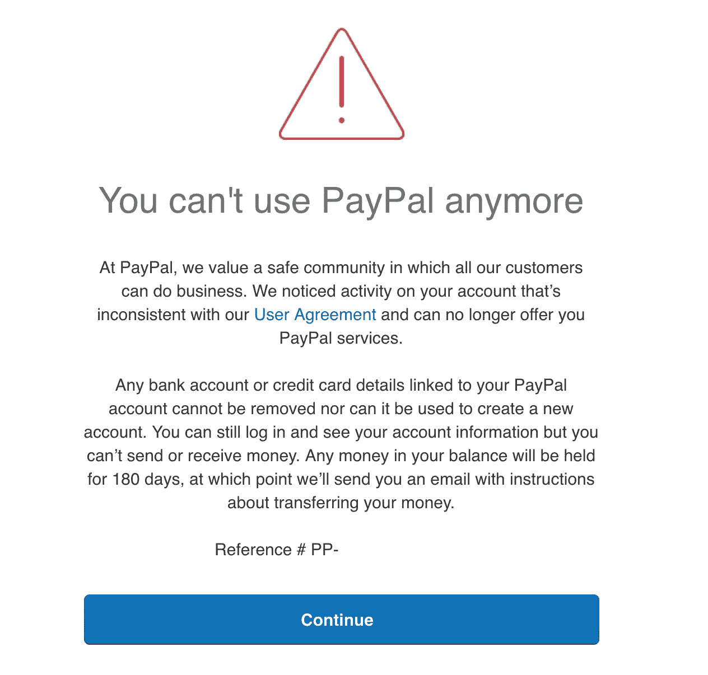

# 如果你的数据被列在暗网上，PayPal 可能会限制你的账户

> 原文：<https://medium.com/swlh/paypal-may-limit-your-account-if-your-data-is-listed-on-the-dark-web-174dec65cf24>

[来源](https://cdn-images-1.medium.com/max/1600/1*vzUyM95At4tWqnvtlgCmvQ.png)

PayPal 为什么限制账户？如果你的贝宝账户是有限的，也许你就是违反贝宝待办事项的人。或者，他们只是想保护你。

请继续阅读，了解 PayPal 限制帐户{s}的原因，了解如何检测 PayPal 诈骗，以及如何防止您的帐户被限制。