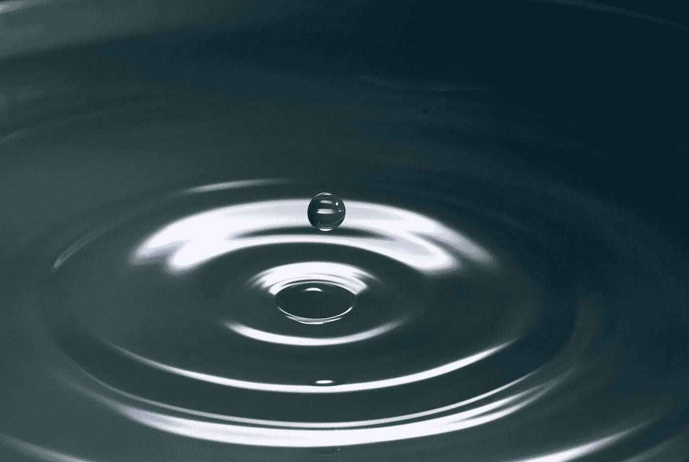

# 和平在“这甚至正在过去”

> 原文：<https://medium.com/swlh/peace-in-this-is-passing-even-now-44bd1f7ac00e>

## 忘记“这一切都会过去的”

Photo by [Levi XU](https://unsplash.com/photos/dOhJtfXJZfw?utm_source=unsplash&utm_medium=referral&utm_content=creditCopyText)on [Unsplash](https://unsplash.com/search/photos/mindfulness?utm_source=unsplash&utm_medium=referral&utm_content=creditCopyText)

即使现在也是这样。

即使现在也是这样。

即使现在也是这样。

即使现在也是这样。

无论我们如何看待和衡量事物，此刻它们都在不断变化。我们正在改变。我们的环境正在改变。每个人和…