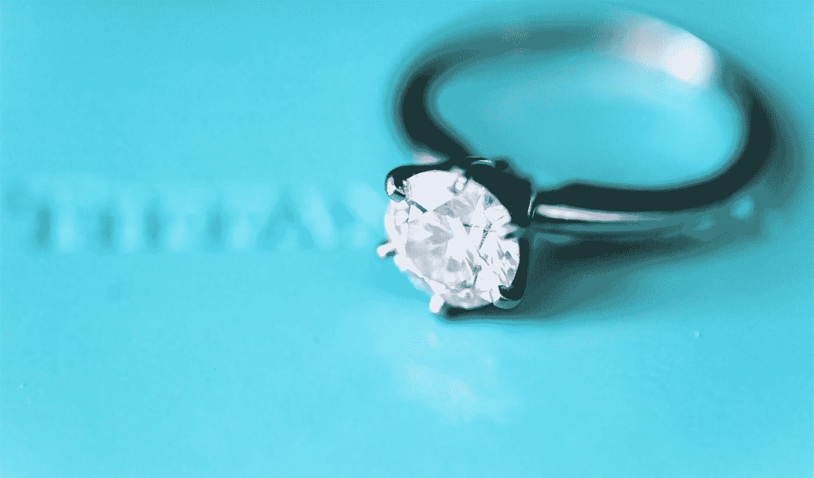

# 人们不会购买功能或好处。他们购买情感。

> 原文：<https://medium.com/swlh/people-dont-buy-features-or-benefits-they-buy-emotions-c7d1c4a646e8>

Photo by [__ drz __](https://unsplash.com/@__drz__?utm_source=medium&utm_medium=referral) on [Unsplash](https://unsplash.com?utm_source=medium&utm_medium=referral)

在我做营销之前，我是做销售的。

我的第一份销售工作是在一个小郊区的劣质商场的珠宝店。我不太擅长。也许比某些人好，但绝不是最好的。

我被灌输了这样一种观念:要成为一名优秀的推销员，你必须与顾客谈论好处，而不是特点。