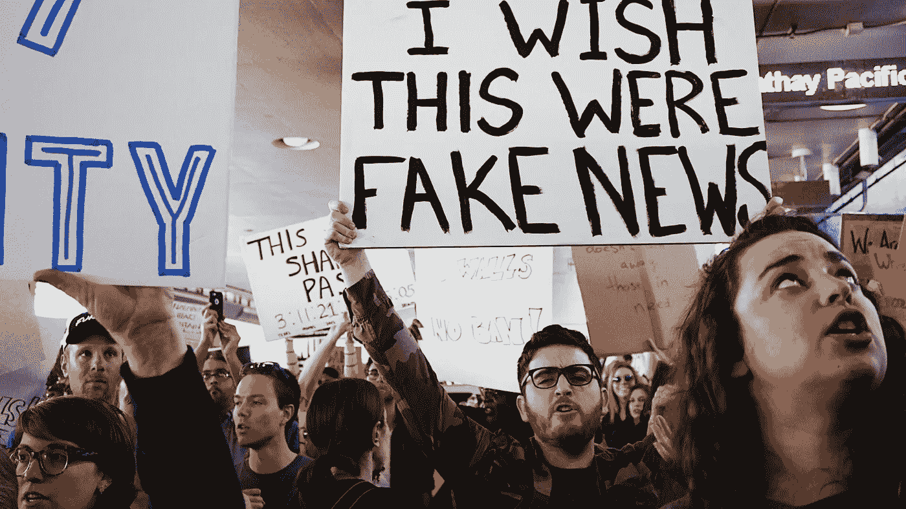

# 人们喜欢坏消息

> 原文：<https://medium.com/swlh/people-love-bad-news-b0a4ec149ddb>

## 为什么我们会吞噬消极，而事实远不止如此呢？

Photo by [Kayla Velasquez](https://unsplash.com/photos/6Xjl5-Xq4g4?utm_source=unsplash&utm_medium=referral&utm_content=creditCopyText) on [Unsplash](https://unsplash.com/search/photos/protest?utm_source=unsplash&utm_medium=referral&utm_content=creditCopyText)

想一个典型的对话。人们更有可能讲述一个积极的故事还是一个消极的故事？

或者更确切地说，你会不会更有可能关注某人讲述的悲剧故事或快乐故事？