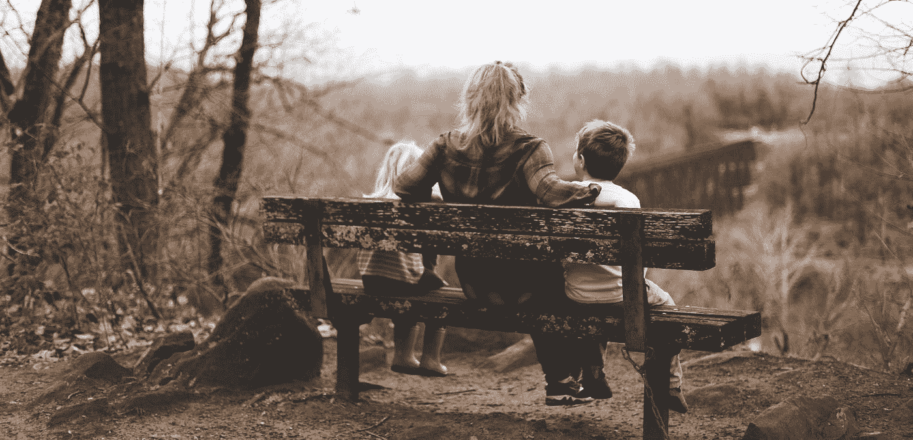

# 完美育儿:指南

> 原文：<https://medium.com/swlh/perfect-parenting-a-guide-c9cbde3ddf5b>

Photo by [Benjamin Manley](https://unsplash.com/@benjaminmanley?utm_source=medium&utm_medium=referral) on [Unsplash](https://unsplash.com?utm_source=medium&utm_medium=referral)

如果你想成为一个完美的父母，只有一条严格的规则可以遵循:

不要有孩子。

说真的。如果你想成为完美的父母，最好不要孩子，否则，你只会让自己失败。这是一个严酷的事实，当我们在策划和计划如何比别人做得更好——比我们自己做得更好——时，我们却忽略了这个事实