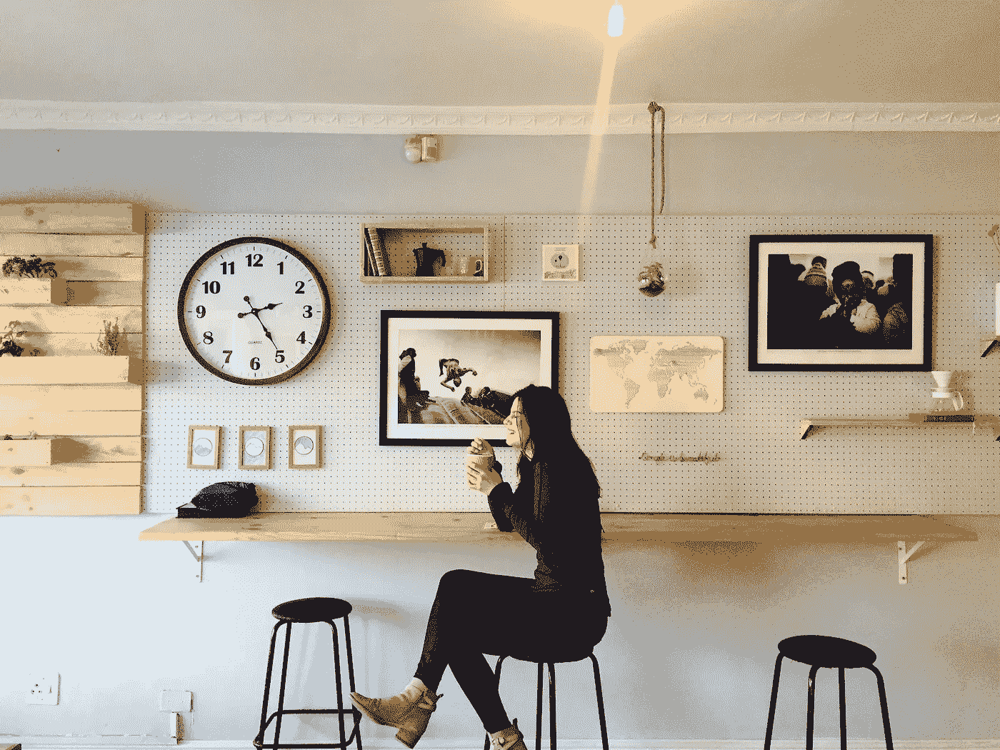

# 完善拖延的艺术

> 原文：<https://medium.com/swlh/perfecting-the-art-of-procrastination-9b9d504d803f>

Photo by [Kaylah Otto](https://unsplash.com/@kaylahotto?utm_source=unsplash&utm_medium=referral&utm_content=creditCopyText) on [Unsplash](https://unsplash.com/search/photos/clock?utm_source=unsplash&utm_medium=referral&utm_content=creditCopyText)

倒退常常被视为一件坏事。家长们被叫进学校，一直听他们孩子“表现平平，平均绩点下滑”的故事。最常见的原因是，他们的孩子缺乏动力，拖延完成许多任务，导致他们错过最后期限，并对周围的孩子产生不良影响。然而，我对…持观望态度