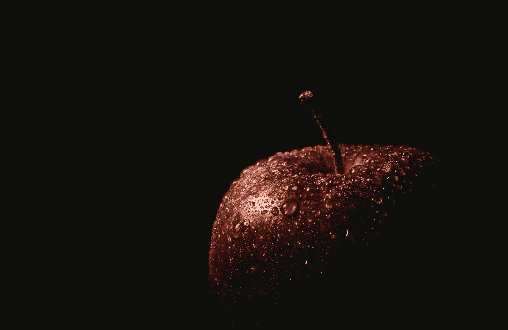

# 完美只是一种幻觉

> 原文：<https://medium.com/swlh/perfection-is-only-an-illusion-3cf83c12ab0f>

Photo by [Carlos Alberto Gómez Iñiguez](https://unsplash.com/@iniguez?utm_source=unsplash&utm_medium=referral&utm_content=creditCopyText) on [Unsplash](https://unsplash.com/search/photos/red-apple?utm_source=unsplash&utm_medium=referral&utm_content=creditCopyText)

今天的社会通过经济实力或不同类型的关系，在身体外观或生活质量方面比以往任何时候都更加追求完美。他们不想理解人类是以这样一种方式被创造的，他可以贬低任何对某人来说似乎完美的东西。我读过许多关于完美的文章，它们没有包括许多重要的观点，最重要的是没有提供…