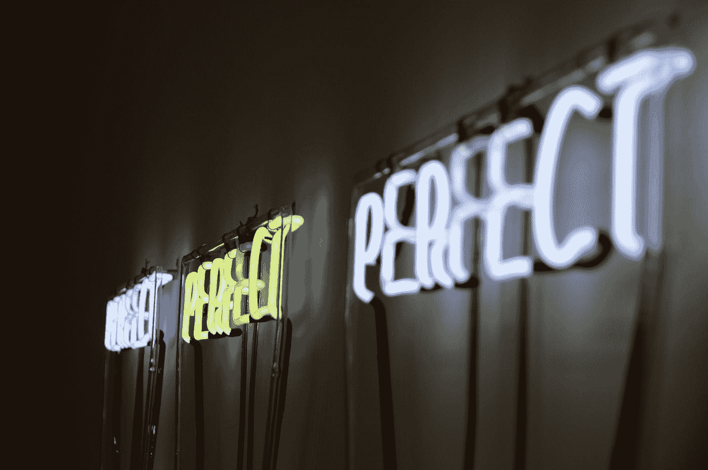

# 完美是完成的敌人

> 原文：<https://medium.com/swlh/perfection-is-the-enemy-of-done-a9cb50bffa2f>

## 完美主义正在伤害你的生活和事业，以下是你可以做的。

Photo by [Jonathan Hoxmark](https://unsplash.com/@hoxmark?utm_source=medium&utm_medium=referral) on [Unsplash](https://unsplash.com?utm_source=medium&utm_medium=referral)

当你发出一封电子邮件时，你胸中的焦虑——你花了半个小时写并校对了五次，只是为了确保你包括了所有的细节和你的语法正确——对你没有任何好处。

你重视展现自己最好的一面，并希望确保自己是专业的，在任何时候都显得有能力。虽然你坚信小细节很重要，但在你不愿意在世界变得*完美之前将你的任何创造推向世界的状态下工作，*可能弊大于利。

不断有压力要求我们做得更多，做得更好，取得更大的成就，无论我们在哪里看到的信息都是一样的。

*你还不够，除非你变得完美，否则你永远都不够。*

这个信息被内在化了。我们开始在脑海中反复播放它，一遍又一遍。然后，我们开始忙碌，试图通过外在的成就来证明自己的价值，并设定不可能达到或保持的高标准。

当我们陷入完美主义时，任何错误都会遇到自我批评的内部对话，我们会对自己产生羞愧、内疚和其他有害的想法。

*我们认为严厉的爱将足以航向正确；我们可以羞愧地做得更好。*

当涉及到你的职业和生活时，追求完美会拖你的后腿。

这是一种产生时间消耗的焦虑，它让你无法通过尝试和错误来学习，实现你的目标，并最终让你更接近你在生活和工作中想要的地方。

# 转变你的心态

你不是唯一一个与完美主义做斗争的人——完美主义无处不在，你很难找到一个无法理解的人。从很小的时候起，我就陷入了与我的外表直接相关的完美主义的无尽循环中。

这种永远不够好的心态转化为我在整个教育过程中的表现，以及后来在我建立职业生涯时的表现。因为我确信我的外表是如此的缺乏，我用我的大脑和智力从人群中脱颖而出。

我想，如果我看起来不像那个角色，我会用另一种方式让自己变得与众不同，这有望带来成功——的确如此，但代价很高。

我的事业进展很快，但我总是焦虑和沮丧。当涉及到我的书面工作时，我对自己有着难以置信的高标准，在我的角色中，我花了大约 50%的时间来写作，这被证明是一个完全浪费时间的任务。

我害怕发送电子邮件或翻动明显是草稿的文件，因为我不想显得无能。

有一个持续不断的疑问，如果我不能把我第一次做的东西完美地呈现出来，那就没有做它的意义。

经历和一些艰难的打击把我带到了一个地方，在那里我意识到我对完美的追求正在阻碍我。

虽然我想生产一个高质量的产品，并保持高标准，但我现在可以看到它直接阻碍了我的进步。

随着我心态的微妙转变——完美固然很好，但它不会让你去你想去的地方——我已经能够放松自己了。

完美主义不会带来成功，相反，它让我们无法避免失败以及随之而来的痛苦。然而，只有通过这些负面的经历，我们才能真正建立起反弹的技能和弹性。

你想重新振作起来，而不是陷入我称之为“完美瘫痪”的状态——不能也不愿意做出决定，因为害怕如果你前进会发生什么。

当你发现自己因为完美主义而怀疑下一步该怎么做时，提醒自己以下三件事:

*   完美主义是完成的大敌。如果我继续让它决定我如何以及何时将我的想法和愿景付诸实践，这会扼杀我的生产力。完成比一大堆“如果”要好。
*   因为我不确定会有一个完美的结果而推迟一个项目或试图避免做决定，最终会导致我陷入困境，无法实现我的目标。
*   没有人是完美的，每个人都会犯错。我的完美主义没有帮助我实现更多，相反，我在避免失败和我认为随之而来的*痛苦。*

# 与失败交朋友

对我们大多数人来说，失败是一个肮脏的字眼。我们把它看作是对我们自我甚至核心身份的负面的、潜在有害的威胁。

没有人想失败，并冒着被家人、朋友和同事评判的风险。对于完美主义者来说，我们也知道一些最糟糕的羞愧和内疚来自我们自己的内心对话。

*我怎么会这么笨？我应该知道得更清楚。只有白痴才会不经过第五次校对就把那份建议书寄出去。*

在过去的一年里，我在职业生涯中尝试了很多新事物。我从一家大型医疗保健机构到一家小型非营利机构，是因为有机会尝试领导角色。

当我开始时，我坚持自己一贯的“完美”标准，很快发现自己被淹没了。我只是无法在保持尽最大努力的同时满足这个角色的要求。

我必须学会放手。

这让我感到不舒服和焦虑。就好像我对所有事情都半斤八两(在某些情况下我就是这样)，因为我没有其他选择。在某些情况下，这并不重要，但在其他情况下，我清楚地听到我没有达到预期。

对于一个从未有过糟糕表现的终身优秀者来说，这是一记冰冷的耳光。在我看来，我完全彻底失败了。

虽然我会反复思考如何从一开始就避免这个错误，但我也有时间去适应不完美和失败的感觉。

事实证明，其实也没那么糟糕。我给自己增加了很多自我同情，评估了我承受的所有压力，决定是时候和失败交朋友了。

 [## 在一个充满耻辱的世界里，自怜是一种激进的行为

### 将这一重要的实践加入到你的生活中，让事情变得更好。

medium.com](/@shannonhennig/in-a-world-of-shame-self-compassion-is-a-radical-act-96cb6e68f531) 

我对工作和生活采取了一种态度，我只是告诉自己，完美是不可能的，我会失败——当我失败时，我拥有了东山再起所需的技能。

现在，每当失败是一种可能的结果时，我会做三件事:

*   问自己最坏的可能结果是什么，并详细写下来。我还列出了如果这种最坏的情况真的发生了，我会怎么做。通过把自己暴露在“如果”中，并且清楚地知道我该做什么来度过难关，恐惧就会退居其次，我就能继续前进。
*   提醒自己，失败是最好的老师。绝对最好的。虽然这可能会有点刺痛，并导致我改变方向，但还没有失败或犯错误导致我的生活崩溃的情况。我会列出所有没有按计划进行的事情，以及我从这些事情中学到的东西，来提醒自己我是有韧性的。
*   从我的字典里去掉“完美”这个词，重新定义“我最好的”是什么样子，注意我目前的处境和环境。有时这意味着仅仅是出现的行为就是一个巨大的胜利。

虽然我们都想做出高质量的工作并做出正确的决定，但我们都会犯错并最终失败。完美主义是一种工具，我们用它来说服自己，我们是以成功为导向的，而实际上它是用来避免失败的。

通过改变你的心态，将完美视为生产力的敌人，并朝着你的目标取得实际进展，你就可以摆脱随之而来的麻痹。

随着你如何看待自己的改变，以及承认完美不会让你达到你想要的目标，与失败交朋友的过程是有价值的。它将建立你的弹性，并作为你需要的证明，你可以从挫折中恢复过来。

加入我的简讯吧！提高你的生产力，平衡工作和生活，向自主创业迈进。