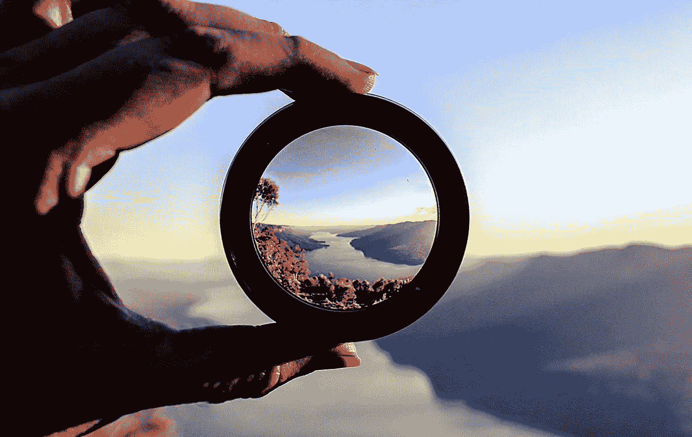

# 视角和领导力

> 原文：<https://medium.com/swlh/perspective-and-leadership-cd0dce5d50f1>

“…如果我们改变看待世界的方式，这实际上改变了我们感受和行动的方式，进而改变了世界本身。” **道格拉斯·艾布拉姆斯**

我的妻子是一个艺术家…一个非常好的艺术家！尽管她声称自己不是，但证据显示并非如此。我经常看她画画，但我只能做很短一段时间。不管是什么媒介的艺术都需要极大的耐心，这不是我的强项。凯伦…