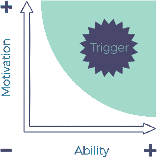
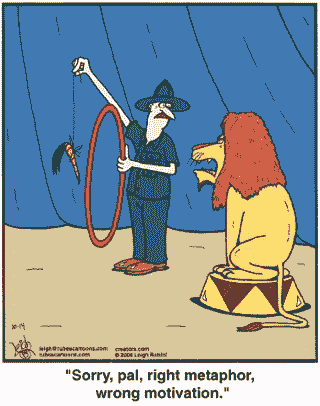
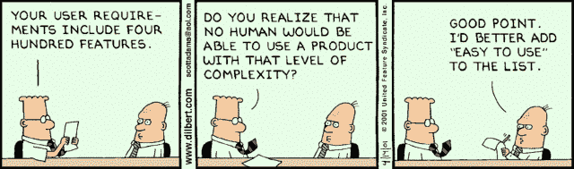
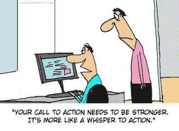
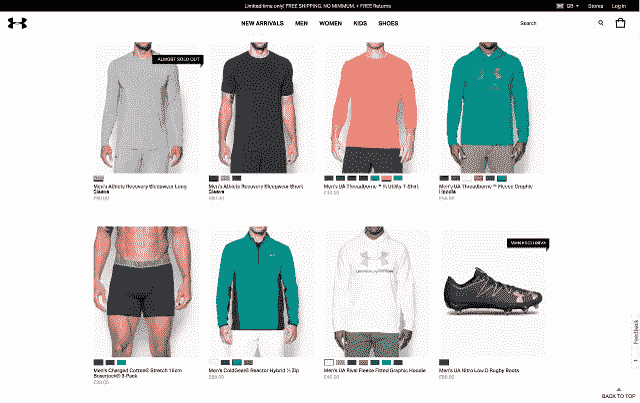
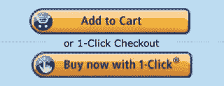
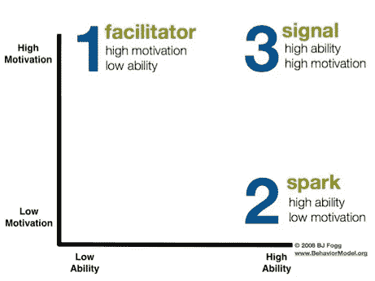

# 使用福格的行为模型进行更敏锐、更有说服力的设计

> 原文：<https://medium.com/swlh/persuasive-design-for-ecommerce-webshops-c52d4d1f3c38>

行为是复杂的。准确预测是多方面的，也是具有挑战性的。然而，凭借今天技术和数据赋予我们的能力，我们获得了前所未有的机会来更深层次地理解行为。

在过去，当涉及到研究人类行为时，众所周知，心理和社会研究可以产生有前途的研究和相互关系的途径。但是，与此同时，它们通常缺乏外部有效性，因此很难将发现转移到“真实世界”。

今天，我们发现自己处于完全不同的境地。我们现在有工具来测试通过高流量平台的实证研究建立的假设。有了这个测试真实行为的机会，科学模型已经适应了网络环境的需要。

# 从旧的设计方法过渡到新的设计方法

前段时间，我们介绍了[精化似然模型](https://blog.crobox.com/article/persuasive-design-elm)，这是说服性沟通中最常用的理论之一。但是时代在变，我们使用和应用于我们需求的模型也在变。

在向更实际的相关模型过渡的过程中，我们经历了福格行为模型的诞生。斯坦福说服技术实验室的创始人 BJ·福格考虑到 UX 网站，创建了这个模型。

“我的行为模型表明，一个行为的发生必须同时具备三个要素:动机、能力和触发因素。当一个行为没有发生时，这三个要素中至少有一个是缺失的。”

[BJ·福格](http://www.behaviormodel.org/)

# 使用 FBM 识别行为障碍

有时，即使有最好的网店设计，购物者也不会按照你想要或期望的方式行事。FBM 帮助行为设计师和电子商务经理识别导致问题的因素，以创建有效的有说服力的设计。

福格行为模型

上图显示触发的最佳时间是能力和动机高的时候(右上角)。满足这些要求的人有很强的积极性，能够完成任务，这使他们成为行为触发器的主要候选人。

但是，自然地，这些元素并不总是完全一致的，这就是为什么尝试和改进缺少的部分很重要。

让我们单独看一下模型的这些组件。

# 动机

当有人来到你的网站时，他或她已经有了完成购买的动机。我的意思是，他们访问你的网站是有原因的，对吗？

如果没有，这将是一场艰苦的战斗，因为这是最难改变的因素。但是，有一些方法可以激发动机。例如，通过:

感觉:寻求体验快乐或避免痛苦。这些强烈的动机被认为是对信息的一种原始而直接的反应。

期待:希望好事发生或害怕坏事发生。这些激励因素与对未来事件的预期有关。

归属感:被社会接受的需要或对被社会拒绝的抵抗。对人类来说，属于某个地方的渴望是压倒一切的，这促使他们以某种方式行动。

在这个模型中，动机是说服的主要驱动力，并反过来促进期望的行为。你可以把它看作是消费者在网上购物过程中的情感背景。

# 能力

这个模型中最有影响力的元素是能力，因为你可以通过提高你的网店的易用性来增加用户的能力。有了这个，简单是必不可少的。因此，当谈到优化它时，请记住您的目标受众能够或希望在您的网店上花费多少:

时间:网店越直截了当，花在搞清楚上的时间就越少。大多数人不想在网上购物上花费不必要的时间，所以相应地进行设计。

钱:你的受众有多少可支配收入？如果他们没有很多，额外的成本(如运费或税不包括在价格中)可能会使你的网店更复杂。

体力劳动:努力使行动尽可能省力。通过启用一键式购物、自动填充选项等来消除障碍。

大脑循环:你的购物者在你的网站上需要多努力思考？通过清晰的文本、尺寸选项说明、产品详情和添加到购物车/结账选项，让客户体验更加直观。

社会标准:人们不想违背常规(即使这样做更省力)。试着理解你的目标受众的社会标准是什么，并通过传达他们的行为符合这些标准来提供内心的平静。

常规:让购物体验感觉尽可能的常规。这意味着添加到购物车、结账和支付的过程应该是直观的，并且跨平台保持一致。

最终，你需要通过使[顾客的旅程无缝和直观](https://blog.crobox.com/article/cognitive-fluency)来设计每一次着陆，从而最大化影响。

# 引发

触发器，也称为提示、行动号召或提示，是任何网站越来越重要的特征。

与印刷或广播广告不同，在线触发器通过让人们在相同的环境中执行与营销相关的行为，更容易地促进行为。此外，由于个性化功能，触发器在相关性上得分明显更高。

触发器通过提示期望的行为将一切集合在一起。虽然一个人可能有很高的能力和动机，但如果没有一个触发器，他们就不知道如何完成他们想要做的事情。有了这个，一个深思熟虑的触发器就是在线转换难题的最后一块。

查看这篇博文，其中有一篇关于触发器的[深度文章(有 16 个实际例子！).](https://blog.crobox.com/article/marketing-triggers-fbm)

**福格概述了三种类型的触发:**

火花:当缺乏执行行为的动机时，使用火花提示。Sparks 通过将激励因素与大胆的行动号召相结合来激励个人。

例如，许多网上商店通过利用稀缺将恐惧作为一种动力。稀缺物品被认为比丰富的物品更有价值。因此，通过增加一个触发器来强调有限性或排他性会影响人们害怕错过的行为。

火花几乎可以结合任何人类认知偏见(例如，社会证明、FOMO、[、价格敏感性](https://blog.crobox.com/article/persuasive-pricing)等。)用措辞恰当的行动号召来[提示期望的行为](https://blog.crobox.com/article/subconscious-marketing)。

辅导员:这个触发器最适合那些动机高但能力低的人。在这种情况下，你的网页设计的可用性通过突出它的易用性而凸显出来。

例如，在你的产品上提供一键式结账选项，以消除时间(或耐心)紧张时可能面临的任何障碍。使用辅导员展示达到预期目标有多容易。

信号:这些触发器最适合那些既有能力又有动机去执行目标行为的人。信号仅仅是提醒你去做一件事情，就像日历通知提醒你给植物浇水一样。

这些暗示不那么咄咄逼人，引导购物者进入购买之旅的下一步。“添加到购物车”或“结账”等行动号召就是最好的例子。

# 使用 FBM 创建转换就绪网站

确保在实施该模型的要点时，在信息传递和设计上保持一致。当客户在线上和线下接触到你的品牌时，他们会设定期望。设计网站时，确保符合(或超过)标准。

密切关注你的分析，判断哪些登陆页面是成功的，哪些是落后的。热图工具也可能是找到这些改进领域的解决方案。但是，最重要的是，[一定要了解客户的期望、动机和行为](https://blog.crobox.com/article/online-marketing-psychology-research)。

目标是最终[消除购物者转化的障碍](https://blog.crobox.com/article/psychology-online-shopping)。通过提供没有打嗝的服务和体验，这些障碍将会消失。

这种以人为本的方法不仅能提高客户的 UX。但是你会从提高的转化率中获益。请记住，不要过度使用说服触发器。购物者是敏锐的，他们会抓住任何欺骗他们的企图或明目张胆的操纵企图。

运行测试，收集反馈，(重新)迭代。如果处理得当，所有相关人员都会更加满意。

简而言之，请记住以下几点:

*   激励、能力和诱因都是促进预期行为所必需的。
*   动机是最难增加的，但可以通过吸引用户的动机(或认知偏差)来鼓励。
*   让你的网站简单易用是提高能力的最好方法。
*   不同的情况需要不同的触发器，确保你的设计考虑到用户的动机和能力。
*   测试测试测试！

*想看看我们是如何为客户应用福格模型的吗？查看我们的* [*有说服力的个性化白皮书*](https://blog.crobox.com/cs/c/?cta_guid=9856eaae-2532-421c-aad6-ca4584fda633&placement_guid=e4e3cb3a-cb26-4734-af75-cb007f99bf04&portal_id=3782461&canon=https%3A%2F%2Fblog.crobox.com%2Farticle%2Fpersuasive-design-bfm&redirect_url=APefjpGWA90bUbYCf5h5mLZTkbif3Fa8ounEuqmnPY9oFAA3B1RZy6sVzYE5EHkOZ4J60bxvJxvEsL1r7JBbQjU2ygSxZekdTSVYuWeV1Km_I11YHoDZ4asPkiMGwMrt_slo4CNLc5eTbywdGP3p2-uIzL7AsIHbmf2zd0V9IQ1pDDbnehysnUyMgwo_juGuLLMTWUSq1gEvDzQaCN07Fa9JVxXckv8aUQykOdQOGhhhgYSBgsPqN3i4apYBQx10p7nsoast_opx&click=b3a2e3d3-fbfa-408e-9808-37f10aae9594&hsutk=efb1d532a9ad2bd4334e229359c508ed&utm_referrer=https%3A%2F%2Fwww.google.com%2F&pageId=5451312239&__hstc=55380212.efb1d532a9ad2bd4334e229359c508ed.1539157259386.1544191863902.1551370706650.67&__hssc=55380212.1.1551370706650&__hsfp=2763278758) *！*

*原载于*[*blog.crobox.com*](https://blog.crobox.com/article/persuasive-design-bfm)*。*

## 这篇文章发表在 [The Startup](https://medium.com/swlh) 上，这是 Medium 最大的创业刊物，拥有+430，678 名读者。

## 在这里订阅接收[我们的头条新闻](https://growthsupply.com/the-startup-newsletter/)。

