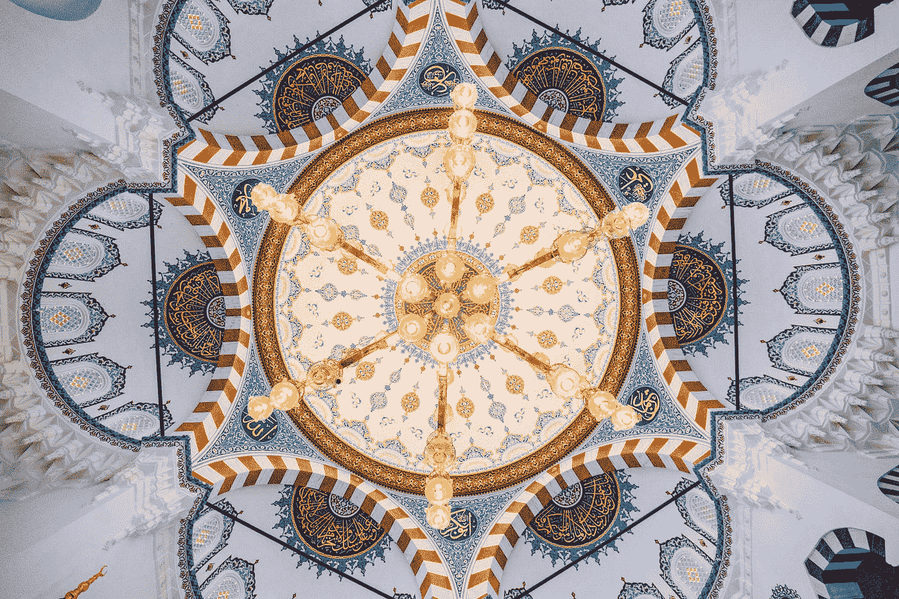

# 物理、对称和美

> 原文：<https://medium.com/swlh/physics-symmetries-and-beauty-4b0ec4169d4b>

> 所有联系中最美丽的是使它自身和它所联系的事物尽可能达到最大的统一；而正是比例(summetria)以最美的方式实现了它。
> 
> —柏拉图，蒂迈乌斯

Photo by [bady qb](https://unsplash.com/@bady?utm_source=medium&utm_medium=referral) on [Unsplash](https://unsplash.com?utm_source=medium&utm_medium=referral)

在佛教的基础文献之一的*法帕达*中，存在的三个标记中的第一个被称为 *aniccā，*也许是最好用英语翻译…