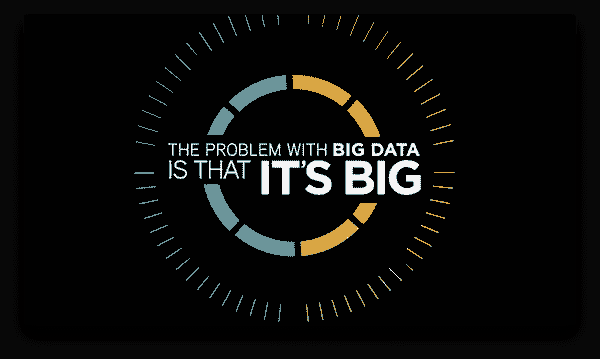

# 图片和大数据，它们能告诉我们什么？

> 原文：<https://medium.com/swlh/pictures-and-big-data-what-can-they-tell-us-e9f83291e6e2>

[*“OneOcean”*](https://www.behance.net/gallery/6882971/OneOcean) *by Brianna Larson is licensed under* [*CC BY-NC-ND 4.0*](https://creativecommons.org/licenses/by-nc-nd/4.0/?ref=ccsearch&atype=rich)

自从暗箱发明以来，摄影一直是在特定地点和时间捕捉瞬间的神奇方式。这一刻，一张照片可以告诉我们关于人、地方、文化的[故事](https://www.jotform.com/blog/35-powerful-photos-that-each-tells-a-story/)。虽然一张照片本身已经告诉了我们很多，但是多张照片放在一起能告诉我们什么呢？随着世界各地越来越多的图片被分享到网上，特别是在…