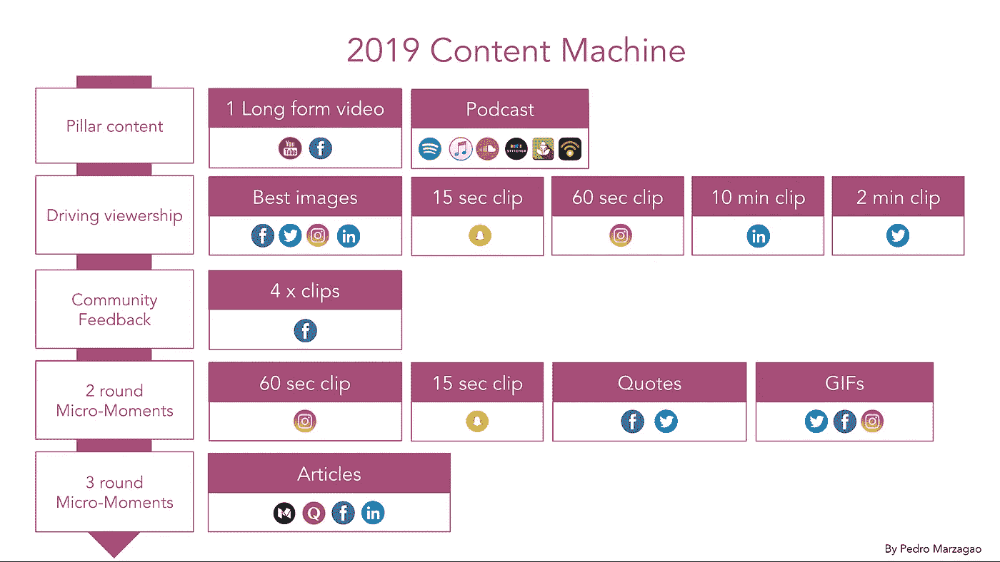

# 支柱内容和 2019 年内容机器

> 原文：<https://medium.com/swlh/pillar-content-and-the-2019-content-machine-e03fb04fd9c1>

我会尽量说得简短些。

至少在过去的 5 年里，内容营销已经成为一种营销“趋势”。对于 2019 年，我对每个营销团队的建议是增加节奏、格式，并在分销方面加大赌注。

这篇文章关注的是一个非常具体的想法，基本上是为了提高创建内容的效率:重新利用。

关于这个话题已经讨论了很多，所以我就不多说了，补充一下我最喜欢的两本书，以防你跟不上这个话题。

 [## 内容再利用的终极指南

### 了解如何通过将内容重新定位为电子书、演示文稿、客座博文等，为旧帖子注入新的活力。

snip.ly](http://snip.ly/ejusud)  [## 重新利用博客内容的完整指南

### 在这份重新利用博客内容的完整指南中，我们将介绍一些策略，让你可以…

snip.ly](http://snip.ly/sd0hvk) 

我想让你从这个故事中得到的主要观点是一个核心内容。这应该是一个长格式的视频或播客。

(顺便说一句，支柱内容机的概念最近在加里·维纳查克变得非常流行，尽管在过去的几年里，包括我在内的许多营销人员都在探索这个概念。尽管如此，Gary 创建流程和可视化工作流的工作还是值得称赞的。

你的内容团队应该真正致力于探索这些，并在预算方面投入大量资金。想想面试、会谈、研讨会等。

*   从一个支柱内容片段，您可以创建多个内容片段，以保持您的内容机器以良好的节奏运行。
*   从视频中，播客诞生了。
*   在 Youtube 和脸书上集中发布视频(如果你认为你在那里有不错的观众，你也可以探索 Vimeo)。
*   随后是第一轮驾驶观众的微观时刻。这包括从最初的视频中获得额外的内容片段(图像、15 秒、60 秒、2 米和 10 米的视频)，在适当的频道上分享这些内容片段，以增加主要内容的流量。
*   观察你的社区对这些的反应会给你新的想法，你的内容在哪里最能引起他们的共鸣。这里有一个建议，每当你的社区对你的视频添加评论时，请他们标记他们所指的时间范围。
*   这些新想法可以产生 3-4 个新片段(来自原始视频)，然后张贴到脸书。
*   然后你会得到一组新的微时刻，也是基于你从你的社区得到的反馈。除了 15 秒和 60 秒的剪辑，你还可以探索报价和 gif。
*   最后，将你从你的观众对所有不同内容的反应中获得的所有知识，你基本上可以创建一个文字稿，并用几个主要的要点来激发它。

正如你所看到的，从一个单一的原始内容片段，你可以生成数量惊人的内容。没有理由缺乏创意或研究时间来创造新的内容。

改变内容用途的进一步想法？请在下面添加您的评论！

另外，如果你喜欢这个故事，给我 10-20 次掌声祝你好运:)谢谢！

## 这篇文章发表在 [The Startup](https://medium.com/swlh) 上，这是 Medium 最大的创业刊物，拥有+437，678 名读者。

## 订阅接收[我们的头条](https://growthsupply.com/the-startup-newsletter/)。

