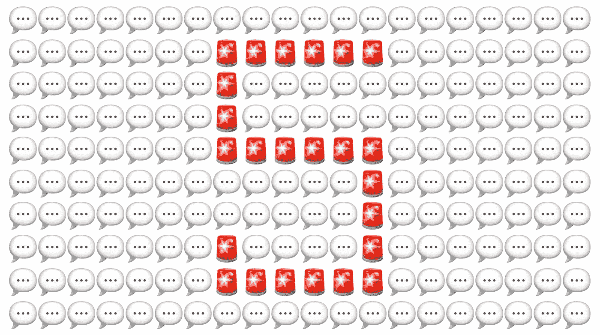

# 拯救投资者:要避免的五个投资者演示陷阱

> 原文：<https://medium.com/swlh/pitch-rescue-five-investor-presentation-pitfalls-to-avoid-df54548eeb6b>

*由* [*约瑟夫*](https://twitter.com/josephflaherty) *主管内容&社区*

我非常荣幸地看到了许多初创公司的宣传资料，并注意到一些常见的叙述模式，这些模式对其他有趣的公司来说是适得其反的。如果你准备投资一家风投公司，试着避开这些陷阱。

# 🌤️☁️头在云里，脚在米娅👞👟

视野很重要。然而，一些创始人试图出售一个纯粹的叙事，基于一个有争议和未经证实的论点，关于一个投机性的用户行为变化或技术突破。都是 30，000 英尺高的景色，没有起飞/降落

## 此推销失败的原因:

当风险投资者不同意创业者的基本论点时，这种方法通常会失败，谈话会偏离主题，变成关于哲学而不是创业的无证据讨论。

# 📊📈数据过载📉💹

一些创始人倾向于让市场规模代表商业计划，并用统计数据轰炸观众，例如:

"这个市场价值 1000 亿美元以上，这 10 张图表证明了这一点！"

"有数百万，不，数十亿的潜在用户！"

## 此推销失败的原因:

一个可观的总可寻址市场(TAM)是必要的，但还不够。如果一家初创公司属于真正奇怪的类别，关注 TAM 是有意义的，但过多强调这一点会让甲板感觉更像是一份读书报告。

# 👋👋永无止境的演示👋👋

没有什么比一流的产品演示更引人注目的了。没有什么比意识到每个问题都是通过引用产品特性来回答更令人担忧的了。在最早期，这是可以的，但风投是基金公司，而不是产品。

## 此推销失败的原因:

专注于产品通常是缺乏经验的创始人的标志，他们还没有意识到分销渠道、销售策略等的重要性。产品只是拼图的一部分！

# 🥚👶自传🤦👴

按照时间顺序展示创业推介很有诱惑力:

“Pat 和我从三年级就认识了…我们的第一次创业是一个消费者应用程序…现在我们在做 B2B SaaS…”

如此循环 20 分钟，直到有人看钟。

## 此推销失败的原因:

在这种模式下，很容易迷失在个人琐事中，浪费掉一半的会议时间。历史很重要，但一旦投资者接受了公司的使命，最好还是留到第二次会面时再说。

# 📝📝清单📝📝

有很多很好的资源可以指导创始人在一套材料中包括什么，但是盲目地遵循那个模板…

这是我们的市场幻灯片…
这是我们的产品幻灯片…
这是我们的团队幻灯片…

…是一个错误。

此推销失败的原因:

这就是一碗面粉、鸡蛋和牛奶的区别..和一个蛋糕。

在一个好的推介中，所有的幻灯片都像菜谱一样一起工作。它解释了团队如何影响决定商业模式的产品。感觉就像创始人破解了密码。

要点是，一个好的推介需要所有这些要素——愿景、产品、市场、团队和结构。如果一个方面占主导地位，整个音高都会受到影响。

你见过其他人吗？

[#集体智慧](https://twitter.com/search?l=&q=%23CollectiveWisdom%20from%3Afcollective%2C%20OR%20from%3Amicahjay1%2C%20OR%20from%3Aepaley%2C%20OR%20from%3Adafrankel%2C%20OR%20from%3Ajosephflaherty&src=typd&lang=en)

## 这篇文章发表在[《创业](https://medium.com/swlh)》上，这是 Medium 最大的创业刊物，有+431，678 人关注。

## 订阅接收[我们的头条新闻](https://growthsupply.com/the-startup-newsletter/)。

