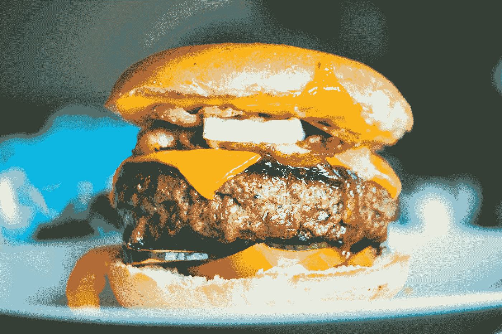

# 基于植物的食品初创企业——可持续发展的未来

> 原文：<https://medium.com/swlh/plant-based-food-startups-the-future-of-sustainability-364e99fbe037>

衣食住行。这是对任何人的三个基本要求。可悲的是，世界上大约一半的人口仍然生活在贫困中。这意味着约有 30 亿人每天挣扎着吃一顿像样的饭。这可能不会困扰我们大多数人，因为我们已经吃得够多了，但当我了解到这一点时，它绝对引起了我的注意。

Photo by [Erik Odiin](https://unsplash.com/@odiin?utm_source=medium&utm_medium=referral) on [Unsplash](https://unsplash.com?utm_source=medium&utm_medium=referral)