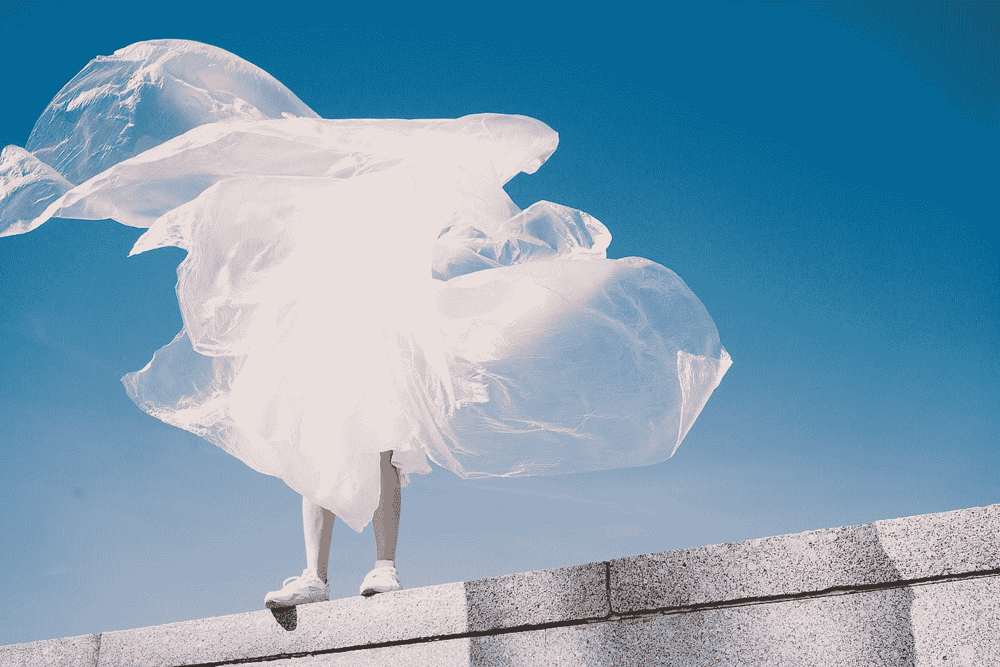

# 无塑料是特权阶层的权利

> 原文：<https://medium.com/swlh/plastic-free-is-for-the-privileged-fcc3b3254443>

Photo by [Karina Tess](https://unsplash.com/@karinatess?utm_source=medium&utm_medium=referral) on [Unsplash](https://unsplash.com?utm_source=medium&utm_medium=referral)

为了纪念无塑料七月，我想讨论低废物运动的独特性，以及它如何只对特权阶层开放。在你纠结之前，听我说完。

我刚刚毕业，23 岁，刚刚开始自己的事业，终于有足够的钱获得一点财务自由。我可以选择这个月不用塑料，并教会自己…