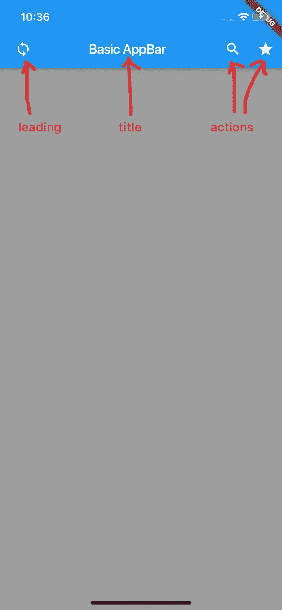

# 使用 Flutter AppBar 小部件进行操作

> 原文：<https://medium.com/swlh/play-around-with-flutter-appbar-widget-1aa04ebcf695>

在这个主题中，我们将在 Flutter 中使用 AppBar 小部件。

AppBar 在底部上方显示工具栏小部件、前导、标题和动作(如果有)。底部通常用于 TabBar。

# 基本应用程序栏

下图描述了 AppBar 的基本元素。

