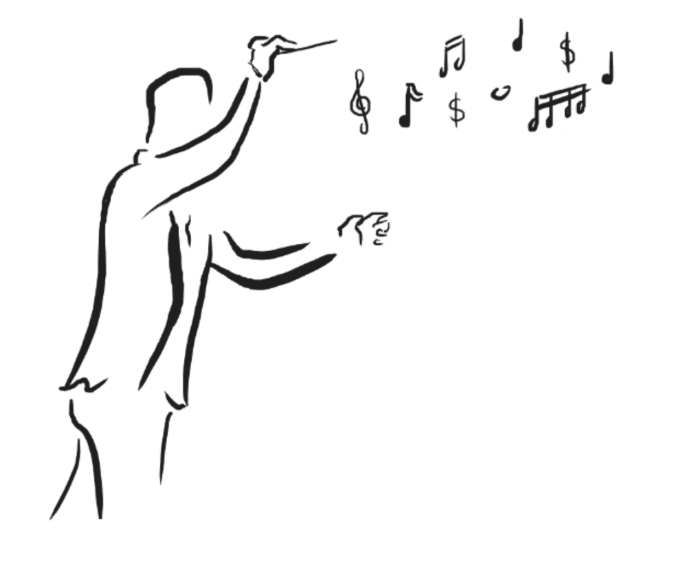
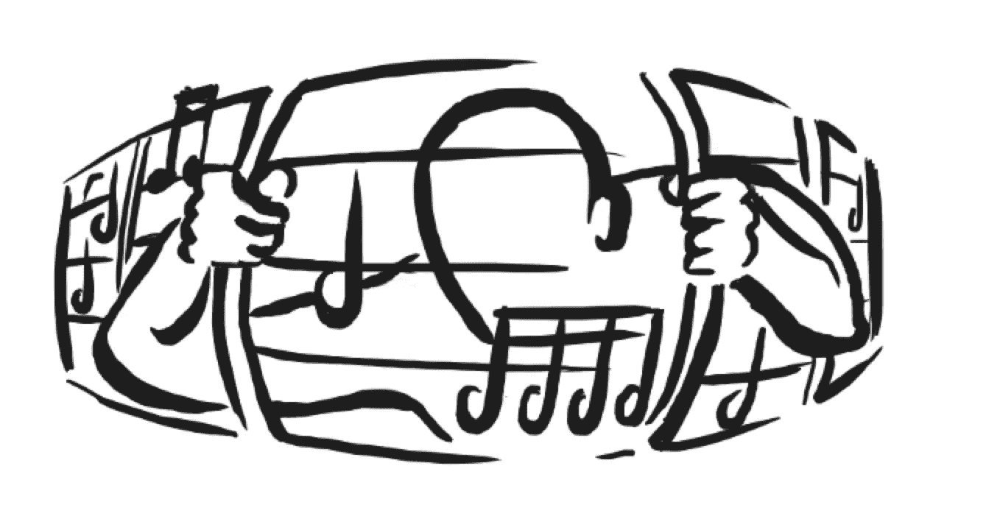

# 玩“大游戏”

> 原文：<https://medium.com/swlh/playing-the-big-game-b59f1ca21e98>

## *学习科技创业如何让我成为更好的音乐人。*

当我告诉人们学习创业帮助我成为一名更好的音乐人时，他们经常感到惊讶。不，这不仅仅是因为我在营销自己和人际关系网方面做得更好(尽管这些都是受欢迎的副产品)。培养一种企业家的心态——一种以开放性、创造性、积极性和弹性为特征的心态——给了我所需的工具，将我的技术音乐训练转变为玩“大游戏”

# **拥抱失败**

*“创造力与其说是野性的天赋，不如说是生产力。为了找到可行的新想法，你需要尝试很多不可行的方法。这是一个纯粹的数字游戏。”—罗伯特·萨顿*

如果你在斯坦福商学院或硅谷创业公司呆过，你可能会听到这样一句口头禅:“早失败，多失败。”在创业的世界里，企业家接受失败是走向创新的必要一步。正如研究员布琳·布朗简洁地指出的那样，

> “没有失败就没有创新和创造力。句号。”

为什么？因为为了做一些从未做过的事情，你必须尝试那些结果不确定的事情。其中一些会起作用，而许多不会，但是不尝试一下就不可能知道哪些会导致成功。

在技术创新领域，有很多失败的例子。托马斯·爱迪生在发明灯泡之前失败了“1000 次”，这是出了名的。成为便利贴主要组成部分的粘合剂是创造超级粘合剂的一次失败尝试。

在科技界，虽然人们不一定想失败，但他们把失败的结果视为学习和成长的机会。正因为如此，该行业支持健康的冒险文化。

在音乐界，我们很多人从很小的时候就开始害怕失败。我们的老师指导我们用“正确”和“错误”的方法来演奏不同的音乐。许多录音都被设计得尽可能完美无缺，这些录音告诉我们，完美是我们作为表演者的最终目标。这种对完美的追求和对古典音乐中“正确”的坚持往往来自一个好的地方——我们希望坚持传统，按照作曲家的要求做正确的事情，并提供强有力的表演。但它也有意想不到的副作用，让我们非常害怕尝试新的东西，把我们自己的旋转放在事情上，并在舞台上冒险。这种对失败的恐惧导致了陈腐、僵化的表演，不幸的是，这种表演充斥着当今的古典音乐。

我们是怎么到这里的？古典音乐过去不是这样。几个世纪以来，许多最优秀的古典音乐家不仅是演奏家，还是作曲家和即兴演奏者。J.S .巴赫在教堂礼拜时即兴创作管风琴音乐。莫扎特和贝多芬过去常常即兴创作当时流行的曲调，并在舞台上完成他们的作品。

利兹大学应用音乐学教授、《巴伦周刊》编辑克莱夫·布朗认为，我们对乐谱的严格遵守起了很大作用。他解释道，

> “老音乐家们明白，一场有效而动人的演出有许多方面是无法在乐谱中体现出来的。人们通常期望节奏更加灵活。节奏可以像我们在爵士乐和其他类型的流行音乐中听到的那样被弯曲。笔记并不总是清晰地记录下来，而是经常使用各种幻灯片和音调变化。颤音是一种装饰效果，而不是声音的连续和有规律的振荡…
> 
> 这些只是音乐家在原始记谱法的基础上建立起来的几种方法，目的是将仅仅正确的演奏变成一场精彩的演奏，使音乐会更加激动人心和充满活力。但这些做法在 20 世纪初逐渐被淘汰。"

布朗将这些变化归功于现代唱片业、音乐比赛和严格的音乐教学。作为在那个生态系统中长大的人，我同意。虽然我早期的音乐学院训练帮助我奠定了作为一名演奏者的坚实基础，但它也教会了我，对待古典音乐有“正确”和“错误”的方式，安全行事比冒着失败的风险做一些有趣的事情更好。最终的结果是，虽然我学会了如何演奏合拍并发出美妙的声音，但我变得如此害怕演奏错误或在舞台上犯错，以至于我不再为自己作为一名音乐家而思考。我变成了我被训练成的死板的音乐家，在这个过程中，我失去了创造力和活力，而这正是我呈现给观众的音乐杰作的核心。

当我开始在斯坦福上学时，有两件事发生了变化。我开始学习创业和设计课程，这帮助我理解了风险、失败和创造力之间的关系。我也停止了每周的常规课程，这是我人生中第一次在很大程度上对自己的音乐发展负责。课程和无组织时间与乐器的结合给了我工具和空间，让我开始思考自己作为一名音乐家的身份，这是我演奏近 15 年来的第一次。我脑子里的对话慢慢开始从“我这样玩对吗？”到“我想知道这种措辞或颜色选择是否会在这篇文章中引起听众的共鸣。”我不再那么在意人们对我演奏的看法，而是开始关注我与观众的关系。

通过慢慢地将我对失败和“错误”的恐惧转变为寻求与观众的联系，我不仅失去了一些通常伴随高风险表演的焦虑，而且我也开始在舞台上感到更加自由。

这个来自创业世界的小洞见——失败本身并不坏，而是发现新事物的必要步骤——把我从古典乐训练的僵化结构中解放出来，让我走上了成为更有活力和创造力的音乐家的道路。

# **技术服务于音乐性**

*“最完美的技巧是完全不被人注意的技巧。”—巴保罗·卡萨尔斯*

作为一名参加[梅菲尔德研究员计划](https://stvp.stanford.edu/mayfield-fellows-program)(一项植根于硅谷科技创业的为期 9 个月的研究员计划)的学生，我了解到了“愿景”和“执行”在硅谷科技公司中的作用。简单来说，“愿景”是公司的为什么，“执行”是如何。这两者对于成功创业都至关重要:没有愿景，创业就毫无意义，没有一流的执行力，公司将无法在高度竞争的环境中取得成功。在创业世界里，愿景和执行之间的关系很清楚:出色的执行是实现愿景的*手段*。它从来都不是终极游戏，而是实现成功的工具箱。

在音乐中，我们有类似的概念，但我们称之为“音乐性”而不是“视觉”，称之为“技巧”同样的道理也存在于音乐中:技术的存在是为了服务于音乐的视觉。然而，由于在音乐发展的早期阶段强调完善技术，大多数古典音乐家在成长过程中认为技术是最终目的，而不是达到目的的手段。学习技巧成为许多年轻音乐家的唯一关注点，只有当学生对乐器的掌握达到一定水平时，音乐才能在交谈中重现。

由于多年来只专注于技术，许多古典音乐家失去了他们独特的音乐感，当情况最终需要时，他们变得无法锻炼肌肉。

我自己也经历过过分强调技术的后果。我不知道有多少次我把自己锁在练习室里，试图让一段复杂的曲子听起来完美，后来才意识到这种追求完美的压力夺走了我在演奏那些完美排练过的音符时的交流能力。

我不是说技术不重要；事实上，这对于传达任何音乐理念都是至关重要的。但是学习技巧的目的应该在音乐发展的所有阶段中被联系起来，所以我们学习技巧不是为了技巧而学习技巧，而是为了拓宽我们的音乐工具箱。

如果从古典音乐家教育的一开始，学习技巧的目的就是成为更好的音乐家，而不是更好的乐器操作者，那会怎样？如果乐器不是注意力的中心，而仅仅是传达音乐背后的思想和情感的工具，会怎么样？

小提琴家威尔德·冯华南是她那一代中最有创造力和最强有力的演奏家之一，她体现了这一理想。在接受《T2》杂志采访时，冯华南解释说，拉小提琴“一直是为了享受音乐创作的乐趣”直到她 16 岁时，她才开始练习音阶并确定她的技巧，因为“我知道，如果我要达到正确的水平，我还必须接受严肃的技术元素。”对于那些相信严格的技术发展是走向音乐自由的必要一步的怀疑论者来说，听听冯华南版本的门德尔松小提琴协奏曲就知道了。

当重点是音乐性而不是技术时，音乐家可以放弃追求完美，开始专注于与观众的交流。结果是像冯华南这样的表演者，他们完全掌握了乐器，但他们也从走上舞台的那一刻起就用他们的音乐故事迷住了你。

作为音乐人，不管是什么流派，我们的工作就是和观众交流。讲一个故事。带领人们踏上情感之旅。这是场大游戏。

# **为什么重要**

好消息是:古典音乐世界已经开始意识到创业技能的重要性。像茱莉亚音乐学院和柯蒂斯学院这样的学校现在要求所有本科生都要上“社会企业家”和“作为企业家的音乐家”这样的课程。除了艺术天赋，主要的比赛和管理机构也开始寻找有创业精神的音乐家。管弦乐队已经开始尝试节目和音乐会场地。所有这些都是一个良好的开端，但我们仍有不足。

创业不仅仅是建立一个网站，或者开始一个系列演唱会，或者策划一场精彩的演唱会。它体现了一种企业家精神，其特点是开放、愿意承担风险、希望从失败中吸取教训，以及不懈地追求与观众真正沟通。如果我们希望古典音乐的未来对观众来说变得真正“可接近”和令人愉快，我们需要把这种方法带到我们作为音乐家每次拿起乐器时所做的每一件事情中。

硅谷巨大成功背后的哲学和技术是可以教授和学习的。是时候将它们融入我们的音乐教育体系了。

我鼓励你开始玩大游戏。我们应该感谢那些有创造力的天才，他们的音乐杰作给我们的生活带来了快乐和灵感。

埃里克·考夫曼的插图。

# 关于作者

*中提琴手 Deanna Badizadegan 经常在圣保罗室内乐团和匹兹堡交响乐团担任客座音乐家，她在 2018-19 赛季担任了一年的职务。她在新英格兰音乐学院完成了研究生音乐学习，在那里她师从金·卡什卡希安。她还拥有斯坦福大学的管理科学工程硕士学位和组织设计工程学士学位。在从事全职绩效工作之前，她曾在硅谷多家科技初创公司担任产品经理。*

# 关于插画师

埃里克·考夫曼从会拿铅笔开始就一直在画画。当他不涂鸦的时候，他会弹吉他或者做他目前的项目，一部关于弗里茨·哈伯生活和时代的原创摇滚歌剧。