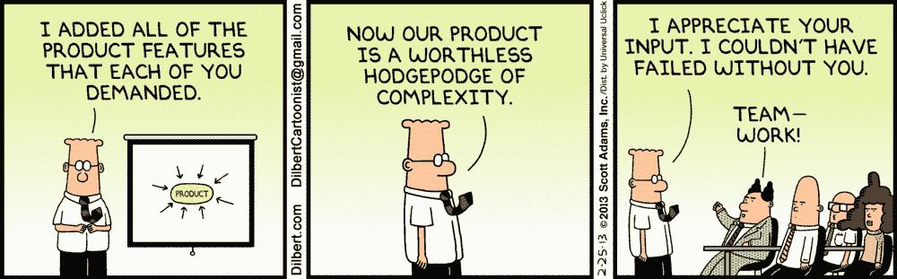

# PM 生存指南:政治环境可能阻止你开发伟大产品的 5 种方式，你能做些什么

> 原文：<https://medium.com/swlh/pm-survival-guide-5-ways-political-situations-can-prevent-you-from-building-a-great-product-and-9f0cd4a8a477>

我经常被问到产品管理的实践方面——有时是关于制造好产品的艺术，有时是关于其他相关的事情。所以我决定在“PM 生存”系列文章中收集一些。希望读者觉得有用。

1.  **高管宝贝**——太多的爱会杀了你。把你的时间花在没人关心的事情上是非常令人沮丧的。但是，当高管们过于关心你在做什么，并且对你应该做什么有太强烈的意见时，这可能会令人沮丧。为你的高管设计通常是一种短期策略。特别是考虑到在许多情况下，高科技公司的高管并不反映普通用户及其需求。怎么走出来？**让数据成为你决策的货币，而不是资历**。说起来容易做起来难，尤其是在那些基于数据的决策不是企业文化的公司。但至少要让设计原则、功能标准和优先级非常明确和详细。进行这样的对话比固执己见的对话要容易得多。
2.  Exec 的特点和缺陷 —这是上一个版本的一个版本。稍微容易一点，但仍然致命。这是当你有一个非常好的产品计划和功能优先级，然后你突然收到一些高管 10 级以上的愤怒的电子邮件，抱怨一些“非常坏”的东西。通常，所有的跟班都开始兜圈子，浪费宝贵的时间，往往只是为了发现高管误解了什么，或者产品版本不对。**你能做什么**？有一个非常明确的 bug 优先级标准，最好有一个分析系统可以帮助你测量问题发生的频率。
3.  **错位激励****——**我曾经在 YouTube 视频广告上工作过一段时间。这是一个迷人的生态系统，由多个关键利益相关方组成，他们的激励不一致:

*   只想免费观看精彩内容，但也不喜欢广告的观众。
*   想要抓住绳子两端的创作者——让数百万用户观看他们的内容，并通过向他们展示广告来最大化盈利。他们更愿意因为允许这些广告而获得高额报酬。
*   希望在最好的内容上展示尽可能多的广告，并且支付尽可能少的费用的广告商。
*   代理机构…

然后，这种不一致在组织自身中表现出来，产品、销售、合作伙伴等不同的团队迎合生态系统中不同的一方。这种情况并不是 YouTube 独有的。我多次看到，区域经理、市场营销、公共关系、客户经理、业务领导、政府和政策关系团队以及其他人都在推动在一个产品契合度低或质量差的市场推出产品。他们通常对发布头条更感兴趣(有时是有充分理由的)，而对可持续的成功不太感兴趣。我认为除了很好地理解产品的可持续生态系统的关键要素，并将其用作启动清单之外，没有其他神奇的解决方案。要做到可衡量，不要让线掉下来。在一个苦苦挣扎的产品的苦涩滋味下，发射的甜蜜滋味很快被遗忘。

**4。制定不可能的截止日期/目标**——推出一个蹩脚产品或者甚至还没开始就宣布失败的最好方法，就是制定不可能的截止日期和/或目标。这些有不同的形状和大小，但有两种常见的味道:

*   **高管规定/过早承诺目标** —很多时候，看似执行或战略问题，实际上只是早期错误规划和目标设定的小问题。特别是对于新的项目，在问题域被完全理解之前，目标和里程碑就已经确定了。这些可能被证明是不可能的或不相关的目标，然而一些团队成员会犹豫是否要反对它们，担心这会被视为失败(特别是如果这些是由“管理层”设定的，他们可能仍然对这些目标是不可能的和不相关的事实视而不见)。
*   **神风敢死队最后期限**——这些可以是自己造成的，也可以是外部压力，因为一些事件、里程碑或其他什么原因而制定一些疯狂的最后期限。**就是不要**。

5.**缺乏所有权/委员会决策/设计产品以缓解组织压力/缺乏产品卓越文化—** 你不是在这个公司或团队出生的，你不需要死在那里。如果你是一名优秀的产品经理，但不知何故发现自己所在的团队/组织/公司并没有让你走向成功，并在你的道路上设置了令人沮丧的组织障碍，那就离开吧！！有足够多的优秀组织愿意花大价钱聘请优秀的产品经理，帮助他们打造优秀的产品，没有任何干扰。去当首相吧！

## 这篇文章发表在 [The Startup](https://medium.com/swlh) 上，这是 Medium 最大的创业刊物，拥有+431，678 名读者。

## 在这里订阅接收[我们的头条新闻](https://growthsupply.com/the-startup-newsletter/)。

