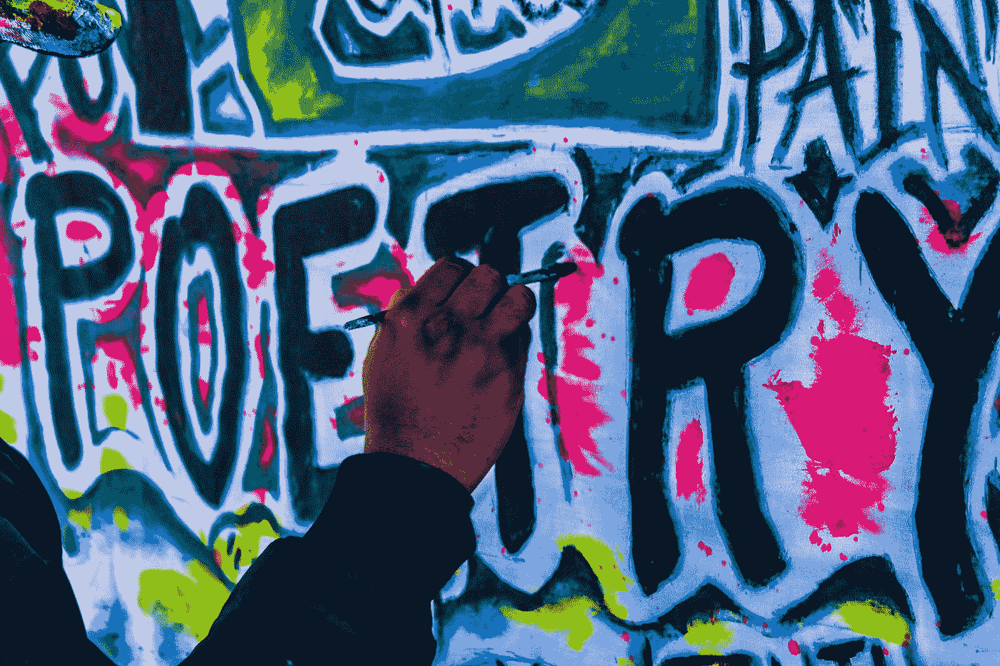

# 诗歌和散文

> 原文：<https://medium.com/swlh/poetry-and-prose-b301b7e8bcc6>

## 两者都包含克服绝望的治疗策略，创造性的思考方式，并为疲惫、分散的世界带来希望。

Photo by [Trust "Tru" Katsande](https://unsplash.com/@iamtru?utm_source=medium&utm_medium=referral) on [Unsplash](https://unsplash.com?utm_source=medium&utm_medium=referral)

写诗和散文让我摆脱了学术写作的日常压力。我找到了释放和表达的自由。当我写下我的想法和感受时，我成了我的个人导师，并帮助了我自己…