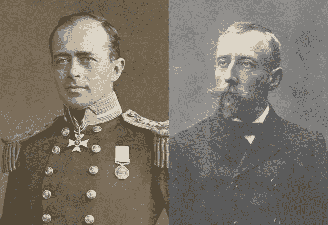

# 两极对立

> 原文：<https://medium.com/swlh/polar-opposites-a-race-to-the-poles-4b39694665d1>

Scott (left) and Amundsen (Right)

## 明智的领导如何带领挪威人比他们的英国同行更快到达南极

1911 年，一群挪威探险家在罗尔德·阿蒙森的带领下完成了前人没有完成的任务——他们到达了南极洲的南极点。他们到达那里比由英国探险家罗伯特·福尔肯·斯科特领导的竞争对手早了五个星期