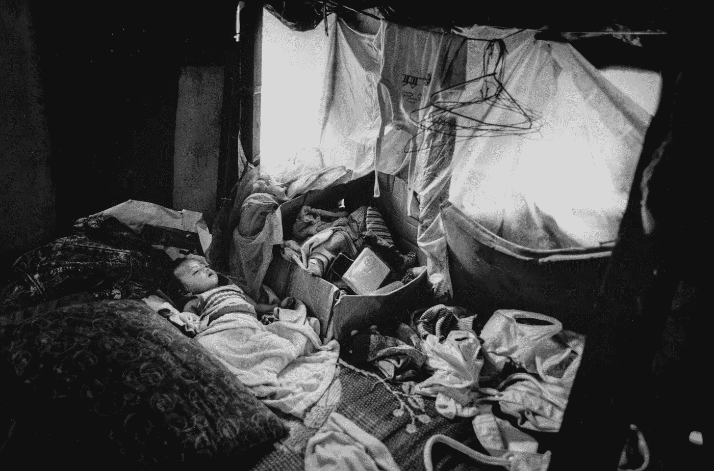
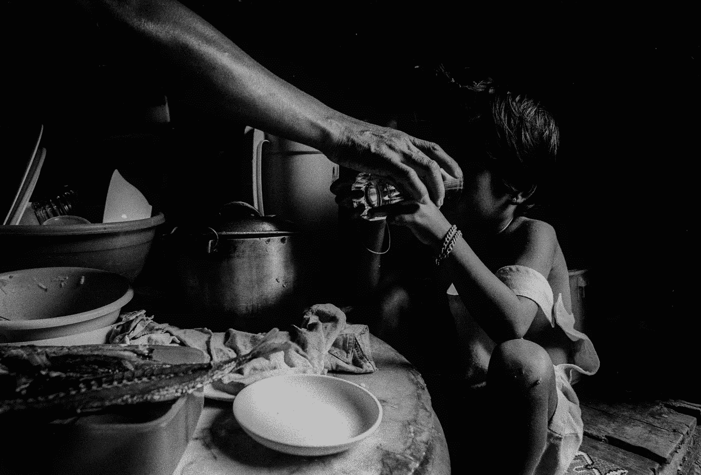
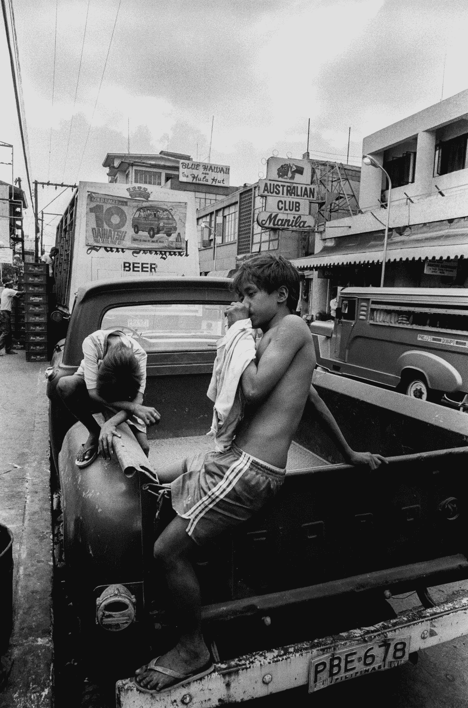
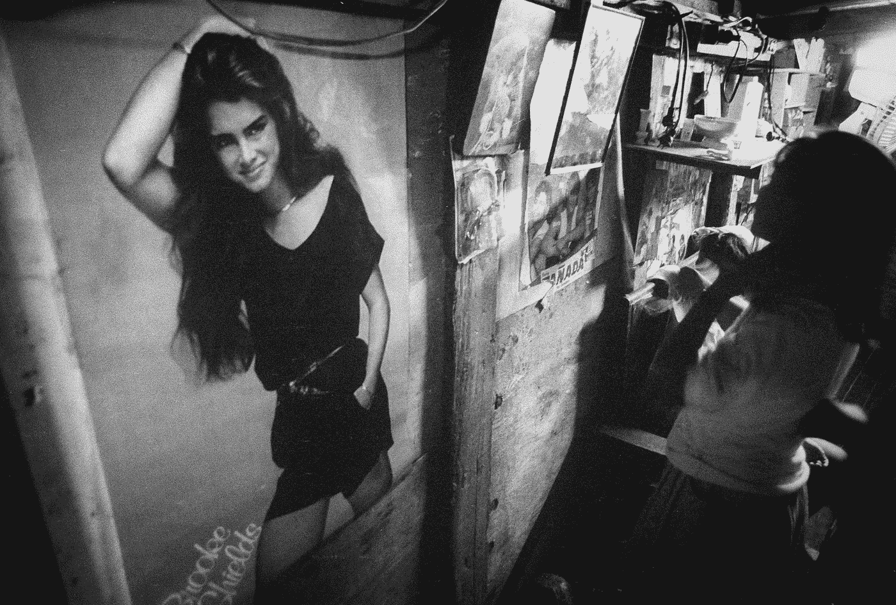
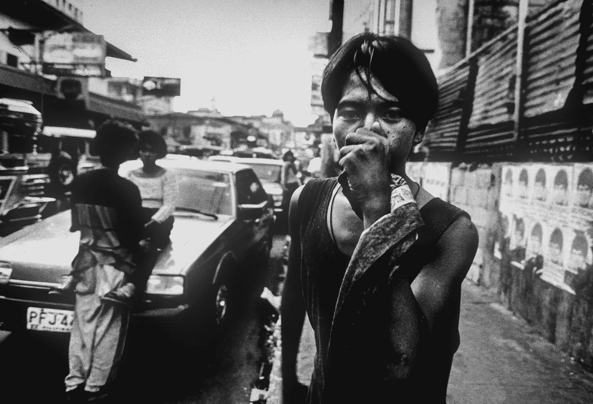
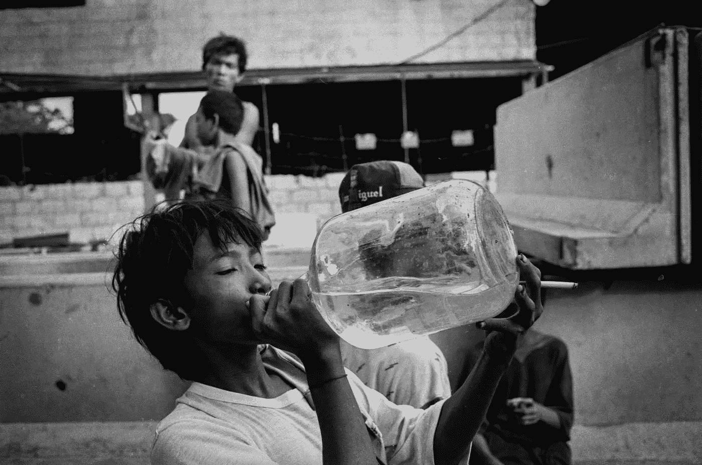

# 贫穷、饥饿和愤怒:为什么投票权仍然是你的

> 原文：<https://medium.com/swlh/poor-starving-and-angry-why-the-right-to-vote-is-still-yours-1a214503888d>

*腐败并不是 2019 年菲律宾大选灾难性结果的唯一原因。系统性的阶级歧视、精英主义和殖民主义的后遗症也是主要原因。*

触发警告:虐待儿童，创伤，谋杀，忽视，家庭暴力，药物滥用，成瘾，抑郁症，饥饿，贫困

***为贫穷而疲惫的曼达卢雍市而写。***

[From Alan Dejecacion’s Medium article, “From the Archives: Philippines Street Life”](/vantage/from-the-archives-philippines-street-life-d048940efbba)

# 你出生时在鞋盒大小的房子里又踢又叫，而你的叔叔却在外面被枪杀；他的大脑、血液和身体在眩目的阳光下放置了三天，然后城市的清理人员从地板上刮掉了他的血管、残渣和灵魂。

你妈妈是个青少年，你爸爸是个游手好闲的人，除了在曼达卢永城寻找最好的毒品之外一无是处。他们在一年一度的 [*piyesta*](https://www.google.com/search?q=piyesta+in+english&rlz=1C1GCEB_enUS838US839&oq=piyesta+in+english&aqs=chrome.0.0l6.4508j1j4&sourceid=chrome&ie=UTF-8) 聚会上相遇，在那里，你的母亲希望消磨掉她的童年时光，而你的父亲则和他那群 20 多岁的不合群的人一起注视着她的成熟。他们在你铁托男孩的[三轮车](https://en.wikipedia.org/wiki/Motorized_tricycle_(Philippines))里乱搞，9 个月后你出生了。

你在饥饿中长大。你不知道饱的感觉。你站在当地餐馆外面看其他孩子吃饭。当 [*马农*](https://www.google.com/search?rlz=1C1GCEB_enUS838US839&ei=Z13kXIXSG-OS0PEP5rGu8As&q=manong++meaning&oq=manong++meaning&gs_l=psy-ab.3..0i71l8.9215.9215..9445...0.0..0.0.0.......0....1..gws-wiz.qrqojY0qrBk) *警卫*看到你时，他用警棍避开你，因为你弄脏了店面的窗户，说你对生意不利。一想到吃 [Jollibee](https://twitter.com/Jollibee?ref_src=twsrc%5Egoogle%7Ctwcamp%5Eserp%7Ctwgr%5Eauthor) 炸鸡、 [*buchi*](https://www.google.com/search?rlz=1C1GCEB_enUS838US839&ei=nF3kXMPmB8HB0PEPt_eH-A0&q=buchi+food&oq=buchi+f&gs_l=psy-ab.1.0.0j0i20i263j0l8.972.1257..1920...0.0..0.135.263.0j2......0....1..gws-wiz.......0i71j0i67.ZHcPo0tMo2A) 来自[周王](http://www.chowkingusa.com/)或者 [*mechado*](https://www.google.com/search?q=mechado+meaning&rlz=1C1GCEB_enUS838US839&oq=mechado+meaning&aqs=chrome..69i57j0l5.2031j0j7&sourceid=chrome&ie=UTF-8) 来自本地 [*carinderia*](https://www.google.com/search?q=carinderia+meaning&rlz=1C1GCEB_enUS838US839&oq=carinderia+meaning&aqs=chrome..69i57j0l5.2432j0j7&sourceid=chrome&ie=UTF-8) 你就垂涎三尺。大多数时候，你饿着肚子回家。在家里，你妈妈会把热咖啡倒在一层米饭上，这样至少你会有 [*sabaw*](https://www.google.com/search?q=sabaw+mwaning&rlz=1C1GCEB_enUS838US839&oq=sabaw+mwaning&aqs=chrome..69i57j0l5.1915j1j9&sourceid=chrome&ie=UTF-8) *。你每天都吃咖啡和米饭——有时一天只吃一次。*

为了缓解你的饥饿，你加入你的*，而不是玩[*holen*](https://www.google.com/search?rlz=1C1GCEB_enUS838US839&ei=JF7kXJGOKJOU0PEPpPmPoAc&q=holen+marble+filipino+meaning&oq=holen+marble+filipino+meaning&gs_l=psy-ab.3...3502.5658..5881...1.0..2.252.1356.0j6j2......0....1..gws-wiz.knkFenbUUZg)[*patintero*](https://www.google.com/search?rlz=1C1GCEB_enUS838US839&ei=K17kXIjaH8yv0PEPreSbgA8&q=patintero+meaning&oq=patintero+meaning&gs_l=psy-ab.3..0i7i30j0l3j0i30l2j0i5i30.13471.14631..14839...0.0..0.225.1259.2j6j1......0....1..gws-wiz.......0i71j0i67j0i7i10i30j0i13i70i249j0i13.RVGrKOCxwLo)或[*agawan base*](https://www.google.com/search?rlz=1C1GCEB_enUS838US839&ei=Rl7kXJnnNMzA0PEP6sOzsAU&q=agawan+base+game&oq=agawan+base+game&gs_l=psy-ab.3..0l2.1793.3264..3374...0.0..0.199.622.0j4......0....1..gws-wiz.......0i71j0i67j0i20i263j0i22i30.6i8UudCxtSw)*你在 [Shaw Boulevard](https://www.google.com/search?q=shaw+bouleveard+ph&rlz=1C1GCEB_enUS838US839&oq=shaw+bouleveard+ph&aqs=chrome..69i57j0l5.2816j0j7&sourceid=chrome&ie=UTF-8) 乞讨金钱。从下午 4 点到 7 点，满大路永城最优秀最聪明的人都被困在交通中，所以你利用这种监禁形式来讨钱。你一定要装出悲伤的表情——你意识到当你这样做时，他们会给你更多。有时你会遇到外国人，他们害怕你，因为你敲他们的出租车窗户，“打破他们的泡沫”——你越饿，你就越用力敲他们的窗户。不管怎样，白人男人和女人总是为你感到内疚和悲伤，所以他们给你很多钱。相比之下，你向你的菲律宾同胞乞讨，你会被吐口水，被嘲笑，然后像一只讨厌的胖蚊子一样挥手离开。有时候你认为乞求是他们看到你和你的痛苦的唯一方式。**

**今天你赚了 50 比索。你吸入金钱的味道是因为此时此刻你很富有，你不知道什么时候你还会有这种感觉。你把一天的收入带回家给你妈妈，她没有给你买一顿饭，而是用这些钱买了一瓶 [*Ginebra*](https://www.google.com/search?q=ginebra+gin&rlz=1C1GCEB_enUS838US839&oq=ginebra+gin&aqs=chrome..69i57j0l5.1250j0j7&sourceid=chrome&ie=UTF-8) 杜松子酒。你骗自己说这是她最后一次会这样。当你六岁的时候，你意识到将会有无限多的最后时光。**

****

**当你八岁的时候，你的表弟 Ato 教你如何吸入[橄榄球](https://en.wikipedia.org/wiki/Rugby_boy)，一种多用途接触水泥。你意识到每次你吸入它，你的饥饿感就消失了。你爱上了这种物质，因为它比你的父母更能消除你的痛苦。到你 10 岁的时候，你会上瘾，变得和你父亲一样。你崇拜橄榄球就像你母亲崇拜圣婴一样。晚上你父亲不在的时候，你母亲向一个不听的神祈祷。你不明白她为什么每晚都费心为你的灵魂祈祷——你们都已经在地狱里了。**

**说到地狱:在你不讨钱或吸橄榄球的日子里，你的母亲强迫你去公立学校。你步行往返于学校，在那里他们教你从 80 年代回收书籍中的主题。你对这些废话感到厌倦，因为他们不是教你如何让你父亲停止用皮带抽打你母亲，而是教你如何加减乘除。他们教你关于何塞·里萨尔、T2、加布里埃拉·西朗、T4 和安德列斯·波尼法秀的故事，有那么一瞬间，你希望这些人能帮助你— —但随后你意识到他们生活在一个多世纪前，所以他们不能帮你找到午餐(你上次吃饭是在昨天，那是你在垃圾桶里找到的一袋打开的薯片)。**

****

**你被迫学习英语。麦格赛赛女士教你白人的语言，并要求你在任何时候都要说这种语言，以便显得“世界一流”。学校的法律规定，你必须在走廊、浴室和教室里说英语——如果他们发现你说他加禄语，你会被送到校长办公室，在那里你会被用竹竿抽打。你讨厌说英语，因为感觉不正常；被迫的。你对学校失去了兴趣，想知道如果你所知道的唯一世界是一个你爸爸是个瘾君子，你妈妈是个酒鬼，而你永远是个穷人的世界，你为什么要显得世界一流。**

****

**你的青少年时期是这样的:你吸入橄榄球。你一天要抽完一包[希望香烟](https://www.google.com/search?q=hope+cigarettes&rlz=1C1GCEB_enUS838US839&oq=hope+ciga&aqs=chrome.0.0j69i57j0l4.2433j0j7&sourceid=chrome&ie=UTF-8)。你早餐喝[红马啤酒](https://www.google.com/search?q=red+horse+beer&rlz=1C1GCEB_enUS838US839&oq=red+horse+beer&aqs=chrome.0.0l6.1514j0j7&sourceid=chrome&ie=UTF-8)。你午餐喝了你妈妈剩下的杜松子酒。你晚餐会吸更多的橄榄球。晚饭后，你走进你的鞋盒屋，发现你的父母正在做 [*涮锅*](https://www.google.com/search?rlz=1C1GCEB_enUS838US839&ei=3F_kXOjxNvXv9AO2-rfoCw&q=shabu+filipino&oq=shabu+filipino&gs_l=psy-ab.3..0l2j0i22i30l4.798.2201..2352...0.0..0.232.1385.1j7j1......0....1..gws-wiz.......0i71j0i67j0i20i263j0i22i10i30.bWx_-EsVPD8) 。你去你的卧室，试着练习你的草书，但是你意识到没有钱买衬纸。**

**15 岁时，你放弃了学校，因为你终于意识到，为像你这样的人学习毫无意义。在这个不想和你有任何关系的世界上，试图做正确的事情是没有意义的。崇拜谷胱甘肽的精英们在他们的殖民圈里没有你棕色皮肤的空间。**

**下次选举时你才 18 岁。几个候选人在你的城市竞选。你会觉得很可笑，他们现在在乞求你的投票。他们不择手段——唱一首 [OPM 热门歌曲](https://www.google.com/search?rlz=1C1GCEB_enUS838US839&ei=iV_kXMvpGevA0PEPvryV8A8&q=opm+filipino+meaning&oq=opm+filipino+meaning&gs_l=psy-ab.3..0i13.2807.3932..4108...0.0..0.363.1414.1j4j2j1......0....1..gws-wiz.......0i71j0i7i30.fUCkXuoW7W0)，雇佣一名 DJ，发表虚假承诺——你能说出所有营销方案，每个候选人都这么做过。你知道不该投那个因腐败入狱的人的票，但是他开了一些有趣的玩笑。又笑了几声后，你最终投票给了那个承诺如果你投他的票，你就能保证在当地政府得到一份工作的人。**

**你想投票给有政治经验的候选人，但你听不懂他们在说什么，因为他们一半时间都在说英语。你不会投票给受过教育的候选人，因为你认为教育是由富人管理的行业，在清除穷人方面表现出色。你认为教育系统是精英们想要打破的。你认为政府和精英是利用穷人的背、腿和四肢来谋取私利的伙伴。**

****

**你想知道为什么富人不能把事实加起来，你和你爱的人住在猪圈里，而你爱的人是瘾君子、酒鬼和妓女。你想知道为什么住在 BGC 共管公寓里的人不能消除他们的精英主义、种族歧视和殖民主义的后遗症，帮助他们自己的人民，因为归根结底，你们都是棕色皮肤，你们都是菲律宾人，你们都来自那片被傲慢的男人和女人糟蹋了的土地，因为贪婪、腐败和无法理解下层人民也是人。**

**他们想知道为什么这个国家会分裂。他们想知道为什么像你这样的人会愤怒。T2 阿尔塔社会公司满足于看着国家下沉，只要他们完全不受影响。**

**你二十多岁的时候是这样的:你吸入橄榄球。你一天要抽完一包[希望香烟](https://www.google.com/search?q=hope+cigarettes&rlz=1C1GCEB_enUS838US839&oq=hope+ciga&aqs=chrome.0.0j69i57j0l4.2433j0j7&sourceid=chrome&ie=UTF-8)。你早餐喝[红马啤酒](https://www.google.com/search?q=red+horse+beer&rlz=1C1GCEB_enUS838US839&oq=red+horse+beer&aqs=chrome.0.0l6.1514j0j7&sourceid=chrome&ie=UTF-8)。你午餐喝了你妈妈剩下的杜松子酒。你晚餐会吸更多的橄榄球。晚饭后，你走进你的鞋盒屋，你、你的母亲和父亲享受 [*涮锅*](https://www.google.com/search?rlz=1C1GCEB_enUS838US839&ei=3F_kXOjxNvXv9AO2-rfoCw&q=shabu+filipino&oq=shabu+filipino&gs_l=psy-ab.3..0l2j0i22i30l4.798.2201..2352...0.0..0.232.1385.1j7j1......0....1..gws-wiz.......0i71j0i67j0i20i263j0i22i10i30.bWx_-EsVPD8) 。你吸入更多的橄榄球，这样你就可以睡觉了。你从商场的商店里偷东西。有时候当你真的需要钱的时候，你会卖毒品。当你遇到麻烦时，你会向你母亲祈祷的上帝祈祷。**

**当你 25 岁时，你所在的城市会举办一年一度的 piyesta。你决定去看看那天你会遇到什么样的麻烦；在家很无聊，你的生活是一片无尽的虚无。你的堂兄阿托和他的一帮流氓叼着烟溜向你。你抽吧。从远处，你看到一个可爱的女孩在玩跳房子。她看起来纯洁无瑕。你认为她从这个地狱出来几乎是个奇迹。你走过去向她介绍自己。你让她笑了。她喜欢你。你们一起坐摩天轮。她亲吻你的脸颊。你回吻她。你在摩天轮里闲逛。**

**九个月后，你的孩子出生了，在一个鞋盒大小的房子里又踢又叫，妈妈和爸爸除了在 Mandaluyong 市找到最好的毒品外什么都不会。**

****

***所有图片:Alan Dejecacion |* [*在 Medium 上找到他。*](/@dejecacion.images)**