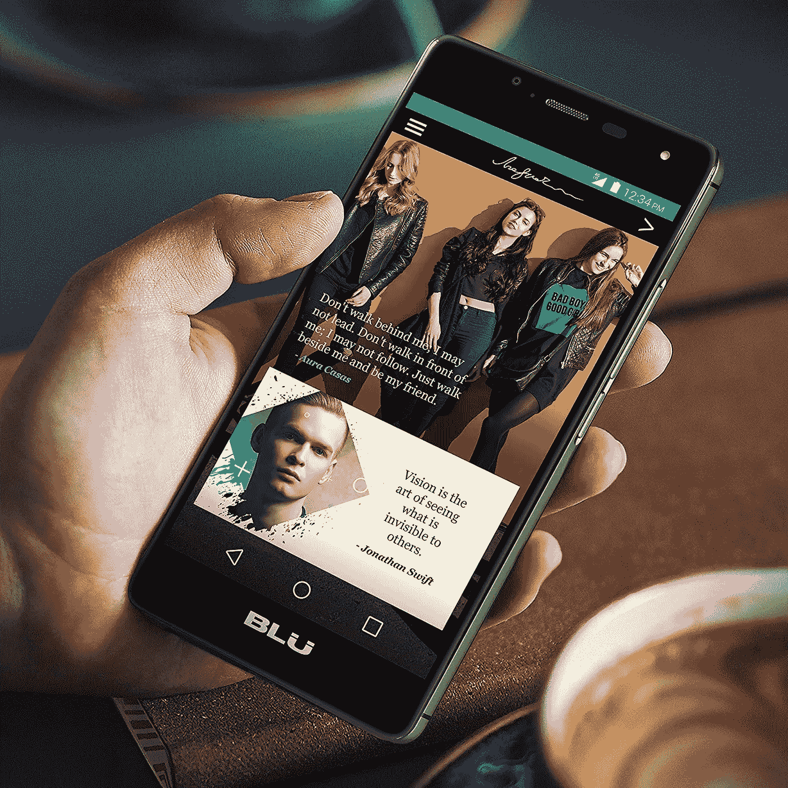

# 帖子隐私:数据分类-划分

> 原文：<https://medium.com/swlh/post-privacy-the-data-class-divide-f86a0c0ec7fc>

“后隐私”一词最适合用来描述一个前数字时代的个人隐私概念不再现实或不可实现的世界的状况和讨论。 ***【后隐私】*** *也是这个系列的名字，它评论了全球各地出现的趋势，这些趋势寻求抵消、加强或与后隐私现实和谐相处。*

在千禧年前的几十年里，乐观的学者和科幻作家都写道互联网有成为“伟大的均衡器”的潜力——一个没有模拟时代的许多经济壁垒的数字乌托邦。不可否认的是，互联网带来了全球信息和交流的民主化。但在 2019 年，你很难找到任何人仍然认为它是社会的乌托邦目的地。互联网更像一面镜子，我们日常生活中存在的社会经济挑战往往共存于网络空间。

无论在线与否，隐私总是与一个人在社会中的经济地位有相当大的关系。遭遇财务困境通常需要向更多的公共和私人团体披露更多的个人信息以获得支持。在你自己的设备上缺乏对你自己的互联网连接的个人访问，增加了你在图书馆桌面或开放的 WIFI 网络中失去浏览匿名性的可能性。即使是你买得起的手机也可能对你的隐私体验产生持久的影响——以 BLU·R1 高清手机*为例，这款售价 60 美元的最畅销手机据称[含有针对中国服务器的间谍软件后门](https://www.cnet.com/news/these-cheap-phones-are-costing-you-your-privacy/)。*

source: Amazon

虽然这些公民和消费者的选择中有许多是我们自己的，但用僵硬的“买家当心”来回应将是错误的。当我们关于数据共享的决定是深思熟虑的或故意轻率的，我们可能不得不承担他们的负担。但是，当经济地位或法律法规要求披露时，我们围绕它们的谈话需要承认特权在隐私中是如何发挥作用的。

以付费隐私经济为例，它的基础是给一个人在相对隐私的情况下浏览、社交和交易的能力贴上价格标签。这种模式的无节制增长将会在隐私拥有者和拥有者之间产生更大的鸿沟。它还可能导致广告商的经营状况发生变化，他们将与日益扭曲和金融霸权的人口统计数据进行沟通(那么，这值得吗？).

# 数据作为驱动因素

具有残酷讽刺意味的是，从缺乏隐私的个人那里收集的数据往往会直接为他人的经济利益服务。尽管世界各地出现了消费者数据权利，但总的来说，数据被视为资本，而不是劳动力。我们 24 小时不间断地产生有商业价值的数据，但很少有人参与讨论这些数据会发生什么，更不用说分享财务回报了。微软研究院的 Glen Weyl 和他的同事在他们的 [2017 年论文](https://papers.ssrn.com/sol3/papers.cfm?abstract_id=3093683)中强调:

> “作为一个社会，我们如何思考和谈论用户生成的数据作为生产的投入很重要，例如将劳动力与资本区别对待。我们的劳动带来了某种尊严和意义……”

将数据视为劳动力是一个有争议且复杂的讨论(超出了本文的范围！)然而，鉴于数据和权力之间的关系已经存在诸多问题，这无疑是一个值得推进的方向。《剑桥分析》向我们展示了在这个互联网时代，个人数据的秘密获取和资本化如何有可能改变选举。但如果它也改变了一些不那么宏大的东西，比如人们如何应对金融危机，那又会怎样呢？

与传统的信用报告不同，数据驱动的服务现在提供了对个人在线资料和活动的可见性。像 *Naborly* 这样的租户筛选公司分析来自潜在租户的大量数据点，包括他们的社交媒体活动，为房东提供风险分析。这不仅对那些在推特上发布财务困境的过度分享者来说是个警告，对任何拥有数字档案的人来说也是如此。这些系统高估了数字足迹的可靠性和准确性，但可能会影响寻找住房、就业、保险和总体经济流动性的努力。

# 态度是一种途径

认为这种趋势仅仅反映了竞争市场的发展，也忽略了这种商业模式所利用的力量失衡。[研究表明](https://ses.library.usyd.edu.au/bitstream/2123/17587/7/USYDDigitalRightsAustraliareport.pdf)我们许多人都觉得对自己的数字足迹缺乏控制，当[的年轻人和低社会经济地位](https://journals.sagepub.com/eprint/x5QQDiq34kP8X6hsUR7I/full)的因素被纳入其中时，这种情况就被夸大了。一个人参与的数据分享越多，这个任务似乎就越庞大。这种不可避免的观点被组织利用，就像他们从更广泛的隐私框架中受益一样，隐私仅仅是一种个人责任，以逃避他们自己的隐私保护任务。

将数据作为资本处理而不考虑其人性，也有可能扭曲社会对隐私作为一项人权的态度。作为自决、自由表达、公平获得服务、甚至行动自由和人身安全的关键推动者，我们能承受隐私概念被数据驱动的经济侵蚀吗？

有些人可能会说船已经起航了——但仍然有机会植入新的价值观，直接回应后隐私世界的现实。即使不情愿，让“伟大的平等者”的愿景成为过去可能是一个好的开始。